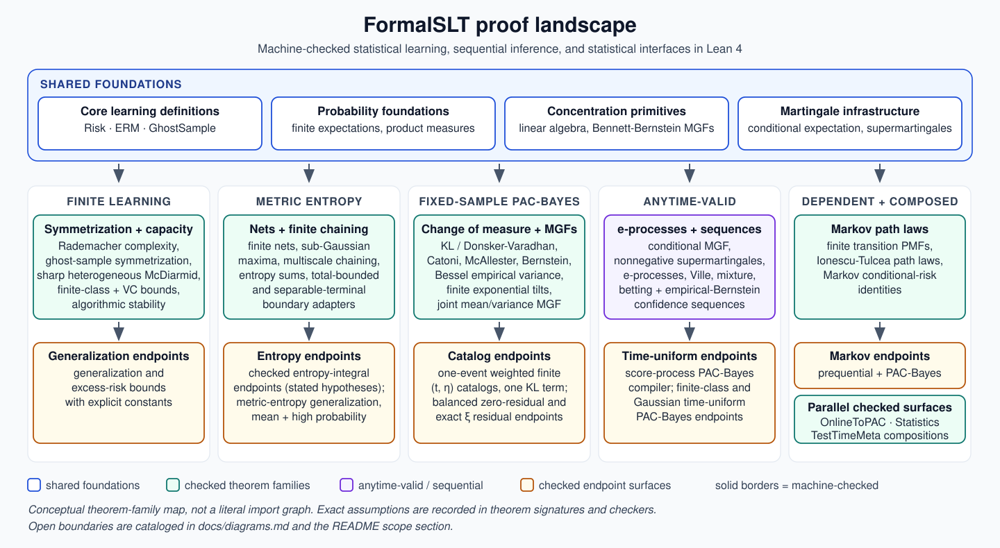

# FormalSLT

[](https://github.com/Robby955/FormalSLT/actions/workflows/ci.yml)
[](https://robby955.github.io/FormalSLT/)
[](https://lean-lang.org/)
[](https://github.com/leanprover-community/mathlib4)
[](./LICENSE)

[](#checked-surfaces)
[](#module-map)
[](#audit-commands)
[](#audit-commands)
[](#audit-commands)

> **Finite-sample statistical learning theory, checked in Lean 4.**
> FormalSLT records theorem statements, constants, and scope boundaries in the
> type signatures, where downstream users can inspect them.

**[Browse the searchable API documentation](https://robby955.github.io/FormalSLT/)**
without installing Lean.

FormalSLT is a Lean 4 library for finite-sample learning theory. It connects
concentration, Rademacher and VC theory, metric entropy, stability, sequential
inference, and PAC-Bayes analysis through reusable machine-checked theorems.

[FormalSLT v0.1.0](https://github.com/Robby955/FormalSLT/tree/v0.1.0) was
publicly released on May 8, 2026. A verifier-gated formalization route built on
the library was accepted at the ICML 2026 AI for Math workshop; see
[*From Agents to Axioms: Verifier-Gated Lean Formalization for Statistical
Learning Theory*](https://openreview.net/pdf?id=EsEqPLc0ef).

## Flagship results

These are the results to start with. For each one, the README first says what
it proves in statistical terms, then links the exact Lean theorem and a concrete
checker. The underlying statistical ideas come from the literature; FormalSLT's
contribution is the machine-checked specialization or derived endpoint.

### All-sample-size empirical-Bernstein PAC-Bayes

For IID $[0,1]$ losses and a full-support prior fixed before seeing the data,
one event has probability at most $\delta$. Outside that event, the following
bound holds simultaneously for **every** sample size $n \ge 2$ and **every**
posterior distribution on the fixed finite hypothesis class:

$$
R(\rho) < \widehat R_n(\rho)
       + \frac{5}{2} \sqrt{\frac{\widehat V_n(\rho) L_n(\rho)}{n}}
       + \frac{5 L_n(\rho)}{n}
$$

Here $R$ is population risk, $\widehat R_n$ is empirical risk, and $\rho$ is the
posterior. $\widehat V_n(\rho)$ is the posterior average of the per-hypothesis Bessel
sample variance, and
$L_n(\rho) = \mathrm{KL}(\rho \| \mathrm{prior}) + \log(r(r+1)^2 / \delta)$ with
$r = \lfloor \log_2 n \rfloor$ (written `Nat.log 2 n` in Lean). The result uses one KL
term and permits the posterior to be chosen after observing the data.

- **Lean theorem:**
  `exists_infiniteEmpiricalBernstein_event` in
  [`InfiniteEmpiricalBernsteinStitch.lean`](./FormalSLT/PACBayes/InfiniteEmpiricalBernsteinStitch.lean)
- **Checked example:**
  [`CheckInfiniteEmpiricalBernsteinStitch.lean`](./examples/CheckInfiniteEmpiricalBernsteinStitch.lean)
  instantiates one all-`n` event for a fair-Boolean stream and a posterior
  selected from the first observation.
- **Numerical comparison:**
  [identical-input benchmark](./benchmark/output/empirical_bernstein_flagship.md),
  where the exact stitched ceiling first falls below one at even `n = 128` in
  the reported scan.

### Fixed-sample empirical-Bernstein foundation

For finite IID data, $[0,1]$ losses, $n \ge 2$, and $0 < \delta < 1$, one event
controls every data-selected posterior over a fixed finite hypothesis catalog.
The theorem uses a fixed full-support prior, one KL term, the posterior average
of per-hypothesis Bessel variances, and a predeclared dyadic scale grid of depth
`ceil(log_2 n)` (written `Nat.clog 2 n` in Lean).

- **Lean theorems:**
  `finiteEmpiricalBernsteinSqrt_badSamples_mass_le_delta` and
  `finiteEmpiricalBernsteinSqrt_posteriorRisk_le_of_not_mem` in
  [`FiniteEmpiricalBernsteinSqrt.lean`](./FormalSLT/PACBayes/FiniteEmpiricalBernsteinSqrt.lean)
- **Checked example:**
  [`CheckFiniteEmpiricalBernsteinSqrt.lean`](./examples/CheckFiniteEmpiricalBernsteinSqrt.lean)
  checks `delta = 1/20`, `KL = log 2 > 0`, empirical variance
  `16/63 > 0`, an explicit positive-mass good sample, and a final ceiling below
  `99/100`.

### Time-uniform PAC-Bayes

One common event controls every positive time and every finite posterior PMF
for IID $[0,1]$ losses and one fixed declared tilt.

- **Lean theorem:** `timeUniformIIDPACBayes_allPosteriors_bound` in
  [`TimeUniformIID.lean`](./FormalSLT/PACBayes/TimeUniformIID.lean)
- **Verification:**
  [`CheckTimeUniformIIDPACBayes.lean`](./examples/CheckTimeUniformIIDPACBayes.lean)
  discharges the IID process obligations. A dedicated positive-KL subunit
  numerical receipt remains planned.

### Finite-tilt time-uniform PAC-Bayes

For finite hypothesis and tilt types, full-support priors, and measurable IID
$[0,1]$ losses, one event is shared by every positive time, every finite
posterior PMF, and every predeclared tilt atom.

- **Lean theorems:**
  `timeUniformIIDPACBayes_tiltMixture_measurableExceptionalEvent_spec` and
  `timeUniformIIDPACBayes_tiltMixture_selected_of_not_mem_measurableExceptionalEvent`
  in
  [`TimeUniformIIDTiltMixture.lean`](./FormalSLT/PACBayes/TimeUniformIIDTiltMixture.lean)
- **Checked example:**
  [`CheckTimeUniformIIDTiltMixture.lean`](./examples/CheckTimeUniformIIDTiltMixture.lean)
  checks `delta = 1/16`, point-posterior `KL = log 2`, both tilt boundaries at
  most `3/8`, and an existential good path with selected risk below `7/8`.
  Its explicit selector-branch exercises are not proved good.

### Finite Markov prequential PAC-Bayes

For a finite-state Markov transition kernel, deterministic initial state, fixed
finite predictor catalog, and predeclared full-support finite tilt prior, one
tilt atom may be selected after the trajectory. The target is encountered
one-step conditional risk, not stationary risk.

- **Lean theorem:**
  `markovPACBayes_tiltMixture_prequentialRisk_certificate` in
  [`MarkovPACBayesTiltMixture.lean`](./FormalSLT/StochasticDynamics/MarkovPACBayesTiltMixture.lean)
- **Checked example:**
  [`CheckMarkovPACBayes.lean`](./examples/CheckMarkovPACBayes.lean) uses an
  asymmetric two-state chain, a path-selected point posterior and tilt atom,
  exact `KL = log 2`, two selected boundaries below `1/20`, and conditional
  risk below `11/20`. The explicit selector-branch paths are not proved good or
  positive-probability.

The source theorem, exact agreement, material differences, and external-review
questions for each result are tracked in
[`docs/LITERATURE.md`](./docs/LITERATURE.md).

## Current results

- **Finite-sample learning bounds:** finite-class concentration, Rademacher
  symmetrization, VC bounds, bounded differences, algorithmic stability, and
  PAC-Bayes routes with explicit constants.
- **Metric-entropy generalization:** mean and high-probability bounds obtained
  by combining Rademacher symmetrization with uniform finite Dudley budgets.
  A checked two-point witness makes both the entropy budget and tail factor
  nontrivial.
- **Sharp McDiarmid concentration:** one-sided, lower-tail, and two-sided
  bounds with exponent `-2ε² / ∑ k, (c k)²` for coordinate sensitivities
  `c k`, including independent coordinates with heterogeneous marginal laws.
  For a common per-coordinate sensitivity bound `B`, the denominator is
  `nB²`. The sharper constant reaches the
  high-probability finite-class, Rademacher, VC, and algorithmic-stability
  wrappers.
- **Time-uniform PAC-Bayes:** finite-class i.i.d. bounds simultaneous over all
  posteriors, finite-grid data-dependent tilt selection, and a finite normalized
  hypothesis--tilt master e-process whose one Ville event permits path- and
  posterior-dependent selection of a declared tilt atom. A finite-IID adapter
  discharges the measurable bounded-loss process assumptions and packages the
  result as one measurable exceptional event. The library also has a
  process-level theorem over arbitrary measurable hypothesis spaces and an
  end-to-end i.i.d. bounded-loss theorem over finite-dimensional
  spherical-Gaussian hypotheses with a checked closed-form KL penalty and a
  stochastic fair-Bernoulli product-stream certificate.
- **Finite Markov prequential risk:** an actual Ionescu--Tulcea path law for a
  finite transition PMF, a derived next-step conditional-risk identity, the
  sharp universal `1/4` conditional-variance proxy for `[0,1]` losses, an
  anytime two-sided fixed-predictor certificate, and a PAC-Bayes certificate
  simultaneous over all positive times and posteriors on a finite predictor
  catalog. A normalized finite tilt prior whose atoms satisfy `0 < λ_j < 3`
  gives one measurable exceptional event; on its complement, the posterior
  and one predeclared tilt atom may be selected after the trajectory, with the
  atom's exact weight penalty.
- **Test-time PAC-Bayes certificate:** a finite-horizon, five-component
  population-risk bound assembled from a conditional sub-Gamma increment
  model, with a worked instance proving all five contributions strictly
  positive.
- **Probability and statistics foundations:** scoped interfaces for measure
  convergence, laws of large numbers, moments, finite estimation, Fisher
  information, Cramer-Rao, finite exponential families, and asymptotic
  statistics.
- **Finite empirical-Bernstein PAC-Bayes:** Bessel-corrected loss variance, its
  exact second-order pair representation and finite-i.i.d. unbiasedness, a
  source-normalized lower-tail MGF proved by random matching and finite Jensen,
  and a fixed-sample, fixed-tilt confidence event simultaneous over every
  finite posterior. A separate bounded-loss Bernstein event and a finite union
  bound now give the observable fixed-parameter risk theorem, with distinct
  variance and risk failure budgets. Separately weighted finite `eta` and
  `lambda` catalogs now permit both tilts to be selected after seeing the
  sample and posterior. The variance catalog is also exposed as its own API,
  with unequal weights, two selector branches, positive-mass samples, and both
  concrete certificates below `1/4`. A fixed-sample joint mean/variance layer
  adds the normalized joint MGF with the retained Bennett factor inside the
  logarithm and a one-event weighted joint-pair posterior catalog with one KL
  term per selected entry. On the checked zero-residual coefficient branch,
  the retained logarithm is absorbed and the selected posterior risk is bounded
  explicitly by empirical risk, empirical variance, and that one KL term. For
  every admissible entry with `t > 0`, nonnegative `kappa`, and failed balance,
  the exact maximum of the retained residual on `[0,1/4]` is checked and
  contributes the explicit penalty `xi / t`. A support-aware countable master
  event and downstream finite-posterior selector over a predeclared
  `Nat`-indexed tilt-pair catalog are checked separately. The selected bound
  uses that same fixed-sample event and one KL term. The closed-form flagship
  now fixes a dyadic
  scale grid of depth `clog 2 n` before observing the data and proves, on one
  event of failure mass at most `delta`,
  $$
  R(\rho) \le \widehat R(\rho)
  + \frac{5}{4} \sqrt{\frac{2 \widehat V(\rho) L(\rho)}{n}}
  + \frac{5}{2} \frac{L(\rho)}{n},
  $$
  where
  $L(\rho) = \mathrm{KL}(\rho \| \mathrm{prior}) + \log((\mathrm{clog}_2 n + 1) / \delta)$.
  A reverse-exchangeability layer now proves the Bessel conditional-expectation
  identity, reverse Bessel martingale, reverse joint mean/variance exponential
  submartingale, one-event posterior catalog on each dyadic epoch, and the
  reverse closed-form bound. Countable stitching on the infinite IID product
  space then gives one measurable event of mass at most `delta` on whose
  complement every `n >= 2` and every finite posterior obey
  $$
  R(\rho) < \widehat R_n(\rho)
  + \frac{5}{2} \sqrt{\frac{\widehat V_n(\rho) L_n(\rho)}{n}}
  + \frac{5 L_n(\rho)}{n},
  $$
  where
  $L_n(\rho) = \mathrm{KL}(\rho \| \mathrm{prior}) + \log(r(r+1)^2 / \delta)$ and
  `r = Nat.log 2 n`. This is an offline reverse-epoch theorem, not a forward
  e-process, optional-stopping result, all-real optimizer, or continuous-
  hypothesis theorem.

The Dudley core is finite by design. The finite-outcome endpoint
`continuous_dudley_entropy_integral` assumes a finite sub-Gaussian process on a
nonempty pseudometric index, a totally bounded universal index set, positive
`radiusScale` and process variance proxy, agreement of the process and ambient
distances, an antitone nonnegative interval-integrable entropy profile, and
supplied separable-terminal boundary certificates. The measure-side endpoint is
instead an expectation-operator lift from a supplied `MeasureChainingBudget`;
it does not construct those metric or chaining hypotheses. Arbitrary measurable
suprema remain out of scope. The general continuous PAC-Bayes
theorem remains process-level; the i.i.d. specialization currently covers
finite-dimensional spherical Gaussian priors and posteriors. The statistics
interfaces preserve the hypotheses of the Mathlib results they expose. See
[Scope and open boundaries](#scope-and-open-boundaries) for the exact limits.

**Zero `sorry`. Zero `admit`. Zero custom axioms.** The public checker files
print only `[propext, Classical.choice, Quot.sound]`.

Badge counts are generated from the source tree by
[`scripts/generate_badge_counts.py`](./scripts/generate_badge_counts.py) and
checked in CI.

[](./docs/theorem-chain.svg)

*Conceptual theorem-family map, not a literal import graph. Exact assumptions
are recorded in theorem signatures and checkers. Detailed lane diagrams are in
[docs/diagrams.md](./docs/diagrams.md); select the map to open it full size.*

## Checked surfaces

Each item below names a public endpoint and a small checker that resolves the
declaration and prints its axiom profile.

### Learning bounds and sequential inference

- **Finite-class Hoeffding confidence sequence** —
  `FiniteClassConfidenceSequence.failure_probability_le`;
  [`CheckUniformConvergence.lean`](./examples/CheckUniformConvergence.lean)
- **Five-component PAC-Bayes population-risk certificate** —
  `flagshipFiveComponent_certificate_from_incrementModel` and
  `pacBayesTestTimeFlagship_theorem`, with non-vacuity witness
  `flagshipFiveComponent_five_slots_positive`;
  [`CheckFlagshipFiveComponentAssembly.lean`](./examples/CheckFlagshipFiveComponentAssembly.lean)
- **Fixed-`λ` countable-time sub-Gamma confidence boundary** —
  `atTop_time_uniform_confidence_sequence_subGamma`;
  [`CheckAnytimeAtTopCS.lean`](./examples/CheckAnytimeAtTopCS.lean)
- **Finite fixed-`λ` Catoni change-of-measure posterior-risk bound** —
  `catoni_changeOfMeasure_bound`;
  [`CheckPACBayesChangeOfMeasure.lean`](./examples/CheckPACBayesChangeOfMeasure.lean)
- **Finite PMF and KL interoperability with Mathlib** —
  `IsPMF.toPMF` and `IsPMF.integral_toPMF_eq_sum` expose finite real PMFs and
  their weighted sums through Mathlib's `PMF` and measure-integral APIs;
  `informationTheory_klDiv_toPMF_eq_of_support` identifies FormalSLT's finite
  real KL sum with Mathlib's extended-real KL divergence under posterior-support
  inclusion in the prior. The disjoint-support checker shows this condition
  cannot be omitted in general;
  [`CheckFinitePMFBridge.lean`](./examples/CheckFinitePMFBridge.lean)
- **Finite Markov trajectory prequential-risk certificate** —
  `markovPrequentialRiskExceptionalEvent_mass_le_delta` and
  `averageConditionalRisk_lt_empiricalPrequentialRisk_add_boundary_of_not_mem`,
  with a persistent two-state receipt at `n = 1024` whose failure probability
  is at most `1/20`, whose boundary radius (half-width) is below `1/20`, and
  whose good-path empirical risk lies in the displayed open interval
  `(11/80, 19/80)`, which has endpoint width exactly `1/10`;
  [`CheckMarkovRisk.lean`](./examples/CheckMarkovRisk.lean)
- **Finite-catalog Markov PAC-Bayes certificate** —
  `markovPACBayes_prequentialRisk_certificate` gives one measurable event of
  probability at most `delta` on whose complement the prequential-risk bound
  holds at every positive time for every posterior PMF, for one fixed declared
  tilt satisfying `0 < λ < 3`. The asymmetric two-state receipt selects a point
  posterior from the first `1024` transitions, has exact KL cost `log 2`,
  empirical risk at most `1/2`, and posterior-average conditional risk below
  `11/20` at confidence `19/20`;
  [`CheckMarkovPACBayes.lean`](./examples/CheckMarkovPACBayes.lean)
- **Finite weighted-tilt Markov PAC-Bayes certificate** —
  `markovPACBayes_tiltMixture_prequentialRisk_certificate` gives one measurable
  exceptional event of probability at most `delta`; on its complement the
  bound is simultaneous over all positive times, posterior PMFs, and atoms
  `0 < λ_j < 3` of a full-support finite tilt prior. A pointwise selector may
  choose one predeclared atom after the trajectory and pays
  `log (1 / (delta * weight j))`. The selector need not be measurable or
  adapted: this uses the common all-atom event and adds no optional-stopping
  claim. In the asymmetric two-state receipt, the path-selected posterior has
  exact KL `log 2`, both selected boundaries are below `1/20`, and conditional
  risk is below `11/20` at confidence `19/20`. The two explicit paths only
  exercise selector branches; they are not proved good or positive-probability;
  [`CheckMarkovPACBayes.lean`](./examples/CheckMarkovPACBayes.lean)

### Concentration and metric entropy

- **Sharp two-sided McDiarmid inequality** —
  `mcdiarmid_twoSided_of_hasBoundedDifferences_sharp`;
  [`CheckSharpMcDiarmid.lean`](./examples/CheckSharpMcDiarmid.lean)
- **Sharp heterogeneous-product McDiarmid inequality** —
  `mcdiarmid_twoSided_of_hasBoundedDifferences_sharp_hetero`;
  [`CheckHeterogeneousMcDiarmid.lean`](./examples/CheckHeterogeneousMcDiarmid.lean)
- **PAC-Bayes Bernstein supplied margin-proxy shell** —
  `finitePACBayesBernsteinMargin_badEventMass_le_delta`;
  [`CheckPACBayesBernstein.lean`](./examples/CheckPACBayesBernstein.lean)
- **Exact finite indicator-loss variance** —
  `indicatorDeviation_secondMoment_eq`, for arbitrary Boolean predicates under
  an arbitrary finite PMF;
  [`CheckIndicatorVariance.lean`](./examples/CheckIndicatorVariance.lean)
- **Hypothesis-specific finite-product indicator Bernstein MGF** —
  `indicator_product_normalizedMGF_le_one`, with exact `R(1-R)` variance and
  explicit fixed-tilt range `0 < lambda < 3n`;
  [`CheckFiniteProductBernstein.lean`](./examples/CheckFiniteProductBernstein.lean)
- **Prior-averaged finite indicator Bernstein moment** —
  `indicator_expectedPriorBernsteinExpMoment_le_one`, matching the abstract
  PAC-Bayes Bernstein adapter with scale `1/(3n)` and variance proxy
  `R_i(1-R_i)/n`;
  [`CheckIndicatorBernsteinMoment.lean`](./examples/CheckIndicatorBernsteinMoment.lean)
- **Finite indicator PAC-Bayes Bernstein confidence theorem** —
  `indicator_finitePACBayesBernstein_fixedLambda_badEventMass_le_delta`, bounding
  the i.i.d. product mass where any finite posterior violates the explicit
  fixed-tilt bound, with
  `indicator_posteriorGeneralizationGap_le_of_not_mem` as the pointwise
  all-posteriors companion. The concrete classifier receipt proves an all-true
  sample belongs to the bad set and sandwiches its mass between `2^-20` and
  `1/2`;
  [`CheckIndicatorBernsteinConfidence.lean`](./examples/CheckIndicatorBernsteinConfidence.lean),
  [`CheckIIDIndicatorPACBayesBernstein.lean`](./examples/CheckIIDIndicatorPACBayesBernstein.lean)
- **Observable low-risk indicator PAC-Bayes--Bernstein corollary** —
  `indicator_posteriorRisk_le_twoThirds_of_not_mem`, at the fixed sample-level
  tilt `lambda = 2n/3`, gives
  $R(\rho) \le (7/4) \widehat R(\rho) + (21/(8n))(\mathrm{KL}(\rho\|\pi) + \log(1/\delta))$;
  `indicator_posteriorRisk_le_min_one_twoThirds_of_not_mem` truncates this at
  one. The concrete balanced sample of size `40` discharges the good-event
  premise and yields the checked certificate $R(\rho) \le 301/320 < 1$;
  [`CheckIndicatorBernsteinLowRisk.lean`](./examples/CheckIndicatorBernsteinLowRisk.lean)
- **Finite weighted indicator-Bernstein tilt catalog** —
  `indicator_finitePACBayesBernstein_weightedCatalog_badEventMass_le_delta`
  allocates confidence budget `delta * w_j` across a fixed finite tilt family,
  while
  `indicator_posteriorRisk_le_weightedLowRiskCatalog_selected_of_not_mem`
  permits the selected entry to depend on both the observed sample and
  posterior. The four-entry unequal-weight receipt proves catalog mass at most
  $1/2$ and an empirical-risk-selected certificate $R(\rho) \le 13/14 < 1$.
  This remains finite, fixed-sample, and population-variance self-bounding; it
  is not empirical sample variance or all-real tilt optimization;
  [`CheckIndicatorBernsteinTiltCatalog.lean`](./examples/CheckIndicatorBernsteinTiltCatalog.lean)
- **Finite empirical loss variance and fixed-parameter PAC-Bayes risk** —
  `finiteEmpiricalVariance_eq_pairwise` identifies the Bessel-corrected
  variance with its ordered off-diagonal second-order statistic, while
  `finiteEmpiricalVariance_unbiased_finiteProduct` proves that its expectation
  under the finite IID product law is the per-hypothesis population variance.
  `finiteEmpiricalVariance_lowerTailMGF_tolstikhinSeldin` proves the
  source-normalized exponential moment for every `n >= 2`, and
  `finiteEmpiricalVariancePACBayes_badEventMass_le_delta` gives one fixed-tilt
  bad set of mass at most `delta`. Outside it,
  `posteriorPopulationVariance_le_empiricalVariance_of_not_mem` holds for every
  finite posterior, including one selected after observing the sample.
  `finiteBoundedLossBernstein_badEventMass_le_delta` supplies the separate
  population-risk event, and
  `posteriorRisk_le_empiricalRisk_add_empiricalVariance_of_not_mem` combines
  them with total failure at most `deltaVariance + deltaRisk`. The
  three-level loss receipt separately evaluates population variance `1/6`, one
  displayed empirical variance `1/4`, and the full `3^3`-sample expectation
  `1/6`. An asymmetric two-hypothesis receipt proves that the posterior selector
  takes both values on positive-mass samples and gives both branches a checked
  certificate at most `202/825 < 1/4`. A fair nonconstant-loss receipt uses
  separate `1/4` budgets, proves combined bad mass at most `1/2`, and derives a
  good-sample final-risk witness. The theorem has two declared tilts and one
  fixed sample size; it is not tilt-grid, all-real optimized, or time-uniform;
  [`CheckFiniteEmpiricalVariance.lean`](./examples/CheckFiniteEmpiricalVariance.lean),
  [`CheckFiniteEmpiricalVariancePACBayes.lean`](./examples/CheckFiniteEmpiricalVariancePACBayes.lean),
  [`CheckFiniteEmpiricalVarianceTiltCatalog.lean`](./examples/CheckFiniteEmpiricalVarianceTiltCatalog.lean),
  [`CheckFiniteEmpiricalBernsteinRisk.lean`](./examples/CheckFiniteEmpiricalBernsteinRisk.lean),
  [`CheckFiniteEmpiricalBernsteinRiskCatalog.lean`](./examples/CheckFiniteEmpiricalBernsteinRiskCatalog.lean),
  [`FiniteEmpiricalVarianceMGF.lean`](./FormalSLT/PACBayes/FiniteEmpiricalVarianceMGF.lean),
  [`FiniteEmpiricalVariancePACBayes.lean`](./FormalSLT/PACBayes/FiniteEmpiricalVariancePACBayes.lean),
  [`FiniteBoundedLossBernstein.lean`](./FormalSLT/PACBayes/FiniteBoundedLossBernstein.lean),
  [`FiniteEmpiricalBernsteinRisk.lean`](./FormalSLT/PACBayes/FiniteEmpiricalBernsteinRisk.lean)
- **Finite exponential tilting and variance transport** —
  `finiteExponentialTilt_changeOfMeasure` and
  `finiteProductExponentialTilt_changeOfMeasure` give exact coordinate and
  product identities. The bounded-loss specialization proves the retained
  Bennett normalizer and `exp (-t) * V_p <= V_{q_t}` without full support;
  [`CheckFiniteExponentialTilt.lean`](./examples/CheckFiniteExponentialTilt.lean),
  [`CheckFiniteExponentialTiltProduct.lean`](./examples/CheckFiniteExponentialTiltProduct.lean),
  [`CheckFiniteBoundedLossExponentialTilt.lean`](./examples/CheckFiniteBoundedLossExponentialTilt.lean)
- **Fixed-sample joint mean/Bessel-variance MGF core** —
  `finiteJointMeanVarianceMGF_le` combines the lower-tail mean score and
  Bessel empirical-variance score by an exact finite exponential tilt, while
  `finiteJointMeanVariance_normalizedMGF_le_one` moves the Bennett and
  transported-variance corrections inside one normalized exponential. The
  fair-Boolean receipt uses the nonconstant loss `0, 1`, `n = 2`, and positive
  tilts `t = eta = 1/2`, for which the joint variance coefficient is `1/2`.
  This core theorem is a per-hypothesis fixed-sample moment; the next checked
  layer lifts it to a prior mixture and posterior-uniform finite catalog, but
  neither layer is a time-uniform process;
  [`CheckFiniteJointMeanVarianceMGF.lean`](./examples/CheckFiniteJointMeanVarianceMGF.lean),
  [`FiniteJointMeanVarianceMGF.lean`](./FormalSLT/PACBayes/FiniteJointMeanVarianceMGF.lean)
- **One-event joint mean/variance posterior catalog** —
  `finiteJointMeanVariance_catalogBadSamples_mass_le_delta` thresholds one
  prior-and-catalog master mixture at `1 / delta` to get a single bad-sample
  set of mass at most `delta`, and
  `finiteJointMeanVariance_posteriorGap_le_selected_of_not_mem` gives every
  posterior a retained-variance inequality with one KL term at a catalog
  entry selected after seeing the sample and the posterior. Under the explicit
  coefficient balance, the zero-residual selector endpoint removes the unknown
  population variance and leaves empirical risk plus empirical variance and
  one KL/confidence term. The Bennett log in the parent theorem is stated at
  the posterior-averaged variance via concavity. Fixed-sample, finite, and
  declared in advance: the score is not an e-process, and
  time-uniform empirical-Bernstein PAC-Bayes results exist in prior work
  (Jang et al., COLT 2023; Chugg, Wang, and Ramdas, JMLR 2023). The receipt
  drives two unequal-weight entries with a selector attaining both and,
  separately, checks a balanced `n = 6` good sample whose zero-residual
  ceiling is `7/10 + log 2 / 3 < 1`;
  [`CheckFiniteJointMeanVariancePACBayes.lean`](./examples/CheckFiniteJointMeanVariancePACBayes.lean),
  [`FiniteJointMeanVariancePACBayes.lean`](./FormalSLT/PACBayes/FiniteJointMeanVariancePACBayes.lean)
- **Exact joint residual envelope** —
  `finiteJointMeanVarianceXi_isGreatest` proves the exact three-branch maximum
  of the retained population-variance residual on `[0, 1/4]`, including its
  zero, endpoint, and interior maximizers.
  `finiteJointMeanVariance_posteriorRisk_le_with_xi_selected_of_not_mem`
  adds the resulting `xi / t` penalty to the same one-event, one-KL selected
  posterior-risk bound. The receipt uses `n = 6`, `t = 1`, and `eta = 1/2`
  to activate a genuinely positive endpoint residual. This remains
  fixed-sample and finite-catalog;
  [`CheckFiniteJointMeanVarianceResidual.lean`](./examples/CheckFiniteJointMeanVarianceResidual.lean),
  [`FiniteJointMeanVarianceResidual.lean`](./FormalSLT/PACBayes/FiniteJointMeanVarianceResidual.lean)
- **Closed-form empirical-Bernstein PAC-Bayes bound** —
  `finiteEmpiricalBernsteinSqrt_badSamples_mass_le_delta` and
  `finiteEmpiricalBernsteinSqrt_posteriorRisk_le_of_not_mem` turn the
  one-event joint score into the literature-shaped square-root-plus-linear
  endpoint. The catalog is fixed at dyadic scales `2 / 2^j` for
  `j <= clog 2 n`; the sample and posterior may then select the useful atom on
  the already-simultaneous event. The final constants are `5/4` on
  `sqrt(2 Vhat L / n)` and `5/2` on `L/n`, with one KL term and logarithmic
  grid cost. The `n = 64`, `delta = 1/20` receipt has positive KL, positive
  empirical variance, an explicit positive-mass good sample, and a ceiling
  below `99/100`. The hypothesis catalog and full-support prior are fixed
  before the sample. This is fixed-sample and finite-hypothesis; it is neither
  all-real optimized nor time-uniform;
  [`CheckFiniteEmpiricalBernsteinSqrt.lean`](./examples/CheckFiniteEmpiricalBernsteinSqrt.lean),
  [`FiniteEmpiricalBernsteinSqrt.lean`](./FormalSLT/PACBayes/FiniteEmpiricalBernsteinSqrt.lean)
- **All-sample-size empirical-Bernstein PAC-Bayes bound** —
  `exists_infiniteEmpiricalBernstein_event` constructs one measurable
  exceptional set of infinite IID paths with mass at most `delta`. Outside it,
  every prefix size `n >= 2` and every posterior PMF on the fixed finite
  hypothesis type satisfy
  $R_{\rho} < \widehat R_{\rho,n} + (5/2) \sqrt{\widehat V_{\rho,n} L_{\rho,n} / n} + 5 L_{\rho,n} / n$,
  with $L_{\rho,n} = \mathrm{KL}(\rho \| \mathrm{prior}) + \log(r(r+1)^2 / \delta)$ and
  `r = Nat.log 2 n`. The posterior may be selected from the path because the
  same event is pointwise uniform over all finite posteriors. The receipt uses
  a fair-Boolean IID stream and a point posterior selected from the first
  coordinate. Numerical nonvacuity of the underlying closed-form boundary is
  supplied by the balanced-64 fixed-sample receipt above. The deterministic
  [benchmark report](./benchmark/output/empirical_bernstein_flagship.md)
  compares the stitched formulas with fixed empirical-Bernstein,
  McAllester/Hoeffding, and PAC-Bayes-kl on identical summary statistics; it
  evaluates constants and does not certify a particular infinite path as good.
  The proof uses reverse-epoch martingales and countable stitching, not a
  forward e-process or optional-stopping API;
  [`CheckInfiniteEmpiricalBernsteinStitch.lean`](./examples/CheckInfiniteEmpiricalBernsteinStitch.lean),
  [`InfiniteEmpiricalBernsteinStitch.lean`](./FormalSLT/PACBayes/InfiniteEmpiricalBernsteinStitch.lean)
- **Countable fixed-sample joint master and finite-posterior selector** —
  `countableJointMeanVariance_catalogBadSamples_mass_le_delta` extends the
  prior-moment master event to a predeclared `Nat`-indexed catalog with
  nonnegative summable weights of total mass at most one. The event includes
  product-law null samples, which cost zero probability and make the real
  `tsum` component extraction sound on every good sample. A geometric-weight
  Boolean receipt proves one event controls every natural-number entry,
  evaluates the first two confidence shares as `4` and `8`, and separately
  exercises the null-sample guard. The downstream
  `countableJointMeanVariance_posteriorRisk_le_with_xi_selected_of_not_mem`
  theorem permits a `Nat` entry selected from the sample and a posterior on the
  finite hypothesis space, with the exact `xi / t` residual and one KL term.
  Its receipt is structural and existential in the good sample; it does not
  evaluate a selected numerical right-hand side below one. This layer remains
  fixed-sample and does not provide all-real optimization or a time-uniform
  process;
  [`CheckCountableJointMeanVariancePACBayes.lean`](./examples/CheckCountableJointMeanVariancePACBayes.lean),
  [`CountableJointMeanVariancePACBayes.lean`](./FormalSLT/PACBayes/CountableJointMeanVariancePACBayes.lean),
  [`CountableJointMeanVariancePosterior.lean`](./FormalSLT/PACBayes/CountableJointMeanVariancePosterior.lean)
- **Mean and high-probability metric-entropy generalization** —
  `metricEntropy_generalization_mean` and
  `metricEntropy_generalization_highProb`;
  [`CheckMetricEntropyGeneralization.lean`](./examples/CheckMetricEntropyGeneralization.lean),
  [`CheckMetricEntropyHighProbability.lean`](./examples/CheckMetricEntropyHighProbability.lean)

### Dudley and finite chaining

- **Continuous Dudley entropy integral under a supplied boundary certificate** —
  `continuous_dudley_entropy_integral` bounds the expected supremum of a
  finite sub-Gaussian process over a nonempty pseudometric index whose universal
  set is totally bounded. It assumes positive `radiusScale` and
  `P.varianceProxy`, with `P.dist` equal to the ambient distance, and bounds by
  `coarseBudget` plus the product of `4 * sqrt (2 * varianceProxy)` with the
  full interval integral of the entropy profile on `(0, radiusScale / 2)`;
  the coarse budget is added, not multiplied. The finite
  outcome support `[Fintype Ω]`, the antitone nonnegative integrable entropy
  profile, and the separable-terminal boundary certificate at every positive
  tolerance are caller-supplied hypotheses stated in the signature; arbitrary
  measurable suprema remain out of scope;
  [`CheckContinuousDudley.lean`](./examples/CheckContinuousDudley.lean)
- **Measure-side continuous Dudley variant** —
  `continuous_dudley_entropy_integral_of_measure` is an expectation-operator
  lift on a measurable space with a probability measure. It assumes a positive
  `radiusScale`, nonnegative `varianceProxy` and entropy profile, interval
  integrability on `[0, radiusScale / 2]`, and a supplied
  `MeasureChainingBudget`; it does not inherit the finite-process or
  topological hypotheses above;
  [`CheckMeasureDudley.lean`](./examples/CheckMeasureDudley.lean)
- **Unit-interval finite-net bridge** —
  `unitIntervalRademacherLinearSup_roundedDyadicGrid_dudley_m_bound_prefixFree`;
  [`CheckUnitIntervalDudley.lean`](./examples/CheckUnitIntervalDudley.lean)
- **Packaged finite dyadic API** —
  `FiniteDyadicDudleyInstance.suppliedSup_dudley_bound`;
  [`CheckV01Usability.lean`](./examples/CheckV01Usability.lean)
- **Two-point dyadic bound** — `twoPointRademacherSup_dudley_m_bound`;
  [`CheckTwoPointDudley.lean`](./examples/CheckTwoPointDudley.lean)
- **`Fin n` discrete dyadic bound** —
  `finDiscreteRademacherSup_dudley_m_bound`;
  [`CheckFiniteDiscreteDudley.lean`](./examples/CheckFiniteDiscreteDudley.lean)
- **Finite entropy-integral endpoint** —
  `dudley_entropy_integral_of_antitone_coveringNumber`;
  [`CheckDudleyEntropyIntegral.lean`](./examples/CheckDudleyEntropyIntegral.lean)
- **Two-point Rademacher entropy-integral instance** —
  `twoPointRademacher_centered_dudley_entropy_integral`;
  [`CheckTwoPointDudleyIntegral.lean`](./examples/CheckTwoPointDudleyIntegral.lean)

### Time-uniform PAC-Bayes

- **Finite weighted hypothesis--tilt master e-process** —
  `pacBayesPriorTiltMixture_eProcess` mixes finite full-support hypothesis and
  tilt priors into one normalized e-process, and
  `timeUniformPACBayes_tiltMixture_allPosteriors_bound` uses one Ville crossing
  to control every positive time, posterior PMF, and declared tilt atom. The
  selected-atom endpoint permits a path- and posterior-dependent tilt choice
  and displays one hypothesis-posterior KL term plus
  `log (1 / (delta * weight j))`; it does not use a finite union bound or a
  second tilt KL. The generic theorem states an outer-mass bound and is not by
  itself an i.i.d. bounded-loss specialization, countable mixture, or all-real
  optimizer.
  The Boolean receipt uses distinct zero and Rademacher hypothesis processes,
  tilts `1/4` and `1/2`, and proves that the master exceeds one on the positive
  outcome;
  [`CheckTimeUniformTiltMixture.lean`](./examples/CheckTimeUniformTiltMixture.lean)
- **Finite-IID weighted-tilt specialization** —
  `timeUniformIIDPACBayes_tiltMixture_measurableExceptionalEvent_spec` supplies
  one measurable event of mass at most `delta` for measurable IID `[0,1]`
  losses, finite full-support hypothesis and tilt priors, and positive tilts
  below three. Outside it, every positive time, posterior PMF, and declared
  atom is valid; the selector corollary allows both posterior and atom to depend
  on the path. The Boolean receipt evaluates both possible boundaries at most
  `3/8` and proves existential, rather than named, good-path risk `< 7/8`;
  [`CheckTimeUniformIIDTiltMixture.lean`](./examples/CheckTimeUniformIIDTiltMixture.lean)
- **Gaussian KL identification** — `diagonalGaussianMeasure_klDiv_toReal_eq`
  and `sphericalGaussianMeasure_klDiv_toReal_eq`;
  [`CheckGaussianMeasureKL.lean`](./examples/CheckGaussianMeasureKL.lean)
- **Continuous process-level bound** —
  `timeUniformContinuousPACBayes_bound`;
  [`CheckTimeUniformContinuousPACBayes.lean`](./examples/CheckTimeUniformContinuousPACBayes.lean)
- **Spherical-Gaussian specialization** —
  `timeUniformSphericalGaussianPACBayes_bound`;
  [`CheckTimeUniformGaussianPACBayes.lean`](./examples/CheckTimeUniformGaussianPACBayes.lean)
- **End-to-end i.i.d. continuous Gaussian bound** —
  `timeUniformIIDGaussianPACBayes_bound`, with `N(1,1)` versus `N(0,1)` KL
  evaluated to `1/2`; the fair-Bernoulli product-stream example has a
  nonconstant Gaussian-threshold loss, population risk `1/2`, a time-100
  penalty `54/275`, and a first-100-true cylinder of probability `2⁻¹⁰⁰`
  contained in the failure event. This proves strictly positive failure-event
  mass without claiming that either bound is tight;
  [`CheckIIDContinuousGaussianPACBayes.lean`](./examples/CheckIIDContinuousGaussianPACBayes.lean)
- **Finite Gaussian posterior/tilt catalog** —
  `timeUniformIIDGaussianPACBayes_grid_bound` controls a finite catalog of
  fixed spherical-Gaussian posterior/tilt pairs simultaneously, while
  `timeUniformIIDGaussianPACBayes_selected_bound` permits an arbitrary
  sample-dependent catalog selector. The worked two-entry fair-Bernoulli
  certificate uses `N(0,1)` at tilt `1/2` and `N(1,1)` at tilt `1/4` with
  total failure budget `exp(-1)`;
  [`CheckIIDContinuousGaussianGridPACBayes.lean`](./examples/CheckIIDContinuousGaussianGridPACBayes.lean)
- **Finite-class i.i.d. bound, simultaneous over all posteriors** —
  `timeUniformIIDPACBayes_allPosteriors_bound`;
  [`CheckTimeUniformIIDPACBayes.lean`](./examples/CheckTimeUniformIIDPACBayes.lean)
- **Finite-grid i.i.d. bound** —
  `timeUniformIIDPACBayes_grid_allPosteriors_bound`;
  [`CheckTimeUniformIIDGridPACBayes.lean`](./examples/CheckTimeUniformIIDGridPACBayes.lean)

### Probability and statistics interfaces

- **Claim-facing wrappers** for probability, statistics, and learning theory;
  [`CheckWrapperPort.lean`](./examples/CheckWrapperPort.lean)

## Where to start

- **Find a theorem:** use the searchable [HTML theorem index](./docs/INDEX.html)
  or grep-friendly [Markdown index](./docs/INDEX.md). Each entry links to the
  declaration's source line.
- **Use a theorem:** run the three
  [getting-started tutorials](./examples/tutorials) for a concrete tail bound,
  PAC-Bayes bound, and anytime-valid confidence sequence.
- **Review the v0.1 surface:** read the
  [quickstart](./docs/formalslt-v0.1-quickstart.md) and
  [technical note](./docs/formalslt-v0.1-technical-note.md).
- **Understand the proof structure:** start with
  [Architecture](./ARCHITECTURE.md),
  [How to read the proofs](./docs/how-to-read-the-proofs.md),
  [Intuition](./docs/intuition.md), and [Diagrams](./docs/diagrams.md).
- **Trace mathematical provenance:** use the
  [source-to-theorem-family map](./docs/references.md), then consult
  [TheoremPath's broader curriculum references](https://theorempath.com/references)
  for chapter-level learning context.
- **Audit public claims:** use the generated
  [proof-frontier manifest](./docs/proof-frontier.md) and
  [scope statement](./docs/assumptions-and-nonclaims.md).
- **Contribute:** read [CONTRIBUTING.md](./CONTRIBUTING.md) and the
  [good first issues](./docs/good-first-issues.md).

The companion library
[formal-martingales](https://github.com/Robby955/formal-martingales) develops
martingale inequalities, anytime-valid inference, and concentration.

## Fast verification

From the repository root:

```bash
lake exe cache get
lake build FormalSLT
lake env lean examples/CheckV01Usability.lean
lake env lean examples/CheckTimeUniformIIDPACBayes.lean
lake env lean examples/CheckWrapperPort.lean
python3 scripts/generate_proof_frontier_manifest.py --check
python3 scripts/generate_badge_counts.py --check
```

If `lake` is not on the shell path, use `~/.elan/bin/lake`. The complete
release check is in [Audit commands](#audit-commands).

## For researchers

- Import the finite-class, Rademacher, VC, stability, or PAC-Bayes statements
  directly; constants and hypotheses are visible in their Lean signatures.
- Reuse `twoPointDudleyInstance`, `finDiscreteDudleyInstance`, and
  `FiniteDyadicDudleyInstance` as templates for new metric-index examples.
- Use `FormalSLT.Rademacher.MetricEntropyGeneralization` and
  `FormalSLT.Rademacher.MetricEntropyHighProbability` when an application has
  a uniform finite Dudley budget almost everywhere over samples.
- Use the finite i.i.d. time-uniform PAC-Bayes endpoints for finite hypothesis
  classes with `[0,1]` losses. Use the grid theorem when the tilt is selected
  from a fixed finite family after observing the data.
- Use `FormalSLT.PACBayes.TimeUniformTiltMixture` when a finite, normalized,
  positive tilt prior should be mixed into one process before applying Ville.
  Its selector chooses one predeclared atom after observing the path and
  posterior. Use `FormalSLT.PACBayes.TimeUniformIIDTiltMixture` for the checked
  measurable-event adapter to finite-IID `[0,1]` losses.
- Use `FormalSLT.PACBayes.IndicatorBernsteinLowRisk` for a posterior-uniform
  finite indicator-loss bound with an observable empirical-risk right-hand
  side. It self-bounds population Bernoulli variance by risk; it is not an
  empirical sample-variance theorem.
- Use `FormalSLT.PACBayes.IndicatorBernsteinTiltCatalog` when a fixed finite
  family of indicator-Bernstein tilts should be selected after observing the
  sample. Positive weights with finite total mass `∑ j, w_j ≤ 1` allocate the
  confidence budget, and the selected entry may also depend on the posterior;
  the catalog itself must be fixed in advance.
- Use `FormalSLT.PACBayes.FiniteEmpiricalVariance` for the Bessel-corrected
  per-hypothesis loss variance, its exact pairwise form, bounded-loss
  estimates, and finite-product unbiasedness.
- Use `FormalSLT.PACBayes.FiniteEmpiricalVarianceMatching` and
  `FormalSLT.PACBayes.FiniteEmpiricalVarianceMGF` for the random-matching,
  disjoint-pair factorization, finite-Jensen proof of the fixed-hypothesis
  source MGF. Use `FormalSLT.PACBayes.FiniteEmpiricalVariancePACBayes` when one
  declared positive tilt should give a fixed-sample event simultaneous over
  every finite posterior. This endpoint averages each hypothesis's variance;
  it does not take the variance of a posterior-averaged loss.
- Use `FormalSLT.PACBayes.FiniteEmpiricalVarianceTiltCatalog` and
  `FormalSLT.PACBayes.FiniteEmpiricalBernsteinRiskCatalog` when variance and
  risk tilts are selected from finite, predeclared weighted catalogs after the
  sample and posterior are observed.
- Use `FormalSLT.PACBayes.FiniteExponentialTilt` and
  `FormalSLT.PACBayes.FiniteExponentialTiltProduct` for exact finite
  change-of-measure identities. Use
  `FormalSLT.PACBayes.FiniteBoundedLossExponentialTilt` for the lower-tail
  bounded-loss normalizer and variance-transport comparison.
- Use `FormalSLT.PACBayes.FiniteJointMeanVarianceMGF` for the fixed-sample,
  per-hypothesis exponential moment coupling the lower-tail mean score to the
  Bessel empirical variance. The normalized endpoint has expectation at most
  one but does not itself quantify over priors, posteriors, or tilt catalogs.
- Use `FormalSLT.PACBayes.FiniteJointMeanVariancePACBayes` for the one-event
  finite joint-pair catalog with one KL term at the selected entry. Its
  zero-residual selector theorem gives an explicit empirical-Bernstein risk
  bound when every selectable entry satisfies the stated coefficient balance.
- Use `FormalSLT.PACBayes.FiniteJointMeanVarianceResidual` for admissible
  positive-`t`, nonnegative-`kappa` entries outside that balance branch. It
  proves the exact piecewise residual maximum on `[0,1/4]` and adds the explicit
  `xi / t` penalty without changing the shared event or finite-catalog selector
  semantics.
- Use `FormalSLT.PACBayes.FiniteEmpiricalBernsteinSqrt` for the direct
  square-root-plus-linear one-event theorem. Its `clog 2 n` dyadic catalog is
  predeclared; the posterior is data-dependent, and the variance is the
  posterior average of per-hypothesis Bessel empirical variances.
- Use `FormalSLT.PACBayes.InfiniteEmpiricalBernsteinStitch` for one
  infinite-IID event shared by every sample size `n >= 2` and every posterior
  on a fixed finite hypothesis type. This is the researcher-facing
  all-sample-size endpoint; use the reverse modules directly only when working
  with the finite-horizon exchangeable filtration or epoch-level proof chain.
- Use `FormalSLT.PACBayes.CountableJointMeanVariancePACBayes` for the
  support-aware fixed-sample `Nat`-indexed master event and per-entry prior
  moment extraction. Use
  `FormalSLT.PACBayes.CountableJointMeanVariancePosterior` for the downstream
  Donsker--Varadhan score, raw gap, exact-`xi` risk, and sample/posterior-
  dependent natural-index selector endpoints. The posterior remains a PMF on
  the finite hypothesis type.
- Use `FormalSLT.PACBayes.FiniteBoundedLossBernstein` for the separate
  fixed-`lambda` population-risk Bernstein event. Use
  `FormalSLT.PACBayes.FiniteEmpiricalBernsteinRisk` to combine it with the
  empirical-variance event. The two confidence budgets are added; no
  independence or single-event reuse is claimed.
- Use the continuous process-level PAC-Bayes endpoint only with a supplied
  prior-mixture supermartingale. The spherical-Gaussian specialization replaces
  its abstract KL term with the checked closed form.
- Use `timeUniformIIDGaussianPACBayes_bound` when the hypotheses are
  finite-dimensional real vectors, the prior and posterior are spherical
  Gaussians, and the jointly measurable loss lies in `[0,1]`; its proof derives
  the process obligations from the i.i.d. sample model. The confidence and tilt
  parameters must satisfy `0 < delta` and `0 < lam < 3`.

See [Mathematical sources](./docs/references.md) for textbook and primary-paper
provenance, and [Related work](./docs/related-work.md) for the relationship to
adjacent Lean empirical-process and learning-theory developments.

## Module map

The generated [theorem index](./docs/INDEX.md) lists public declarations;
[`FormalSLT.lean`](./FormalSLT.lean) is the complete import map.

- **Core learning definitions:** `Risk`, `ERM`, `UniformConvergence`,
  `GhostSample`, `GlivenkoCantelli`
- **Probability and convergence:** `Probability.Concentration`,
  `Probability.KolmogorovAxioms`, `Probability.BorelCantelli`,
  `Probability.LawOfLargeNumbers`, `Probability.MeasureConvergence`,
  `Probability.Martingale`, `Probability.Moments`
- **Statistics:** `Statistics.Bernoulli`, `Statistics.SampleStatistics`,
  `Statistics.ClassicalEstimation`, `Statistics.FisherInformation`,
  `Statistics.CramerRao`, `Statistics.ExponentialFamily`,
  `Statistics.AsymptoticStatistics`
- **Concentration and sequential inference:** `Azuma.*`,
  `Concentration.SharpMcDiarmid`, `Concentration.SubGamma.*`,
  `AnytimeValid.*`
- **Rademacher and metric entropy:** `Rademacher.FiniteSample`,
  `Rademacher.Symmetrization`, `Rademacher.Massart`,
  `Rademacher.HighProbability`, `Rademacher.Contraction`,
  `Rademacher.LinearPredictor`, `Rademacher.Localized`,
  `Rademacher.MetricEntropyGeneralization`,
  `Rademacher.MetricEntropyHighProbability`
- **VC theory:** `VC.Dimension`, `VC.PACBridge`, `VC.SauerShelah`,
  `VC.Rademacher`, `VC.SampleComplexity`, `VC.BinaryVCBridge`
- **Covering and chaining:** `Covering.DudleyChaining`,
  `Covering.FiniteSubGaussianChaining`, `Covering.TotalBoundedDudley`,
  `Covering.DudleyEntropyIntegral`, `Covering.UnitIntervalDudley`,
  `Covering.TwoPointDudleyIntegral`
- **Stability:** `AlgorithmicStability`, `Stability.BousquetElisseeff`,
  `Stability.RKHSRegularisedERM`
- **PAC-Bayes:** `PACBayesKL`, `PACBayes.FinitePMFBridge`, `PACBayesMcAllester`,
  `PACBayesBoundedLoss`, `PACBayesBernstein`, `PACBayes.ChangeOfMeasure`,
  `PACBayes.IndicatorBernsteinLowRisk`,
  `PACBayes.IndicatorBernsteinTiltCatalog`,
  `PACBayes.FiniteEmpiricalVariance`,
  `PACBayes.FiniteEmpiricalVarianceMatching`,
  `PACBayes.FiniteEmpiricalVarianceMGF`,
  `PACBayes.FiniteEmpiricalVariancePACBayes`,
  `PACBayes.FiniteEmpiricalVarianceTiltCatalog`,
  `PACBayes.FiniteExponentialTilt`,
  `PACBayes.FiniteExponentialTiltProduct`,
  `PACBayes.FiniteBoundedLossExponentialTilt`,
  `PACBayes.FiniteBoundedLossBernstein`,
  `PACBayes.FiniteEmpiricalBernsteinRisk`,
  `PACBayes.FiniteEmpiricalBernsteinRiskCatalog`,
  `PACBayes.FiniteJointMeanVarianceMGF`,
  `PACBayes.FiniteJointMeanVariancePACBayes`,
  `PACBayes.FiniteJointMeanVarianceResidual`,
  `PACBayes.FiniteEmpiricalBernsteinSqrt`,
  `PACBayes.FiniteEmpiricalVarianceReverse`,
  `PACBayes.FiniteEmpiricalVarianceReverseEpoch`,
  `PACBayes.FiniteEmpiricalVarianceReverseExponential`,
  `PACBayes.FiniteEmpiricalVarianceReverseMartingale`,
  `PACBayes.FiniteEmpiricalVarianceReverseMaximal`,
  `PACBayes.FiniteEmpiricalVarianceReversePACBayes`,
  `PACBayes.FiniteJointMeanVarianceReverse`,
  `PACBayes.FiniteJointMeanVarianceReversePACBayes`,
  `PACBayes.FiniteJointMeanVarianceReverseCatalog`,
  `PACBayes.FiniteEmpiricalBernsteinReverseSqrt`,
  `PACBayes.FiniteProductMeasureBridge`,
  `PACBayes.InfiniteProductMeasureBridge`,
  `PACBayes.InfiniteEmpiricalBernsteinStitch`,
  `PACBayes.CountableJointMeanVariancePACBayes`,
  `PACBayes.CountableJointMeanVariancePosterior`,
  `PACBayes.GaussianMeasureKL`, `PACBayes.TimeUniformPACBayes`,
  `PACBayes.TimeUniformScorePACBayes`,
  `PACBayes.TimeUniformTiltMixture`,
  `PACBayes.TimeUniformIIDTiltMixture`,
  `PACBayes.TimeUniformContinuousPACBayes`,
  `PACBayes.TimeUniformGaussianPACBayes`, `PACBayes.TimeUniformIID`,
  `PACBayes.TimeUniformIIDGrid`, `PACBayes.IIDContinuousGaussian`,
  `PACBayes.IIDContinuousGaussianGrid`
- **Stochastic dynamics:** `StochasticDynamics.MarkovRisk`,
  `StochasticDynamics.MarkovPACBayes`, and
  `StochasticDynamics.MarkovPACBayesTiltMixture`, re-exported by the stable
  topic import `FormalSLT.StochasticDynamics`

## Scope and open boundaries

The main learning-theory results are deliberately finite and explicit.

### Assumptions

- **Hypothesis classes:** finite index types unless a theorem states a finite
  net or the process-level continuous PAC-Bayes interface
- **Samples:** finite i.i.d. samples through product measures for the main
  learning spine; the heterogeneous McDiarmid theorem allows a separate
  probability law in each independent coordinate
- **Losses and processes:** real-valued, with boundedness or finite
  sub-Gaussian MGF assumptions
- **Sharp bounded differences:** independent finite product measures, including
  heterogeneous coordinate laws, with a common coordinate state space
- **PAC-Bayes Bernstein:** finite priors and posteriors with a supplied variance
  proxy and normalized prior-moment certificate; the indicator specialization
  also has a fixed finite weighted tilt catalog with simultaneous validity.
  The empirical-variance specialization assumes a finite IID product law,
  sample size at least two, `[0,1]` losses, one fixed positive tilt, and
  `0 < delta`. Its one bad set is simultaneous over all posteriors on a finite
  hypothesis type and bounds the posterior average of per-hypothesis variances.
  A finite weighted empirical-variance tilt catalog makes a family of such
  tilts simultaneously valid under one event and supports sample- and
  posterior-dependent selection. The finite joint master-mixture mass theorem uses
  nonnegative catalog weights with total at most one and `0 < delta`; its
  entrywise posterior bounds require every catalog weight to be strictly
  positive and the prior to have full support. The countable master-mixture
  foundation instead requires nonnegative summable weights with `tsum` at most
  one for its mass theorem, together with `0 < delta`; its component theorem
  requires positive weights. The downstream conditional posterior endpoints
  assume a full-support finite prior, a finite posterior PMF, and a supplied
  sample outside the shared event. The single-entry exact-`xi` theorem requires
  the selected tilt to be positive, while the arbitrary selector theorem
  requires every catalog tilt to be positive. The closed-form dyadic endpoint
  assumes `0 < delta < 1`, fixes the finite hypothesis catalog and full-support
  prior before the sample, and uses the predeclared depth `Nat.clog 2 n`. The
  all-sample-size endpoint additionally places the samples on the infinite IID
  product space, requires a finite measurable-singleton outcome type, and uses
  the same fixed finite hypothesis type and full-support prior for every
  `n >= 2`.
- **Time-uniform PAC-Bayes:** finite-class and finite-dimensional
  spherical-Gaussian i.i.d. bounded-loss theorems at discrete sample times;
  process-level for a fully arbitrary measurable hypothesis space. The finite
  weighted tilt-master theorem instead assumes finite nonempty hypothesis and
  tilt types, full-support normalized priors, adapted centered bounded
  increments with a common conditional second-moment proxy, and declared
  tilts satisfying `0 < lambda_j` and `b * lambda_j < 3`. Its finite-IID
  adapter assumes measurable `[0,1]` losses, measurable IID sample coordinates,
  and specializes that tilt condition to `lambda_j < 3`.
- **Finite Markov prequential risk:** finite state space, transition PMFs,
  deterministic initial state, and a fixed `[0,1]` observable and finite
  catalog of fixed `[0,1]`-valued predictors with a full-support prior; the
  PAC-Bayes endpoint is simultaneous over every positive time, posterior, and
  atom `0 < λ_j < 3` of a full-support finite tilt prior declared before the
  trajectory. A pointwise post-path selector may choose one atom but need not
  be measurable or adapted and adds no optional-stopping guarantee. The target
  is posterior-average one-step conditional squared risk along the realized
  path
- **Chaining:** finite nets, images, supports, outcome spaces, and entropy sums
- **Public axiom profile:** `[propext, Classical.choice, Quot.sound]`

### Not yet proved

- A general probability-space Dudley theorem that constructs arbitrary
  measurable suprema and the required separability/chaining interface
- An infinite-class confidence sequence
- All-real tilt optimization, a countable process-level tilt mixture, and a
  forward exact-Bessel e-process with optional-stopping semantics. The generic
  finite weighted hypothesis--tilt e-process, fixed
  rational two-event theorem,
  separately weighted finite `eta`/`lambda` catalogs, one-event finite
  joint-pair catalog, zero-residual specialization, and all three branches of
  the exact finite-catalog `xi` residual are checked. The closed-form dyadic
  square-root-plus-linear endpoint is also checked. A support-aware
  `Nat`-indexed fixed-sample master event, per-entry prior-moment extraction,
  finite-posterior bound, and exact-`xi` selector are also checked. The separate
  reverse-epoch stitch gives an all-sample-size event for finite hypotheses;
  it is not a countable-hypothesis posterior, continuous-hypothesis theorem,
  all-real optimizer, or forward e-process.
- An end-to-end i.i.d. bounded-loss PAC-Bayes specialization over continuous
  hypothesis spaces beyond the current finite-dimensional spherical Gaussian
  family
- Same-trajectory-trained or online-updated predictors, random initial laws,
  continuous-state dynamics, and stationary or mixing-based long-run risk
  guarantees
- A neural-network generalization theorem

For the full statement, see
[Scope and assumptions](./docs/assumptions-and-nonclaims.md).

## Installation

Install [elan](https://github.com/leanprover/elan), the Lean toolchain manager.
It reads [`lean-toolchain`](./lean-toolchain) and fetches the pinned Lean
version.

```bash
git clone https://github.com/Robby955/FormalSLT.git
cd FormalSLT
lake exe cache get
lake build FormalSLT
```

If `lake` is not on the shell path:

```bash
~/.elan/bin/lake exe cache get
~/.elan/bin/lake build FormalSLT
```

The first command downloads the prebuilt Mathlib cache; later builds are
incremental.

## Audit commands

Run the complete release check from the repository root:

```bash
lake exe cache get
lake build FormalSLT
for f in examples/*.lean; do
  echo "$f"
  lake env lean "$f"
done
make tutorials
rg -n --pcre2 '^\s*(?:by\s+)?(?:sorry|admit)\b|:=\s*(?:by\s+)?(?:sorry|admit)\b' FormalSLT examples
rg -n --pcre2 '^\s*(?:axiom|constant)\s+[A-Za-z_]' FormalSLT examples
python3 scripts/generate_proof_frontier_manifest.py --check
python3 scripts/generate_badge_counts.py --check
python3 scripts/check_doc_anchors.py --self-test
git ls-files -z -- '*.md' '*.mdx' | \
  xargs -0 python3 scripts/check_doc_anchors.py
git diff --check
```

Expected results:

- the root build, example sweep, and tutorials finish successfully;
- public checkers print only standard Lean/Mathlib axioms;
- the proof-debt scans find no executable `sorry`, `admit`, or custom axiom;
- generated proof-frontier, badge, and documentation anchors are current; and
- `git diff --check` reports no whitespace errors.

The badge script counts theorem and lemma declarations under `FormalSLT/` and
`examples/`, modules under `FormalSLT/`, and Lean lines under both trees.
Running it without `--check` updates the JSON files under `docs/badges/`.

## Roadmap

Completed work is indexed in [Checked surfaces](#checked-surfaces) and the
[theorem index](./docs/INDEX.md). The remaining public boundaries are:

- [ ] Extend the checked Dudley boundary-certificate theorem to arbitrary
  measurable suprema and non-finite outcome constructions
- [x] Lift the checked countable fixed-sample master event to finite-posterior
  and exact piecewise-`xi` natural-index selector endpoints
- [ ] Countable weighted `λ` catalogs for process-level selection beyond the
  checked fixed-sample selector layer
- [x] Mix a finite, normalized hypothesis--tilt catalog into one generic
  sub-Gamma e-process with post-path atom selection
- [x] Specialize the finite hypothesis--tilt master to measurable IID `[0,1]`
  losses with one measurable exceptional event and a selected-atom endpoint
- [x] Extend the fixed-sample joint mean/Bessel-variance score through reverse
  dyadic epochs and countable stitching to one all-sample-size finite-IID event
- [ ] Extend the all-sample-size empirical-Bernstein result to general
  measurable hypothesis spaces, and separately study a forward e-process,
  optional stopping, conditional e-variable composition, and composite nulls
- [ ] Extend end-to-end i.i.d. bounded-loss PAC-Bayes beyond finite-dimensional
  spherical Gaussian priors and posteriors
- [ ] Extend the finite Markov PAC-Bayes certificate to random initial laws,
  predictable or independently trained predictor catalogs, and normalized
  countable or predictable tilt families

## Dependencies

- [Lean 4](https://lean-lang.org/) v4.32.2
- [Mathlib4](https://github.com/leanprover-community/mathlib4) @ `905b9581`

## Contributing

Read [CONTRIBUTING.md](./CONTRIBUTING.md) before opening a pull request. The
short version: one theorem per pull request, no `sorry` or `admit`, only the
standard `[propext, Classical.choice, Quot.sound]` axioms, and assumptions in
the theorem signature. New modules should also follow the subject ownership and
import direction in [ARCHITECTURE.md](./ARCHITECTURE.md).

For candidate contributions, see
[open formalization problems](./docs/open-formalization-problems.md) and
[good first issues](./docs/good-first-issues.md). Maintainers can use the
[public release checklist](./docs/public-release-checklist.md).

## Citation

If you use FormalSLT in academic work, cite the library and, where relevant,
the ICML 2026 AI for Math workshop paper.

```bibtex
@software{formal_slt,
  title  = {FormalSLT: Formal Statistical Learning Theory in Lean 4},
  author = {Sneiderman, Robert},
  year   = {2026},
  url    = {https://github.com/Robby955/FormalSLT},
  note   = {Lean 4 formalization of finite-sample SLT bounds.}
}

@inproceedings{sneiderman2026agents,
  title     = {From Agents to Axioms: Verifier-Gated Lean Formalization for Statistical Learning Theory},
  author    = {Sneiderman, Robert},
  booktitle = {ICML 2026 Workshop on AI for Math (AI4Math)},
  year      = {2026},
  url       = {https://openreview.net/pdf?id=EsEqPLc0ef}
}
```

## License

FormalSLT is released under the [MIT License](./LICENSE).
