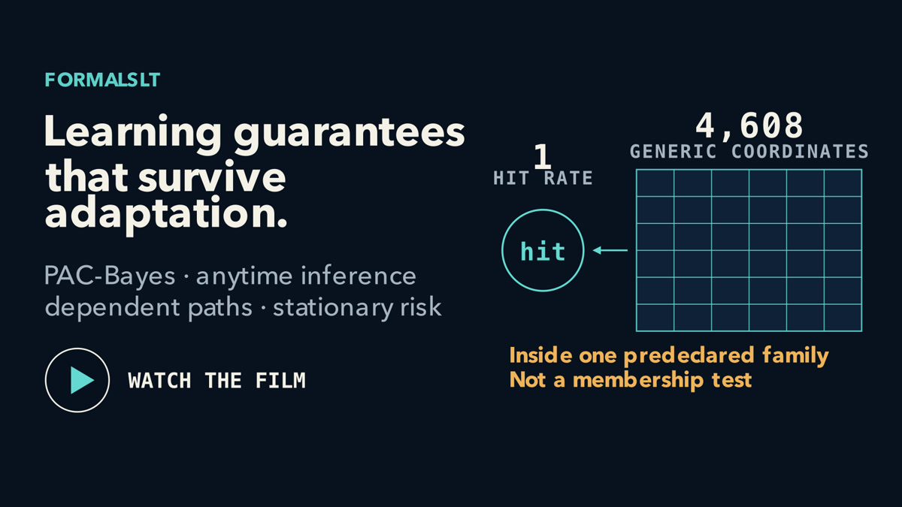
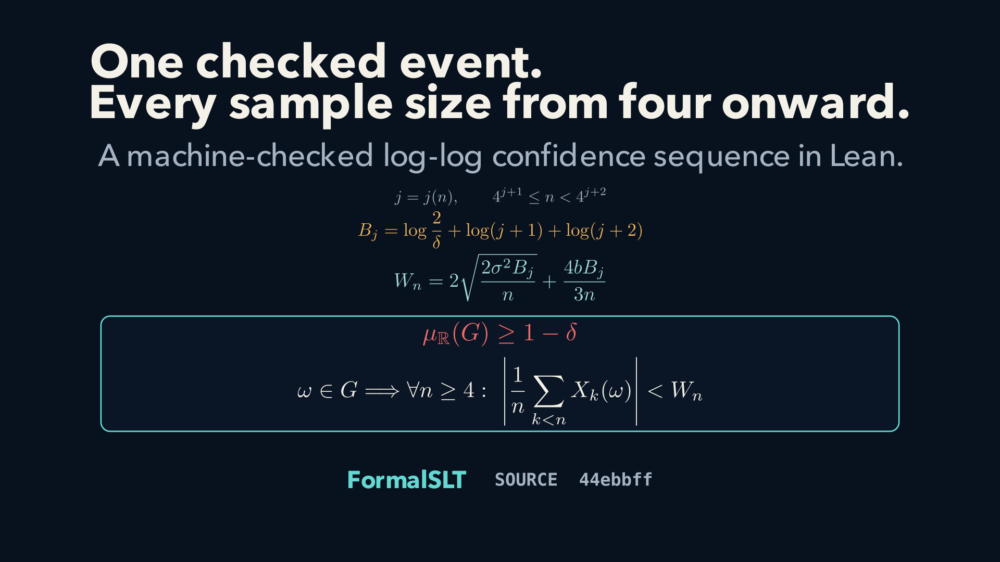

# FormalSLT

[](https://github.com/Robby955/FormalSLT/actions/workflows/ci.yml)
[](https://robby955.github.io/FormalSLT/)
[](https://github.com/Robby955/FormalSLT/releases/latest)
[](https://lean-lang.org/)
[](https://github.com/leanprover-community/mathlib4)
[](./LICENSE)

FormalSLT is a Lean 4 library for statistical learning theory and modern
finite-sample inference.

It develops reusable results in VC and Rademacher theory, metric entropy and
chaining, PAC-Bayes bounds, confidence sequences and e-processes, and learning
from adaptive or dependent trajectories. The goal is a coherent Lean
foundation in which classical learning theory and newer sequential methods can
be composed and extended.

Worked applications show how these parts of the library combine.

[Documentation](https://robby955.github.io/FormalSLT/) ·
[Theorem map](./docs/theorem-map.md) ·
[Search declarations](https://robby955.github.io/FormalSLT/search.html) ·
[Install](#install)

## Overview video

<p align="center">
  <a href="https://robby955.github.io/FormalSLT/#overview-film">
    
  </a>
</p>

Fixed-time guarantees can fail under repeated monitoring; one checked event
can cover repeated looks. The repo-wide film starts there, then maps reusable proof
infrastructure across VC and Rademacher theory, chaining, PAC-Bayes,
e-processes, and dependent-data inference. It establishes the platform and its
current interfaces; it does not claim end-to-end verification of an ML system.

[Play the responsive film](https://robby955.github.io/FormalSLT/#overview-film) ·
[Transcript](./media/formalslt-overview/TRANSCRIPT.md) ·
[Manim source](./media/formalslt-overview/) ·
[Pinned v0.2.0 film receipt](https://github.com/Robby955/FormalSLT/blob/v0.2.0/media/formalslt-overview/render-receipt.json)

## Theorem film: one event from sample size four onward

<p align="center">
  <a href="https://robby955.github.io/FormalSLT/#stitched-lil-film">
    
  </a>
</p>

A fixed-time bound assumes one fixed look. This Lean theorem gives one
measurable event `G`, with `mu.real(G) >= 1 - delta`, on which the running mean
of bounded, conditionally centered adapted increments stays inside an explicit
boundary for every sample size `n >= 4`. The increment bound,
conditional-centering equality, and conditional second-moment inequality are
stated almost everywhere.

[Watch the theorem film](https://robby955.github.io/FormalSLT/#stitched-lil-film) ·
[Lean theorem](./FormalSLT/AnytimeValid/PolynomialStitchedLIL.lean) ·
[checker](./examples/CheckPolynomialStitchedLILMeasurableEvent.lean) ·
[claim receipt](./media/stitched-lil-result-film/claim-receipt.json) ·
[film source](./media/stitched-lil-result-film/)

## Results

### Classical learning theory

FormalSLT includes Sauer-Shelah bounds for finite set families, VC-based
uniform-deviation and ERM excess-risk bounds for binary zero-one loss,
finite-sample Rademacher symmetrization, Massart bounds, contraction,
linear-predictor bounds, and metric-entropy estimates. Its chaining results
reach total-bounded spaces and continuous entropy-integral bounds while
keeping the required boundary, separability, and modulus assumptions explicit.

[VC source](./FormalSLT/VC/) ·
[Rademacher source](./FormalSLT/Rademacher/) ·
[chaining source](./FormalSLT/Covering/) ·
[theorem map](./docs/theorem-map.md)

### Anytime PAC-Bayes and empirical Bernstein

For an infinite IID sequence, one event controls every sample size `n ≥ 2` and
every admissible posterior. The bound uses Bessel sample variance and
measure-theoretic KL divergence. A separate forward construction handles
predictable residuals for sequential use. The all-sample result is uniform over
sample size, but it is not an optional-stopping theorem.

[Lean source](./FormalSLT/PACBayes/ContinuousInfiniteEmpiricalBernsteinStitch.lean) ·
[checker](./examples/CheckContinuousInfiniteEmpiricalBernsteinStitch.lean) ·
[positive-KL example](./examples/CheckContinuousInfiniteEmpiricalBernsteinGaussianWitness.lean)

### Adaptive trajectories

For a finite score family fixed in advance, one event allows the posterior and
tilt to depend on the observed prefix and time. With the geometric time
selector, the resulting width tends to zero. A separate theorem covers
measurable state and hypothesis spaces with a finite tilt family. These results
start from a deterministic initial state and bound prefix-conditional risk.

[finite-state source](./FormalSLT/StochasticDynamics/TrajectoryEmpiricalBernsteinPACBayesCountable.lean) ·
[measurable-space source](./FormalSLT/StochasticDynamics/ContinuousMeasurableTrajectoryEmpiricalBernsteinPACBayes.lean) ·
[worked checker](./examples/CheckTrajectoryEmpiricalBernsteinPACBayesCountableInformative.lean)

### Stationary and Markov risk

Prequential bounds combine with finite-depth Poisson corrections to control
stationary risk. One route uses a known contracting kernel. The empirical route
uses a finite catalog of contracting candidates and requires every source row
to be visited. A selected empirical contraction bound below one additionally
proves uniqueness of the true invariant law.

[known-kernel source](./FormalSLT/StochasticDynamics/StationaryPoissonDepthSelection.lean) ·
[candidate-family source](./FormalSLT/StochasticDynamics/EmpiricalStationaryCatalog.lean) ·
[worked checker](./examples/CheckEmpiricalStationaryCatalogInformative.lean)

### Controlled queue

For a 24-state controlled queue, the generic transition bound allocates
confidence across `48 × 48 × 2 = 4,608` coordinates. Under a specified
one-parameter refresh model, a single destination-hit statistic has a
row-independent conditional mean, and Lean proves that its parameter
discrepancy equals physical-row total variation. This example is retrospective
and conditional on the refresh model; it does not test family membership.

[application](./applications/controlled_queue/README.md) ·
[design](./docs/controlled-queue-application-design.md) ·
[Lean receipt](./FormalSLT/Applications/ControlledQueueSharpStructuredRetrospectiveReceipt.lean)

## Install

FormalSLT currently uses Lean 4.32.2 and Mathlib 4.32.2. The stable topic
imports are:

```lean
import FormalSLT.PACBayes
import FormalSLT.Sequential
import FormalSLT.StochasticDynamics
import FormalSLT.VC
```

Add the latest tagged release to a Lake project:

```lean
require «formal-slt» from git
  "https://github.com/Robby955/FormalSLT.git" @ "v0.2.0"
```

For unreleased work, pin a full commit SHA that you have reviewed rather than
the moving branch.

Then run:

```bash
lake update
lake exe cache get
lake build
```

[v0.2.0 release notes](./docs/releases/v0.2.0.md)

## Repository layout

- `FormalSLT/PACBayes`: PAC-Bayes inequalities and change-of-measure tools
- `FormalSLT/Rademacher`: symmetrization, contraction, and generalization bounds
- `FormalSLT/Covering`: metric entropy and chaining
- `FormalSLT/Sequential`: confidence sequences, e-processes, and Ville bounds
- `FormalSLT/StochasticDynamics`: adaptive paths, kernels, and stationary risk
- `FormalSLT/VC`: VC dimension, growth functions, and uniform convergence
- `examples`: small checker files for public results
- `applications`: end-to-end worked examples

## Verify

```bash
lake exe cache get
lake build FormalSLT
make examples
make tutorials
make api
make downstream
```

[Verification details](https://robby955.github.io/FormalSLT/readers/verification/)

## Papers and references

- [A Machine-Checked Anytime-Valid Confidence Sequence by the Method of Mixtures](https://github.com/Robby955/anytime-valid-mixture-cs/blob/main/paper/sneiderman-copa2026-anytime-valid-mixture-cs.pdf),
  accepted poster at [COPA 2026](https://copa-conference.com/#nav-program);
  forthcoming in PMLR 329
  ([artifact and reproduction](https://github.com/Robby955/anytime-valid-mixture-cs))
- [From Agents to Axioms: Verifier-Gated Lean Formalization for Statistical Learning Theory](https://openreview.net/pdf?id=EsEqPLc0ef), ICML 2026 AI for Math workshop
- [Literature notes](./docs/LITERATURE.md)
- [Source map](./docs/references.md)
- [Citation metadata](./CITATION.cff)

## Contributing

See [CONTRIBUTING.md](./CONTRIBUTING.md) and the
[good first issues](./docs/good-first-issues.md).

## License

MIT. See [LICENSE](./LICENSE).
