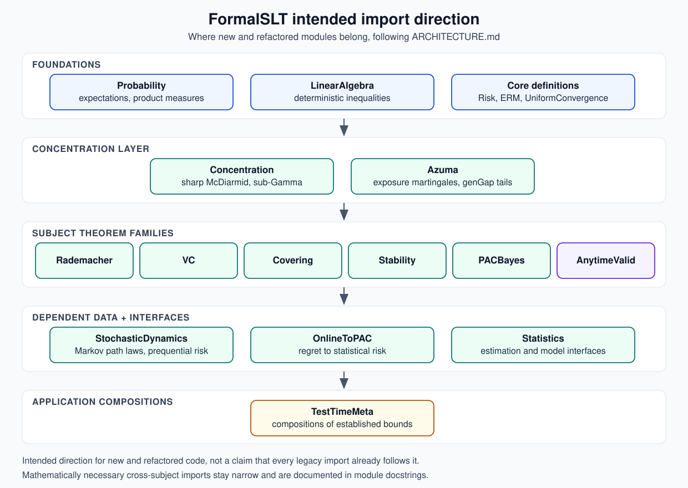

# FormalSLT System Architecture

This document describes how the four subsystems of this repository fit
together: the Lean library, the certificate compiler, the docs/manifest sync
layer, and the CI/release gate. Each subsystem exists to protect one
invariant. The invariant comes first in each section, because the invariant
is the design.



```
  compiler/specs/*.json
        |
        v
  compiler/compile.py  ----emits---->  FormalSLT/PACBayes/Generated/*.lean
        |                              examples/Check_*.lean
        v
  compiler/results/*.csv                       |
                                               v
  FormalSLT/*.lean  <---imports----  FormalSLT.lean (root)
        |                                      |
        v                                      v
  lake build FormalSLT  ------>  lake env lean examples/*.lean
        |                                      |
        v                                      v
  scripts/generate_proof_frontier_manifest.py --check
  scripts/check_doc_anchors.py
        |
        v
  .github/workflows/ci.yml  (gate for main / release-candidate)
        |
        v
  docs/*.md, README.md, TheoremPath page draft   (public claims)
```

## 1. Lean library (`FormalSLT/`, `FormalSLT.lean`, `examples/`)

**Invariant: no public claim outruns a kernel-checked theorem with the
standard axiom set `[propext, Classical.choice, Quot.sound]`.**

The library is layered; lower layers never import higher ones:

| Layer | Modules | Role |
|---|---|---|
| Core definitions | `Risk`, `ERM`, `UniformConvergence`, `GhostSample` | learning-theoretic objects |
| Probability utilities | `Probability.*` | finite union bounds, expectations, concentration primitives |
| Concentration | `Concentration.SharpMcDiarmid`, `Concentration.SubGamma.*`, `Azuma.*` | tail bounds and martingale infrastructure |
| Complexity routes | `Rademacher.*`, `VC.*`, `Covering.*` | symmetrization, VC, chaining/Dudley |
| Change-of-measure | `PACBayesKL`, `PACBayesBoundedLoss`, `PACBayesMcAllester`, `PACBayesSeeger`, `PACBayesBernstein`, `PACBayes.*` | PAC-Bayes track and Gaussian KL algebra |
| Stability | `AlgorithmicStability`, `Stability.*` | expected-gap and high-probability wrappers |
| Composition | `OnlineToPAC.*`, `TestTimeMeta.*` | flagship composed theorems |
| Generated | `PACBayes.Generated.Cert_*` | compiler outputs, committed and kernel-checked |

`FormalSLT.lean` imports every module, so `lake build FormalSLT` checks the
whole library. The `examples/Check*.lean` files are the test suite: each one
`#check`s public theorems and prints their axioms. A theorem is "public" in
this repo exactly when an example file audits it.

There is no Lean-side notion of partial coverage. A theorem either compiles
under the kernel or the build fails. The coverage question lives entirely in
the Python tooling (section 4).

## 2. Certificate compiler (`compiler/`)

**Invariant: every committed generated artifact is byte-for-byte reproducible
from its spec, and every emitted numeric budget is a true upper bound.**

Pipeline: `compiler/specs/<id>.json` -> `compiler/compile.py` -> two
artifacts, `FormalSLT/PACBayes/Generated/<id>.lean` (the certificate module)
and `examples/Check_<id>.lean` (the axiom audit), plus a sweep CSV under
`compiler/results/`.

The soundness-relevant checks live on the Python side as validation, and on
the Lean side as the actual proof:

- `normalize_spec` rejects supplied KL values below the true
  `kl_divergence(posterior, prior)` (a declared KL must be an upper bound);
- the complexity budget is ceiled to a rational before emission;
- the emitted theorem instantiates
  `finiteMcAllesterBoundedComplexity_badEventMass_le_delta`, so the Lean
  kernel re-derives the bound from scratch. A buggy compiler can emit a
  theorem that fails to compile; it cannot emit a false checked theorem.

Tests (`compiler/test_*.py`): KL upper-bound rejection regression, mirrors of
the Gaussian closed forms for the Route B lane, and the golden-file test
pinning committed `Cert_*` artifacts to the emitter output.

## 3. Docs and manifest sync (`docs/`, `scripts/`)

**Invariant: prose, counts, and theorem anchors never drift from source.**

Three mechanisms:

- `scripts/generate_proof_frontier_manifest.py --check` regenerates the
  proof-frontier manifest and fails if `docs/proof-frontier.md` or the counts
  are stale;
- `scripts/check_doc_anchors.py` verifies that every documented
  `FormalSLT/...lean:line` anchor in the release docs points at the named
  declaration;
- the lane documents (`docs/next-lane.md`,
  `docs/route-b-continuous-pac-bayes-blueprint-2026-06-10.md`,
  `docs/open-formalization-problems.md`) carry design intent between
  sessions and contributors. Lane docs state target signatures and explicit
  boundaries before code exists, and they are updated in the same PR when a
  signature moves.

Claims discipline beyond the scripts is manual and documented in
`docs/release-and-submission-strategy.md` (count and claim policy) and
`docs/assumptions-and-nonclaims.md` (scope statement).

## 4. CI and release gate (`.github/workflows/ci.yml`)

**Invariant: `main` and `release-candidate` never carry a broken build, a
proof-debt marker, a custom axiom, or stale tooling artifacts.**

CI order is cheapest-first:

1. Python tooling tests (`pytest compiler/`), including the generated-cert
   golden-file sync test; seconds, no Lean required;
2. doc-anchor audit; seconds;
3. elan install, Mathlib cache fetch, `lake build FormalSLT`;
4. `lake env lean` over every `examples/*.lean`;
5. proof-frontier manifest `--check`;
6. greps rejecting executable `sorry` / `admit` / `axiom` / `constant`;
7. line and module counts (informational).

Release flow: feature branch -> PR review -> `main`; release candidates are
tagged per `docs/release-and-submission-strategy.md` and audited with
`docs/public-release-checklist.md`. The README badge tracks CI on `main`.

## Environment requirements

Building requires network access to the Lean infrastructure hosts listed in
`AGENTS.md` (elan manifest, Mathlib olean cache). Environments that allow
only `github.com` can still run the Python test suite, fetch Mathlib source
for API inspection, and do docs work, but cannot verify Lean. Work produced
under that restriction must be labeled unverified until compiled.

## Where the architecture is heading

The active lanes and their design documents:

- continuous-posterior PAC-Bayes (Route B):
  `docs/route-b-continuous-pac-bayes-blueprint-2026-06-10.md`;
- continuous/total-bounded Dudley: `docs/next-lane.md`;
- milestone grouping for the next release: `docs/v0.2-milestone.md`;
- candidate Mathlib upstreams: `docs/upstream-candidates.md`.
