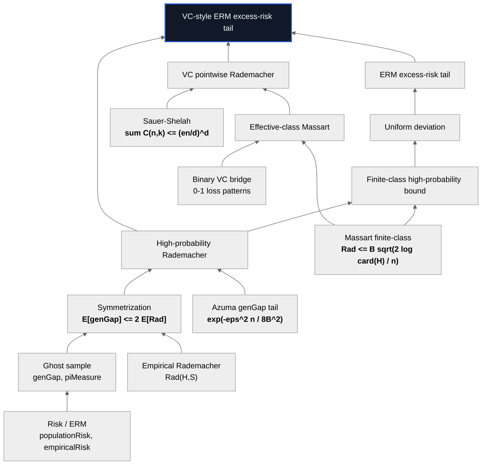
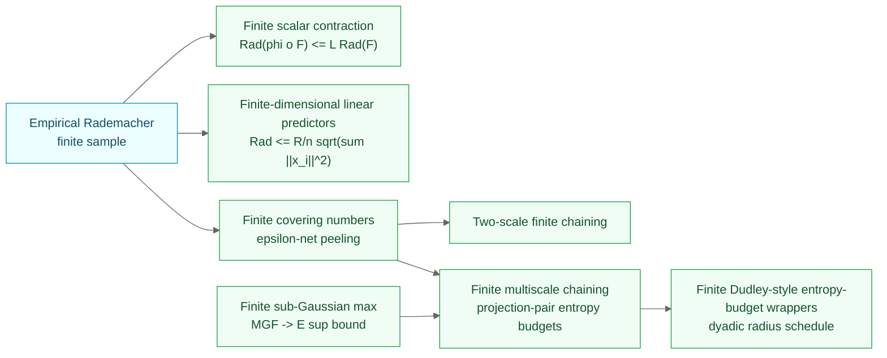
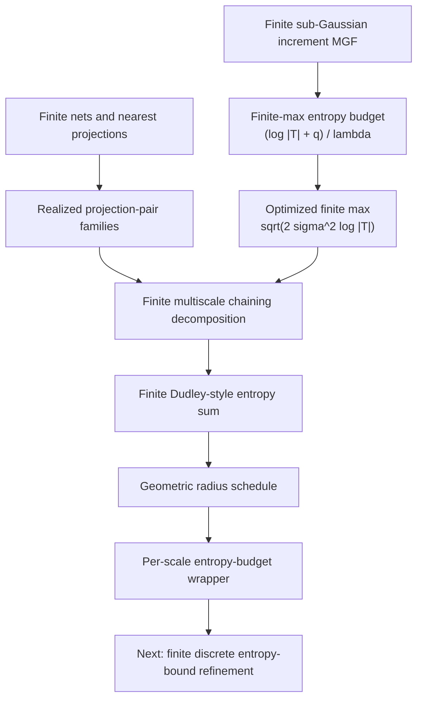
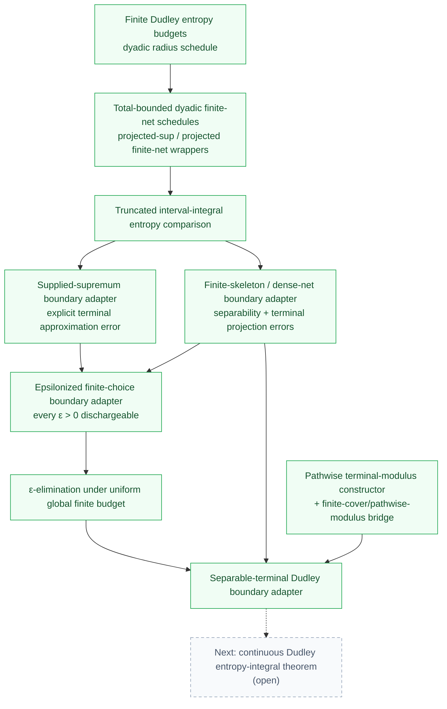
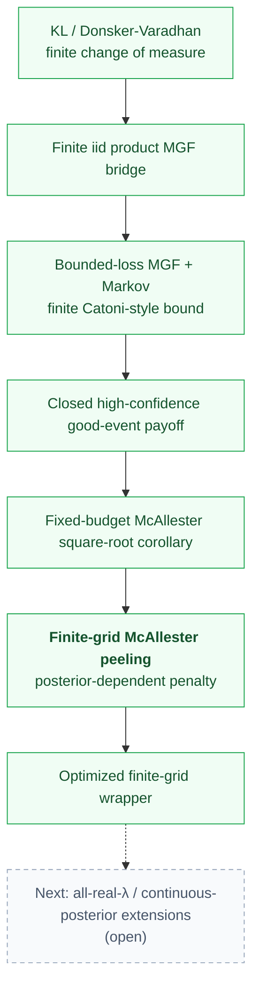
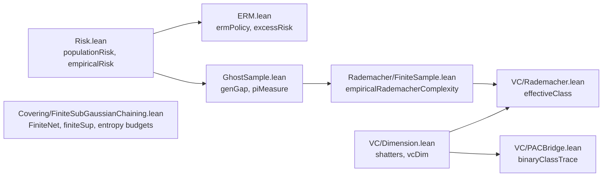

# Theorem-Dependency Diagrams

Visual companion to [`theorem-map.md`](./theorem-map.md). The README uses the
checked-in SVG asset; this page keeps Mermaid versions for readers who want to
scan the proof graph directly on GitHub.

## Core finite-class spine



## Extensions now attached to the spine



## Finite Dudley ladder

The chaining layer is deliberately finite. The current endpoint is a finite
dyadic entropy-budget statement, which is the right foundation before moving
toward integral comparisons.



## Unit-interval Dudley example

```mermaid
flowchart LR
    unit["UnitInterval = [0,1]"]
    tb["TotallyBounded Set.univ"]
    half["half mesh<br/>3 centers, radius 1/4"]
    quarter["quarter mesh<br/>5 centers, radius 1/8"]
    process["Rademacher linear process<br/>X(b,t)=sign(b)*t"]
    mgf["increment MGF"]
    inc["projection-pair increment<br/>sqrt(log 15)"]
    projected["projected quarter-mesh Dudley bound"]
    supplied["supplied supremum bound<br/>E[sup] <= projected bound"]

    unit --> tb
    unit --> half --> inc
    unit --> quarter --> inc
    process --> mgf --> inc --> projected --> supplied

    classDef index fill:#eff6ff,stroke:#2563eb,color:#1e3a8a;
    classDef checked fill:#f0fdf4,stroke:#16a34a,color:#14532d;
    class unit,tb index;
    class half,quarter,process,mgf,inc,projected,supplied checked;
## Conditional concentration toolkit

The concentration layer now has both the conditional sub-gamma MGF extractor
(`Concentration.SubGamma.*`) and the sharp bounded-differences route through
the exposure martingale.

```mermaid
flowchart TD
    bounded["Bounded increment<br/>|X| ≤ b a.s."]
    center["Conditional centering<br/>μ[X | m] = 0"]
    var["Conditional second moment<br/>μ[X² | m] ≤ σ²"]
    bennett["Bennett-Taylor pointwise inequality<br/>exp(λx) ≤ 1 + λx + λ²x²/(2(1−bλ/3))"]
    toolkit["Conditional-expectation toolkit<br/>Jensen, Markov, product, variance-from-square"]
    extractor["<b>Conditional sub-gamma MGF extractor</b><br/>μ[exp(λX) | m] ≤ exp(σ²λ²/(2(1−bλ/3))) on b·λ &lt; 3"]
    sharp["Sharp McDiarmid genGap tail<br/><b>exp(-eps^2 n / 2B^2)</b>"]

    bounded --> extractor
    center --> extractor
    var --> extractor
    bennett --> extractor
    toolkit --> extractor
    bounded --> sharp
    center --> sharp
    toolkit --> sharp

    classDef verified fill:#f5f3ff,stroke:#7c3aed,color:#3b0764;
    classDef future fill:#f8fafc,stroke:#94a3b8,color:#475569,stroke-dasharray: 5 4;
    class bennett,toolkit,extractor,sharp verified;
```

## Total-bounded Dudley boundary adapters

The finite Dudley entropy-budget layer now feeds a chain of total-bounded
boundary adapters (`Covering.TotalBoundedDudley`). Each step discharges more of
the continuous-boundary hypotheses from finite, checkable data; the continuous
Dudley entropy integral remains the open endpoint.



## PAC-Bayes finite confidence layer

The PAC-Bayes lane runs from the KL/Donsker-Varadhan change of measure through
a finite Catoni-style bound to a finite-grid McAllester peeling wrapper for
posterior-dependent penalties.



## Where each definition first appears



## See also

- [`theorem-map.md`](./theorem-map.md) for exact theorem names and statements.
- [`proof-spine.md`](./proof-spine.md) for a narrative walkthrough.
- [`assumptions-and-nonclaims.md`](./assumptions-and-nonclaims.md) for scope and assumptions.
- [`intuition.md`](./intuition.md) for plain-English explanations.
