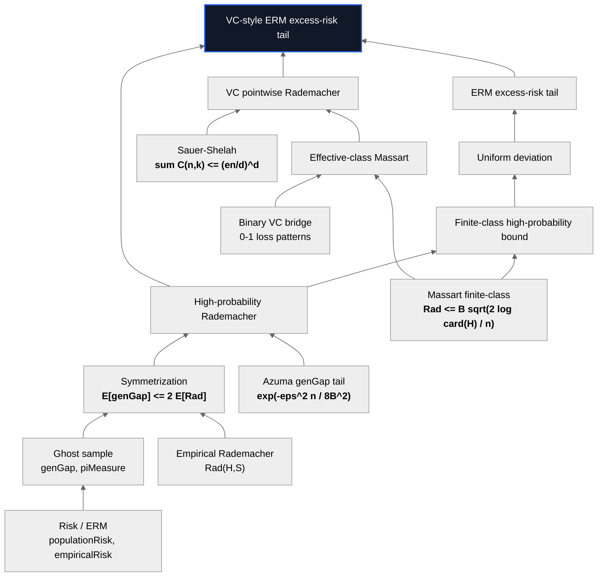
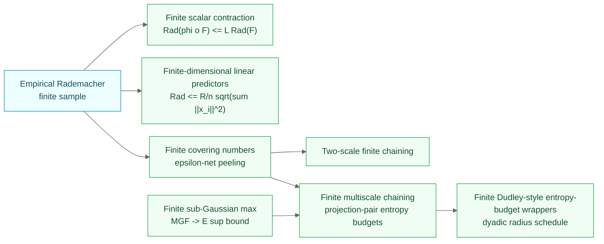
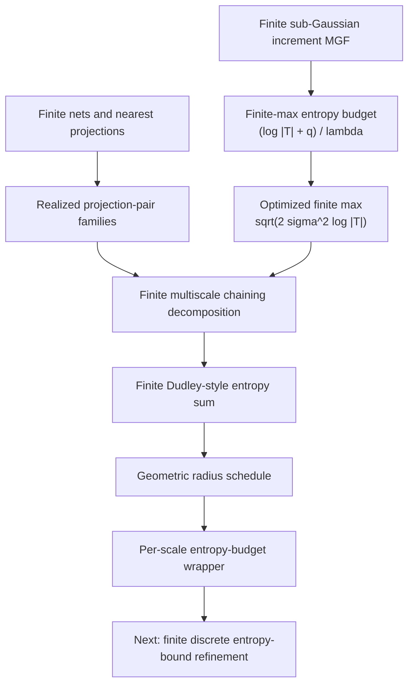
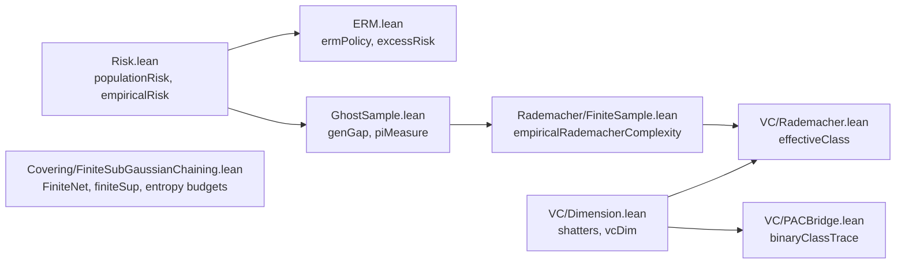

# Theorem-Dependency Diagrams

Visual companion to [`theorem-map.md`](./theorem-map.md). The README uses the
checked-in SVG asset; this page keeps Mermaid versions for readers who want to
scan the proof graph directly on GitHub.

## Core finite-class spine

## Extensions now attached to the spine

## Finite Dudley ladder

The chaining layer is deliberately finite. The current endpoint is a finite
dyadic entropy-budget statement, which is the right foundation before moving
toward integral comparisons.

## Where each definition first appears

## See also

- [`theorem-map.md`](./theorem-map.md) for exact theorem names and statements.
- [`proof-spine.md`](./proof-spine.md) for a narrative walkthrough.
- [`assumptions-and-nonclaims.md`](./assumptions-and-nonclaims.md) for scope and assumptions.
- [`intuition.md`](./intuition.md) for plain-English explanations.
