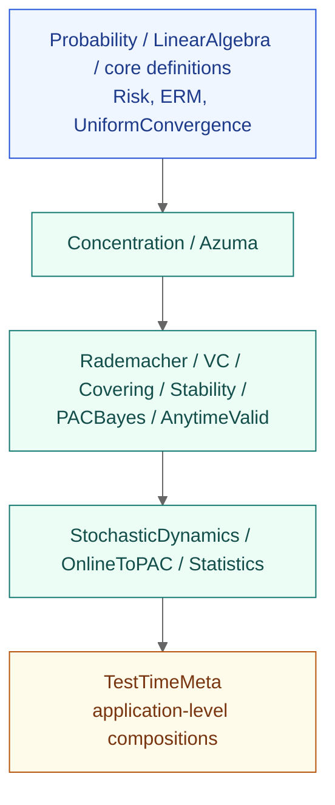
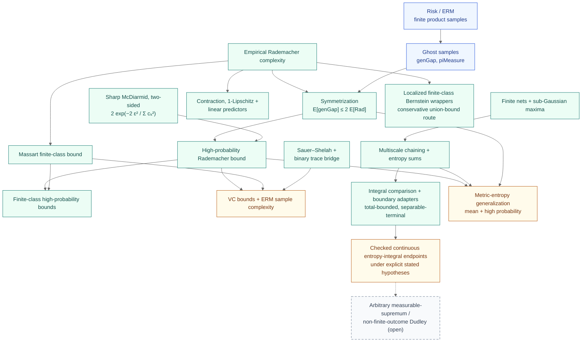
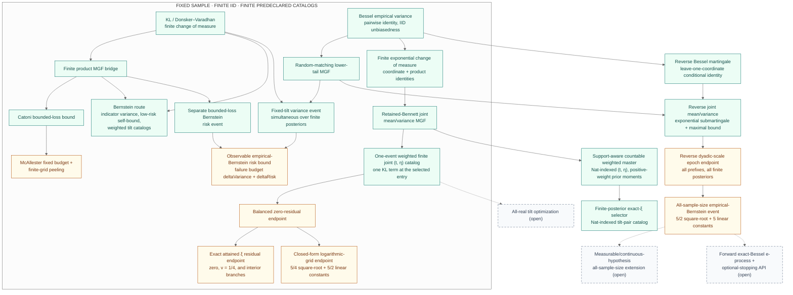
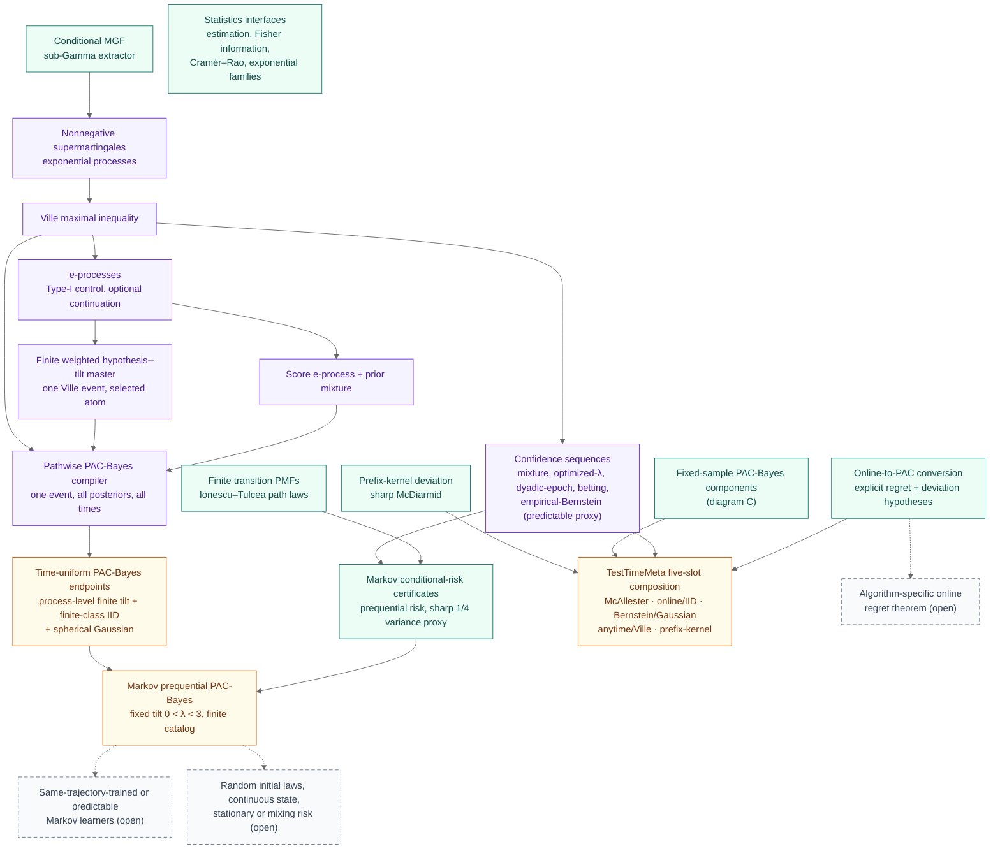

# Theorem-family diagrams

Visual companion to [`theorem-map.md`](./theorem-map.md). The README embeds the
checked-in SVG hero ([`theorem-chain.svg`](./theorem-chain.svg)); this page
holds four detailed Mermaid diagrams that render directly on GitHub.

All four diagrams are conceptual theorem-family maps, not literal import
graphs. Exact assumptions live in the theorem signatures and the checker files
under [`examples/`](../examples). Solid nodes are machine-checked surfaces;
dashed slate nodes marked "(open)" are genuinely open work. Status is encoded
in the label and stroke style, not in color alone.

## A. Architecture and public imports

The intended dependency direction from [`ARCHITECTURE.md`](../ARCHITECTURE.md).
This is a rule for new and refactored code, not a claim that every legacy
import already follows it; mathematically necessary cross-subject imports are
narrow and documented in module docstrings.

[Open the static architecture view.](./architecture-flowchart.svg)

Public topic umbrellas: `FormalSLT.PACBayes`, `FormalSLT.VC`,
`FormalSLT.Sequential`, and `FormalSLT.StochasticDynamics` re-export their
subject surfaces; `FormalSLT.lean` is the whole-library build umbrella.

## B. Classical learning, entropy, and localization

The finite learning spine and the metric-entropy lane. The sharp McDiarmid
bound shown is two-sided. The localized lane is a checked but conservative
finite union-bound route; it is not a completed nonconservative
random-threshold fast-rate theorem.

The localized wrappers consume finite Bernstein tails and finite union bounds
over the localized class; the algebraic centered-moment interfaces name the
whole-supremum obligation without discharging it.

## C. PAC-Bayes and empirical Bernstein

The classical change-of-measure branch contains fixed-tilt Catoni bounds and
fixed-budget or finite-predeclared-grid McAllester bounds. The separate-event
empirical-variance plus risk route assumes `n ≥ 2`, `0 < η · n < 2(n − 1)`,
and `0 < λ < 3n`; it uses separate `deltaVariance` and `deltaRisk` budgets,
supports separately weighted finite `η` and `λ` catalogs, and has two KL
appearances in the final bound. The joint route instead uses one predeclared
weighted finite `(t, η)` catalog and one shared event. Its entry may be selected
after seeing the sample and posterior, with one KL term plus that entry's
catalog-weighted confidence allocation. Those routes are fixed-sample and
finite-IID. The separate reverse-exchangeability route turns prefix means and
Bessel variances into reverse martingales, controls every prefix in each
dyadic epoch, and stitches the epochs into one infinite-IID event valid for
every `n >= 2`. All catalogs are declared before the sample is observed.

The finite joint route thresholds one prior-and-catalog master mixture, so the
selected entry may depend on the sample and the posterior while paying one KL
term. Its closed-form endpoint fixes the dyadic grid in advance through
`Nat.clog 2 n` and proves the optimizer coverage inside Lean; it does not assume
a sample- or posterior-dependent grid choice. The checked countable foundation
controls every positive-weight prior moment through one support-aware master
event. Its downstream layer applies the finite Donsker–Varadhan and residual
theorems to a sample- and finite-posterior-selected natural-number entry on
that same event. The stitched endpoint instead uses a telescoping confidence
allocation across reverse dyadic epochs and one finite-prefix/infinite-product
measure bridge. It is an offline all-sample-size theorem, not a forward
e-process or optional-stopping result. The variance events
bound the posterior average of per-hypothesis variances; they do not bound the
variance of the posterior-averaged loss.

## D. Anytime-valid, Markov, and composition

The sequential lane, the finite Markov lane, and the composition surfaces.
The empirical-Bernstein confidence sequence uses a predictable
conditional-variance proxy, not the exact Bessel sample variance.

The statistics interfaces preserve the hypotheses of the Mathlib results they
expose; they are shown without arrows because no theorem family above depends
on them.

The five TestTimeMeta slots are McAllester, online/IID, Bernstein/Gaussian,
anytime/Ville, and the sharp-McDiarmid prefix-kernel deviation.

## Nonclaims

These diagrams do not claim more than the theorem signatures state:

- The fixed-time random-matching score is not an e-process.
- Terminal random matchings at different sample sizes are not projectively
  nested.
- The checked countable master and selector use a finite hypothesis type and
  finite posterior over a predeclared natural-number catalog; they are not a
  countable-hypothesis posterior, all-real tilt optimizer, or time-uniform
  process.
- The finite time-uniform tilt master selects one declared atom; it is not a
  countable mixture, an arbitrary joint hypothesis--tilt posterior, an all-real
  tilt optimizer, or an i.i.d. loss specialization.
- The generic forward time-uniform PAC-Bayes endpoints do not imply the
  exact-Bessel result. The checked exact-Bessel all-sample-size theorem instead
  uses offline reverse epochs and does not provide optional-stopping semantics.
- The posterior average of per-hypothesis variances is not the variance of
  the posterior-averaged loss.
- The checked Dudley boundary adapters are not an unrestricted
  arbitrary-measurable-supremum theory.
- The Gaussian time-uniform endpoints cover fixed spherical-Gaussian
  prior/posterior pairs and finite declared catalogs, not every posterior or
  every real tilt.
- The Markov certificates do not cover same-trajectory training, random
  initial laws, continuous state spaces, or stationary/mixing risk unless a
  theorem explicitly says so.
- No diagram on this page makes a novelty or priority claim; adjacent work is
  surveyed in [`related-work.md`](./related-work.md).

## See also

- [`frontier-diagram.svg`](./frontier-diagram.svg) for a static checked-versus-open overview.
- [`theorem-map.md`](./theorem-map.md) for exact theorem names and statements.
- [`proof-spine.md`](./proof-spine.md) for a narrative walkthrough.
- [`assumptions-and-nonclaims.md`](./assumptions-and-nonclaims.md) for the
  full scope statement.
- [`intuition.md`](./intuition.md) for plain-English explanations.
