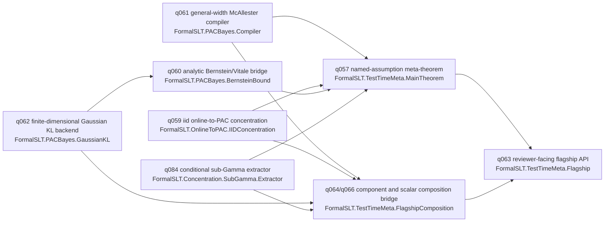
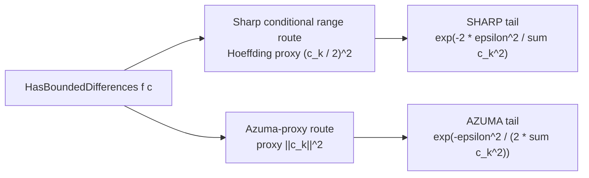

# PAC-Bayes Test-Time Flagship Theorem

This packet is the reviewer-facing map for the integrated q062/q063/q064/q066 stack.
It is meant to let a paper reader find the public theorem without reading every
helper module.

## Public Theorem

The theorem to cite is:

```lean
FormalSLT.TestTimeMeta.pacBayesTestTimeFlagship_theorem :
  ∀ (certificate : FormalSLT.TestTimeMeta.FlagshipCertificate),
    FormalSLT.TestTimeMeta.flagshipConclusion certificate
```

This statement was copied from:

```bash
~/.elan/bin/lake env lean /tmp/q065_extract.lean
```

The public certificate type is `FormalSLT.TestTimeMeta.FlagshipCertificate`. It
contains:

- `user : FlagshipUserSupplied`
- `derived : FlagshipDerivedContributions`
- `assembledBound : user.populationRisk ≤ flagshipBound user derived`

The public conclusion expands to:

```lean
certificate.user.populationRisk ≤
  flagshipBound certificate.user certificate.derived
```

The proof of `pacBayesTestTimeFlagship_theorem` routes through
`FormalSLT.TestTimeMeta.pacBayesTestTimeMeta_theorem`; q063 is an API cleanup,
not a replacement proof.

## Dependency Diagram



Current integration branch status:

- q061, q059, q062, q084, q057, and q063 are present.
- q060 analytic Bernstein/Vitale support is present.
- q064 component-to-flagship composition is present. The source q064 commit was
  `8b6fd34`; this packet branch replays it as `8c76b62`.
- q066 scalar assembly is present: `flagshipCertificate_from_components` now
  consumes component gap inequalities through `FlagshipScalarComponentBounds`
  rather than a single `hassembled` proof.

## Sharp-vs-Azuma Boundary

The sharp and Azuma routes are separate. Do not label the Azuma-proxy route as
sharp.



Sharp, axiom-clean path with exponent `exp(-2 * epsilon^2 / sum c_k^2)`:

- `FormalSLT.Concentration.mcdiarmid_of_hasBoundedDifferences_sharp`
- `FormalSLT.Concentration.mcdiarmid_of_hasBoundedDifferences_sharp_lower`
- `FormalSLT.Concentration.mcdiarmid_twoSided_of_hasBoundedDifferences_sharp`
- `FormalSLT.Azuma.ExposureMartingale.sharp_mcdiarmid_inequality_iid_const_width`
- `FormalSLT.Azuma.ExposureMartingale.hasBoundedDifferences_tail_sharp`

Azuma-proxy path with looser exponent
`exp(-epsilon^2 / (2 * sum c_k^2))`:

- the `GenGapTail` / `ExposureMartingale` Azuma-proxy route, where the
  increment proxy is `||c||^2`, not `(c / 2)^2`.

The claimability, faithfulness, and non-vacuousness source-of-truth report is
`/Users/robsneiderman/Projects/theorempath/HQ/FORMALSLT_CLAIMABILITY_2026-06-08.md`.
This packet keeps the theorem-boundary summary here and leaves that report as
the verdict source.

## What Is Proved

| Component | Representative declaration | Status |
| --- | --- | --- |
| General-width McAllester compiler | `PACBayesCertificateCompiler.compileGeneralWidth_sound` | Proved in Lean from the finite PAC-Bayes McAllester bound for losses in `[0, b]`. |
| IID online-to-PAC deviation | `iidDeviationBadEventMass_le_exp_of_sharpMcDiarmid`, `cesaBianchi_iid` | Proved in Lean from q049 sharp additive McDiarmid plus finite online-to-PAC algebra. |
| Finite-dimensional Gaussian KL backend | `sphericalGaussianKL_eq_closedForm`, `diagonalGaussianKL_eq_sum_closedForm` | Proved in Lean for the finite-dimensional Gaussian parameter surface and closed-form KL expression. |
| Conditional sub-Gamma extractor | `condSubGammaMGF_of_bounded_centered_condVariance` | Proved in Lean for bounded centered variables with conditional variance control. |
| Named meta-theorem | `pacBayesTestTimeMeta_theorem` | Proved in Lean as the q057 named-assumption framework theorem. |
| Reviewer-facing flagship theorem | `pacBayesTestTimeFlagship_theorem` | Proved in Lean by converting the q063 certificate object to the q057 theorem. |
| Component-to-flagship bridge | `flagshipCertificate_from_components` | Proved in Lean by deriving the q063 contribution bundle from q061/q059/q062/q060 component surfaces, deriving the scalar assembly from component gap inequalities, and then invoking the q063 theorem. |

## What Is Still Certificate-Supplied

| Item | Where it appears | Why it is still supplied |
| --- | --- | --- |
| Problem-specific scalar gap decomposition | `FlagshipScalarComponentBounds` | q066 derives the final `flagshipBound` comparison from component gap inequalities. A concrete application still supplies the problem-specific decomposition of population risk into the named gaps. |
| Component contribution magnitudes | `FlagshipDerivedContributions` | q064 derives the McAllester, iid online-to-PAC, and Gaussian/Bernstein slots from q061/q059/q062/q060 routes. |
| Anytime Ville contribution | `anytimeVilleContribution` | q084 supplies the conditional sub-Gamma extractor. This q064 bridge keeps the final anytime contribution value explicit. |
| Prefix-kernel contribution | `prefixKernelContribution` | The q057/q063/q064 surface keeps the prefix-kernel contribution named instead of silently absorbing it. |
| Problem-specific algorithmic regret certificate | Input to q059/q064 online contribution | The framework proves conversion from a regret certificate; a concrete online learner still supplies its regret proof/certificate. |
| Continuous-prior PAC-Bayes penalty gate | q056/q060/q062 bridge assumptions | The Gaussian KL backend is finite-dimensional and closed-form. It is not a general Radon-Nikodym KL theorem for arbitrary continuous priors. |

## Exact Component Statements Used For Orientation

```lean
@FormalSLT.PACBayes.PACBayesCertificateCompiler.compileGeneralWidth_sound :
  ∀ {ι : Type u_1} {Z : Type u_2}
    [Fintype Z] [MeasurableSpace Z] [MeasurableSingletonClass Z]
    [Fintype ι] [Nonempty ι]
    (spec : FormalSLT.PACBayes.PACBayesCertificateSpec ι Z)
    (lossBound : ℝ),
    0 < spec.sampleSize →
      FormalSLT.PACBayesKL.IsPMF spec.dataLaw →
        FormalSLT.PACBayesKL.IsFullSupportPMF spec.prior →
          0 < spec.complexityBound →
            0 < spec.delta →
              0 ≤ lossBound →
                (∀ (i : ι) (z : Z),
                  0 ≤ spec.loss i z ∧ spec.loss i z ≤ lossBound) →
                  FormalSLT.PACBayes.PACBayesCertificateCompiler.compileGeneralWidth
                    lossBound spec
```

```lean
@FormalSLT.PACBayes.sphericalGaussianKL_eq_closedForm :
  ∀ {d : ℕ}
    (posterior prior : FormalSLT.PACBayes.SphericalGaussianParams d),
    FormalSLT.PACBayes.sphericalGaussianKL posterior prior =
      FormalSLT.PACBayes.sphericalGaussianKLClosedForm posterior prior
```

```lean
@FormalSLT.OnlineToPAC.cesaBianchi_iid :
  ∀ {T : ℕ},
    0 < T →
      ∀ {Ω : Type u_1} [MeasurableSpace Ω] (μ : MeasureTheory.Measure Ω)
        (input : FormalSLT.OnlineToPAC.BoundedLossRegretConversionInput T)
        (X : Fin T → Ω → ℝ) (ω : Ω) {eps : ℝ} (regretRate : ℝ),
        0 ≤ input.lossBound →
          (∀ (t : Fin T),
            0 ≤ input.populationLoss t ∧
              input.populationLoss t ≤ input.lossBound) →
            (∀ (t : Fin T),
              0 ≤ input.empiricalLoss t ∧
                input.empiricalLoss t ≤ input.lossBound) →
              (∀ (t : Fin T), input.populationLoss t = ∫ (x : Ω), X t x ∂μ) →
                (∀ (t : Fin T), input.empiricalLoss t = X t ω) →
                  eps ≤ input.deviationBound →
                    ω ∉ FormalSLT.Probability.IIDConcentration.iidDeviationBadEvent μ X eps →
                      FormalSLT.OnlineToPAC.averageEmpiricalLoss input ≤
                          input.comparatorEmpiricalLoss + input.regretBound / ↑T →
                        input.regretBound / ↑T ≤ regretRate →
                          FormalSLT.OnlineToPAC.averagePopulationLoss input ≤
                            input.comparatorEmpiricalLoss + regretRate +
                              input.deviationBound
```

```lean
@FormalSLT.TestTimeMeta.flagshipCertificate_from_components :
  ∀ {ι : Type u_1} {Z : Type u_2} {T d : ℕ}
    (user : FormalSLT.TestTimeMeta.FlagshipUserSupplied)
    (mcAllesterSpec : FormalSLT.PACBayes.PACBayesCertificateSpec ι Z)
    (onlineInput : FormalSLT.OnlineToPAC.BoundedLossRegretConversionInput T)
    (onlineRegretRate : ℝ)
    (gaussianBernsteinSpec :
      FormalSLT.PACBayes.ContinuousPriorPosteriorSpec
        (FormalSLT.PACBayes.GaussianParameterSpace d))
    (anytimeContribution prefixKernelContribution : ℝ)
    (hmcAllester :
      0 ≤ FormalSLT.TestTimeMeta.flagshipMcAllesterContribution mcAllesterSpec)
    (honline :
      0 ≤ FormalSLT.TestTimeMeta.flagshipOnlineIidContribution
        onlineInput onlineRegretRate)
    (hgaussianBernstein :
      0 ≤ FormalSLT.TestTimeMeta.flagshipGaussianBernsteinContribution
        gaussianBernsteinSpec)
    (hanytime : 0 ≤ anytimeContribution)
    (hprefix : 0 ≤ prefixKernelContribution)
    (mcAllesterGap onlineGap gaussianBernsteinGap anytimeGap prefixGap : ℝ)
    (scalarBounds :
      FormalSLT.TestTimeMeta.FlagshipScalarComponentBounds user
        (FormalSLT.TestTimeMeta.flagshipDerivedContributionsOfComponents
          mcAllesterSpec onlineInput onlineRegretRate gaussianBernsteinSpec
          anytimeContribution prefixKernelContribution hmcAllester honline
          hgaussianBernstein hanytime hprefix)
        mcAllesterGap onlineGap gaussianBernsteinGap anytimeGap prefixGap),
    FormalSLT.TestTimeMeta.flagshipConclusion
      (FormalSLT.TestTimeMeta.flagshipCertificateOfComponents
        user mcAllesterSpec onlineInput onlineRegretRate gaussianBernsteinSpec
        anytimeContribution prefixKernelContribution hmcAllester honline
        hgaussianBernstein hanytime hprefix mcAllesterGap onlineGap
        gaussianBernsteinGap anytimeGap prefixGap scalarBounds)
```

## Axiom Audit

The focused public audits are:

```bash
~/.elan/bin/lake env lean examples/CheckFlagship.lean
~/.elan/bin/lake env lean examples/CheckGaussianKL.lean
~/.elan/bin/lake env lean examples/CheckOnlineToPACIID.lean
~/.elan/bin/lake env lean examples/CheckSubGammaExtractor.lean
~/.elan/bin/lake env lean examples/CheckFlagshipComposition.lean
```

For q063, `examples/CheckFlagship.lean` reports:

```text
'FormalSLT.TestTimeMeta.flagshipBound_eq_testTimeMetaBound' depends on axioms: [propext, Classical.choice, Quot.sound]
'FormalSLT.TestTimeMeta.pacBayesTestTimeFlagship_theorem' depends on axioms: [propext, Classical.choice, Quot.sound]
'FormalSLT.TestTimeMeta.FlagshipWorkedExample.flagshipWorkedExample_certificate' depends on axioms: [propext,
 Classical.choice,
 Quot.sound]
```

For q064, `examples/CheckFlagshipComposition.lean` reports:

```text
'FormalSLT.TestTimeMeta.flagshipMcAllesterContribution_from_compileGeneralWidth' depends on axioms: [propext,
 Classical.choice,
 Quot.sound]
'FormalSLT.TestTimeMeta.flagshipOnlineIidContribution_from_iidRegretConversion' depends on axioms: [propext,
 Classical.choice,
 Quot.sound]
'FormalSLT.TestTimeMeta.flagshipGaussianBernsteinContribution_from_sphericalGaussian' depends on axioms: [propext,
 Classical.choice,
 Quot.sound]
'FormalSLT.TestTimeMeta.flagshipDerivedContributions_from_components' depends on axioms: [propext,
 Classical.choice,
 Quot.sound]
'FormalSLT.TestTimeMeta.flagshipScalarAssembly_from_componentInequalities' depends on axioms: [propext,
 Classical.choice,
 Quot.sound]
'FormalSLT.TestTimeMeta.flagshipCertificate_from_components' depends on axioms: [propext, Classical.choice, Quot.sound]
'FormalSLT.TestTimeMeta.FlagshipComponentWorkedExample.flagshipComponentWorkedExample_scalarAssembly' depends on axioms: [propext,
 Classical.choice,
 Quot.sound]
'FormalSLT.TestTimeMeta.FlagshipComponentWorkedExample.flagshipComponentWorkedExample_certificate' depends on axioms: [propext,
 Classical.choice,
 Quot.sound]
```

## Paste-Ready Paper Paragraph

We formalize a finite-sample PAC-Bayes test-time meta-theorem in Lean 4. The
public theorem `FormalSLT.TestTimeMeta.pacBayesTestTimeFlagship_theorem` states
that a single `FlagshipCertificate` implies the population-risk bound
`flagshipConclusion certificate`. The certificate separates user-supplied
quantities, such as sample size, confidence, loss width, and empirical risk,
from derived contributions supplied by checked component theorems: the q061
general-width McAllester compiler, the q059 iid online-to-PAC conversion from
the sharp McDiarmid path, the q062 finite-dimensional Gaussian KL backend with
q060 Bernstein/Vitale support, and the q084 conditional sub-Gamma extractor.
The q064/q066 composition bridge derives the named contribution bundle from
those component surfaces and constructs a q063 certificate after deriving the
scalar flagship bound from component gap inequalities. The theorem is
axiom-clean against `[propext, Classical.choice, Quot.sound]` and routes
through the named-assumption q057 meta-theorem, giving a reviewer-facing
statement without hiding the remaining certificate-supplied parts.

For a longer paper-section draft with theorem wording, proof-route prose, Lean
declaration citations, and nonclaim boundaries, see
`docs/pac-bayes-test-time-paper-section.md`.

## Focused Audit Script

Run:

```bash
scripts/audit_flagship_stack.sh
```

The script checks the q062/q063/q064/q066 flagship surface, including
`examples/CheckFlagshipComposition.lean`.

The q068 integration run also passed:

- `~/.elan/bin/lake exe cache get` in `4.361s` wallclock.
- `~/.elan/bin/lake build FormalSLT` in `1.496s` wallclock.
- Generated certificate builds for `Cert_A` through `Cert_E` in `5.53s`
  wallclock.
- `for f in examples/*.lean; do ~/.elan/bin/lake env lean "$f"; done` in
  `107.63s` wallclock.
- `python3 scripts/generate_proof_frontier_manifest.py --check`.
- No `sorry` / `admit` matches in `FormalSLT` or `examples`.
- No custom `axiom` / `constant` matches in `FormalSLT` or `examples`.
- `git diff --check`.
