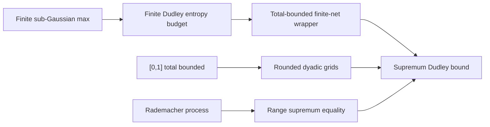

# FormalSLT v0.1 Artifact Map

Date: 2026-06-01
Worktree: `/private/tmp/formalslt-nonfinite-unit-interval`
Branch: `local/nonfinite-unit-interval-20260531`
Snapshot: local working tree. Run `git rev-parse HEAD` before citing a commit.

This map turns the current checked FormalSLT state into a v0.1 research
artifact plan. It is not a release note and not a public announcement. Its job
is to identify the theorem chain, file anchors, proof gaps, diagrams, and paper
outline needed for a technical note and TheoremPath page.

## v0.1 Claim

FormalSLT v0.1 should make one narrow claim:

> FormalSLT contains checked Lean theorem chains for finite-class
> concentration and finite-net empirical-process bounds, including a
> countable-time finite-class confidence-sequence wrapper and a concrete
> non-finite `[0,1]` Dudley bridge through rounded dyadic finite nets.

This is stronger than a theorem inventory and weaker than a claim that the
repo formalizes all of statistical learning theory.

## Current Verification Snapshot

Fresh checks run from this worktree:

```bash
lake env lean examples/CheckUnitIntervalDudley.lean
lake env lean examples/CheckTwoPointDudley.lean
lake env lean examples/CheckFiniteUnionBound.lean
lake env lean examples/CheckUniformConvergence.lean
lake env lean examples/CheckV01Usability.lean
python3 scripts/generate_proof_frontier_manifest.py --check
git diff --check
```

Results:

- `CheckUnitIntervalDudley.lean`: `CHECK_UNIT_EXIT=0`
- `CheckTwoPointDudley.lean`: `CHECK_TWO_POINT_EXIT=0`
- `CheckFiniteUnionBound.lean`: `CHECK_UNION_EXIT=0`
- `CheckUniformConvergence.lean`: `CHECK_UNIFORM_EXIT=0`
- `CheckV01Usability.lean`: `CHECK_V01_EXIT=0`
- Proof-frontier manifest check: `MANIFEST_CHECK_EXIT=0`
- Diff whitespace check: `DIFF_CHECK_EXIT=0`
- Executable proof-debt scan over `FormalSLT/**/*.lean` and
  `examples/**/*.lean`: clean after stripping comments.

Printed theorem axiom profiles stay inside the expected mathlib profile:

```text
[propext, Classical.choice, Quot.sound]
```

Some declarations use smaller subsets such as `[propext]` or
`[propext, Quot.sound]`.

## Headline Chain A: Anytime Finite-Class Hoeffding

Purpose: show that the repo has a checked finite-class concentration spine
that reaches a countable-time confidence-sequence surface for `[0,1]` losses.


Main anchors:

| Role | Declaration | Anchor |
|---|---|---|
| Finite budgeted union bound | `finiteMeasureUnionBound_budget` | `FormalSLT/Probability/FiniteUnionBound.lean:143` |
| Equal-cardinality union budget | `finiteMeasureUnionBound_cardInv` | `FormalSLT/Probability/FiniteUnionBound.lean:198` |
| Countable dyadic budget sum | `finiteDyadicTimeBudget_tsum_le` | `FormalSLT/UniformConvergence.lean:244` |
| Countable-time class union bound | `countableTimeClassUnionBound_dyadicBudget` | `FormalSLT/UniformConvergence.lean:286` |
| Route-facing named radius | `zeroOneDyadicFiniteClassConfidenceRadius` | `FormalSLT/UniformConvergence.lean:333` |
| Named-radius sample-size inversion | `zeroOneDyadicFiniteClassConfidenceRadius_le_of_sampleSize_ge` | `FormalSLT/UniformConvergence.lean:3748` |
| Finite-prefix variable-radius event | `finitePrefixFiniteClassDeviationFromHoeffding_zeroOneRange_timeVaryingRadius` | `FormalSLT/UniformConvergence.lean:3127` |
| Finite-prefix Hoeffding discharge | `finitePrefixFiniteClassDeviationFromHoeffding_zeroOneRange_timeVaryingRadius_fromHoeffding` | `FormalSLT/UniformConvergence.lean:3202` |
| Countable-time Hoeffding wrapper | `anytimeFiniteClassDeviationFromHoeffding_zeroOneRange_timeVaryingRadius_fromHoeffding` | `FormalSLT/UniformConvergence.lean:3318` |
| Exists-form named-radius wrapper | `anytimeFiniteClassDeviationFromHoeffding_zeroOneRange_namedRadius_exists_fromHoeffding` | `FormalSLT/UniformConvergence.lean:3582` |
| Confidence-sequence failure event | `finiteClassConfidenceSequenceFailureEvent` | `FormalSLT/UniformConvergence.lean:3624` |
| Confidence-sequence assumption bundle | `FiniteClassConfidenceSequence` | `FormalSLT/UniformConvergence.lean:3641` |
| Confidence-sequence failure bound | `anytimeFiniteClassDeviationFromHoeffding_zeroOneRange_confidenceSequence_fromHoeffding` | `FormalSLT/UniformConvergence.lean:3663` |
| Bundled confidence-sequence API | `FiniteClassConfidenceSequence.failure_probability_le` | `FormalSLT/UniformConvergence.lean:3718` |

What this proves:

- The theorem controls a simultaneous all-times and all-hypotheses bad event.
- The time allocation uses a dyadic summable budget.
- The final surface has a named confidence radius.
- The theorem is finite-class: the hypothesis type has `[Fintype H]` and
  `[Nonempty H]`.

What it does not prove:

- No martingale/e-process Ville theorem is claimed here.
- No infinite hypothesis-class confidence sequence is claimed.
- No data-adaptive stopping theorem is claimed beyond the stated countable-time
  union-bound surface.

## Headline Chain B: Non-Finite `[0,1]` Dudley Bridge

Purpose: show that finite sub-Gaussian chaining machinery reaches a concrete
non-finite metric index space through total boundedness, rounded dyadic finite
nets, and a checked supplied-supremum adapter.



Main finite-chaining anchors:

| Role | Declaration | Anchor |
|---|---|---|
| Finite expected-sup MGF bound | `finite_expectedSup_le_of_mgf_log` | `FormalSLT/Covering/FiniteSubGaussianChaining.lean:744` |
| Sub-Gaussian finite max wrapper | `finite_expectedSup_le_of_subGaussian_mgf_sqrt` | `FormalSLT/Covering/FiniteSubGaussianChaining.lean:839` |
| Finite Dudley entropy budget | `finite_dudley_entropy_sum_coveringNumbers_geometric_entropy_budget` | `FormalSLT/Covering/FiniteSubGaussianChaining.lean:2343` |
| Supplied-supremum total-bounded adapter | `finite_supFunctional_dudley_totalBounded_dyadic_entropy_truncatedIntervalIntegral_comparison` | `FormalSLT/Covering/TotalBoundedDudley.lean:751` |

Main `[0,1]` anchors:

| Role | Declaration | Anchor |
|---|---|---|
| Unit interval is totally bounded | `unitInterval_totallyBounded_univ` | `FormalSLT/Covering/UnitIntervalDudley.lean:47` |
| Rounded projection radius `1 / 2^(level+1)` | `unitIntervalDyadicGridRoundProject_dist_le` | `FormalSLT/Covering/UnitIntervalDudley.lean:323` |
| Rounded-grid net uses process distance | `unitIntervalRoundedDyadicGridNet_dist` | `FormalSLT/Covering/UnitIntervalDudley.lean:1231` |
| Supremum equals range `sSup` for this process | `unitIntervalRademacherLinearSup_sSup_range` | `FormalSLT/Covering/UnitIntervalDudley.lean:983` |
| Projected rounded-grid Dudley bound | `unitIntervalRademacherLinear_roundedDyadicGrid_dudley_m_bound` | `FormalSLT/Covering/UnitIntervalDudley.lean:1631` |
| Supplied-supremum rounded-grid Dudley bound | `unitIntervalRademacherLinearSup_roundedDyadicGrid_dudley_m_bound` | `FormalSLT/Covering/UnitIntervalDudley.lean:2066` |
| Prefix-free supplied-supremum version | `unitIntervalRademacherLinearSup_roundedDyadicGrid_dudley_m_bound_prefixFree` | `FormalSLT/Covering/UnitIntervalDudley.lean:2098` |
| Evaluated one-step scalar corollary | `unitIntervalRademacherLinearSup_dudley_m1_bound_constEntropy_eval` | `FormalSLT/Covering/UnitIntervalDudley.lean:2482` |

What this proves:

- The index type is the non-finite unit interval, not a finite ambient type.
- The module extracts and constructs finite nets over `[0,1]`.
- Nearest-grid rounding gives the sharper radius `1 / 2^(level+1)`.
- For the concrete Rademacher linear process, the supplied supremum is tied to
  the actual range supremum by checked order-supremum lemmas.
- The final finite-horizon theorem works for arbitrary finite `m`.

What it does not prove:

- No full continuous Dudley entropy integral is claimed.
- No general separability theorem is claimed.
- No arbitrary measurable supremum construction is claimed.
- The theorem remains a finite-horizon dyadic finite-net bridge.

## Supporting Library Surface

The v0.1 note should mention, but not headline, these already checked families:

- Rademacher symmetrization and finite-class high-probability bounds.
- VC sample-complexity wrappers.
- PAC-Bayes finite bounded-loss and finite-grid peeling wrappers.
- Algorithmic stability expected-gap and high-probability wrappers.
- Localized Rademacher deterministic and conservative finite fast-rate shells.

These are evidence of scope, but the paper should not become a catalog. The
paper should use them as context and make the two headline chains above the
main contribution.

## Proof Gaps and Nonclaims

These are the exact gaps the note and TheoremPath page should state.

1. **Continuous Dudley integral.** The finite-net bridge has interval-integral
   comparison scaffolding, but no full continuous entropy-integral theorem.
2. **Measurable arbitrary suprema.** The `[0,1]` example proves the needed
   range-supremum facts for its concrete process. It does not construct
   arbitrary measurable suprema over non-finite classes.
3. **Separability.** No general separability theorem is proved.
4. **Infinite classes.** Most learning-theory bounds remain finite-index or
   finite-posterior statements.
5. **Sharper random-threshold localized Rademacher concentration.** The current
   localized random-threshold layer is conservative. The non-conservative
   whole-supremum concentration theorem remains open.
6. **Sharp McDiarmid/product-kernel route.** The current high-probability
   route uses available finite and Azuma-style scaffolding; the sharper
   product-kernel conditional-expectation route is not closed.
7. **API ergonomics.** The countable-time confidence-sequence theorem now has a
   bundled `FiniteClassConfidenceSequence` API. Downstream notes still need to
   cite the bundle instead of the long theorem signature.

## Diagrams Needed

### Diagram 1: v0.1 Backbone

Show the two headline chains side by side:

- finite-class Hoeffding to confidence sequence;
- finite sub-Gaussian chaining to `[0,1]` Dudley bridge.

Use this as the paper Figure 1 and TheoremPath hero diagram.

### Diagram 2: Dyadic Time Budget

Show confidence mass allocated across times:

```text
delta/2, delta/4, delta/8, ...
```

Then show each time budget split across a finite hypothesis class.

### Diagram 3: Rounded Dyadic Grid on `[0,1]`

Show levels:

```text
level 1: 0, 1/2, 1
level 2: 0, 1/4, 1/2, 3/4, 1
level k: i / 2^k
```

Highlight nearest-grid projection radius `1 / 2^(k+1)`.

### Diagram 4: Supremum Adapter

Show:

```text
non-finite index family -> projected finite grid supremum -> supplied
supremum functional -> expectation bound
```

The caption must say that this is closed for the concrete process, not for
arbitrary measurable suprema.

### Diagram 5: Proof-Gap Boundary

Separate checked v0.1 objects from next work:

```text
checked: finite nets, rounded grids, finite horizons, concrete supplied sup
open: separability, measurable arbitrary suprema, continuous entropy integral
```

## Exact Paper Outline

Working title:

```text
FormalSLT v0.1: Checked Finite-Class and Finite-Net Bounds for Statistical Learning Theory
```

Target length: 6 to 10 pages, excluding appendix.

### Abstract

State the narrow contribution: checked Lean theorem chains for finite-class
concentration and finite-net empirical-process bounds, with two worked
endpoints: a finite-class countable-time Hoeffding confidence sequence and a
non-finite `[0,1]` Dudley bridge through rounded dyadic nets.

### 1. Motivation

Explain why machine-checking learning-theory bounds matters: assumptions,
constants, finite versus infinite classes, and proof-boundary visibility.
Do not claim that FormalSLT replaces informal theory.

### 2. FormalSLT Architecture

Describe the main modules:

- `FormalSLT/Probability`
- `FormalSLT/UniformConvergence.lean`
- `FormalSLT/Covering/FiniteSubGaussianChaining.lean`
- `FormalSLT/Covering/TotalBoundedDudley.lean`
- `FormalSLT/Covering/UnitIntervalDudley.lean`

Include the v0.1 backbone diagram.

### 3. Result I: Countable-Time Finite-Class Hoeffding

Present the theorem chain from finite union budgets to
`anytimeFiniteClassDeviationFromHoeffding_zeroOneRange_confidenceSequence_fromHoeffding`.

Required prose:

- finite hypothesis class;
- shared finite sample;
- `[0,1]` losses;
- dyadic time budget;
- failure probability bounded by `delta`.

### 4. Result II: A Concrete Non-Finite Dudley Bridge

Present the unit-interval example:

- `[0,1]` as a non-finite totally bounded index type;
- Rademacher linear process `X(b,t) = sign(b) * t`;
- rounded dyadic finite nets;
- checked supremum/range equality for this process;
- arbitrary finite-horizon rounded-grid Dudley bound.

Include the rounded-grid and supremum-adapter diagrams.

### 5. Verification and Axiom Profile

List the exact commands:

```bash
lake build
lake env lean examples/CheckUnitIntervalDudley.lean
lake env lean examples/CheckFiniteUnionBound.lean
lake env lean examples/CheckUniformConvergence.lean
python3 scripts/generate_proof_frontier_manifest.py --check
```

State the expected axiom profile:

```text
[propext, Classical.choice, Quot.sound]
```

### 6. Limitations

Use the proof gaps above. This section is load-bearing. It prevents the paper
from sounding like a full formalization of empirical-process theory.

### 7. Roadmap

Near-term theorem work:

1. Use the confidence-sequence bundle in downstream route metadata and notes.
2. Generalize the rounded dyadic-net wrapper away from the unit interval.
3. Prove the analytic domination step toward the continuous Dudley integral.
4. Continue localized Rademacher whole-supremum concentration work.

### Appendix A. Lean Declaration Index

Include the two anchor tables above.

### Appendix B. Checker Output

Include selected `#print axioms` snippets for headline declarations.

## TheoremPath Page Outline

Route title:

```text
FormalSLT v0.1: Checked Statistical Learning Theory Spines
```

Sections:

1. **What is checked.** Two-column overview of the confidence-sequence and
   Dudley chains.
2. **The theorem chain.** Short code-anchored cards for each headline
   declaration.
3. **The `[0,1]` example.** Rounded grid visual plus process definition.
4. **What is not claimed.** Same proof-gap boundary as the paper.
5. **How to verify.** Commands and checker files.
6. **Next theorem.** Downstream use of the `FiniteClassConfidenceSequence`
   bundle and the abstract rounded dyadic-net wrapper.

Required assets:

- v0.1 backbone diagram;
- dyadic time-budget diagram;
- rounded grid diagram;
- supremum-adapter diagram.

Tone requirements:

- no priority claims;
- no admissions framing;
- no workflow/process references;
- theorem names and file anchors only;
- limitations visible without scrolling past the first half of the page.

## Next Local Work

1. Convert this map into `docs/formalslt-v0.1-technical-note.md`.
2. Draft a route-ready TheoremPath MDX page from the TheoremPath outline.
3. Generate the four diagrams as SVG or Mermaid-backed assets.
4. Run:

```bash
python3 scripts/audit_public_writing.py docs/formalslt-v0.1-artifact-map-2026-06-01.md
```

plus the same gate on the technical note and TheoremPath draft.

The next theorem step remains separate from the writing step: bundle the
confidence-sequence theorem into a smaller API surface, or abstract the rounded
dyadic-grid wrapper so the unit-interval proof becomes an instance rather than
the only place the argument lives.
