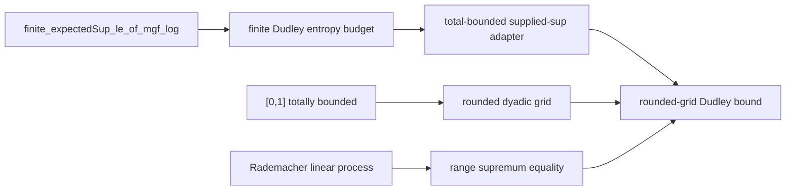

# FormalSLT v0.1: Checked Finite-Class and Finite-Net Bounds

Date: 2026-06-01
Status: local draft

## Abstract

FormalSLT is a Lean 4 library for machine-checking theorem chains from
statistical learning theory. The current v0.1 surface contains two checked
endpoints. First, it proves a finite-class countable-time Hoeffding
confidence-sequence wrapper for `[0,1]` losses, using explicit dyadic failure
budgets and finite union bounds. Second, it proves a concrete non-finite
`[0,1]` Dudley bridge: a Rademacher linear process indexed by the unit interval
is routed through rounded dyadic finite nets and finite sub-Gaussian chaining.

The contribution is deliberately finite-scale. The library does not yet prove
the continuous Dudley entropy integral, construct arbitrary measurable suprema,
or discharge general separability assumptions. The v0.1 result is a checked
foundation layer: finite-class concentration, finite-net chaining, and one
worked non-finite index-space example with explicit theorem anchors and axiom
checks.

## 1. Motivation

Learning-theory proofs often hide technical boundaries. A theorem may be
finite-class in one paragraph and infinite-class in the next. A supremum may be
treated as measurable without stating separability assumptions. A confidence
bound may use a finite union bound, a countable union bound, or a martingale
argument, with different assumptions and constants.

FormalSLT v0.1 focuses on making those boundaries explicit. The current library
does not try to formalize all of statistical learning theory. It instead
formalizes reusable proof spines where the assumptions are visible in Lean
types and the endpoint theorem can be checked by small example files.

The two v0.1 endpoints were chosen because they exercise different proof
interfaces:

1. A finite-class Hoeffding confidence sequence shows how finite union bounds,
   dyadic time budgets, and `[0,1]` loss assumptions compose into a
   countable-time statement.
2. A non-finite unit-interval Dudley bridge shows how finite sub-Gaussian
   chaining can be connected to a total-bounded metric index space through
   explicit finite nets.

Together, these endpoints make the library more than a collection of isolated
lemmas. They show checked theorem chains from assumptions to named
route-facing theorems.

## 2. Architecture

The v0.1 surface is distributed across five modules.

| Module | Role |
|---|---|
| `FormalSLT/Probability/FiniteUnionBound.lean` | finite union-bound bookkeeping with explicit event budgets |
| `FormalSLT/UniformConvergence.lean` | finite-class and countable-time uniform-deviation wrappers |
| `FormalSLT/Covering/FiniteSubGaussianChaining.lean` | finite expected-sup bounds and finite Dudley-style entropy budgets |
| `FormalSLT/Covering/TotalBoundedDudley.lean` | adapters from total boundedness to finite-net Dudley wrappers |
| `FormalSLT/Covering/UnitIntervalDudley.lean` | concrete non-finite `[0,1]` example using rounded dyadic grids |

The proof surface is checked by:

```bash
lake env lean examples/CheckFiniteUnionBound.lean
lake env lean examples/CheckUniformConvergence.lean
lake env lean examples/CheckUnitIntervalDudley.lean
```

Those example files do not replace `lake build`; they give a focused
declaration-level checker for the v0.1 endpoints and print the axiom profiles
for the headline theorems.

## 3. Result I: Countable-Time Finite-Class Hoeffding

The finite-class endpoint is:

```lean
anytimeFiniteClassDeviationFromHoeffding_zeroOneRange_confidenceSequence_fromHoeffding
```

The ergonomic API endpoint is:

```lean
FiniteClassConfidenceSequence.failure_probability_le
```

Anchor:

```text
FormalSLT/UniformConvergence.lean:3718
```

The theorem controls the failure event for a simultaneous all-times,
all-hypotheses confidence sequence. Its hypotheses expose the finite-class
scope:

- a finite nonempty hypothesis type `H`;
- a shared finite sample `s`;
- probability-measure assumptions on the sample space;
- coordinate-wise independent losses;
- `[0,1]` bounded-loss assumptions;
- a positive real failure budget `delta`.

The theorem states that the measure of the event where some time and some
hypothesis violates the named radius is bounded by `ENNReal.ofReal delta`.

### Theorem Chain


The core anchors are:

| Step | Declaration | Anchor |
|---|---|---|
| Budgeted finite union bound | `finiteMeasureUnionBound_budget` | `FormalSLT/Probability/FiniteUnionBound.lean:143` |
| Dyadic countable time budget | `finiteDyadicTimeBudget_tsum_le` | `FormalSLT/UniformConvergence.lean:244` |
| Countable-time class union bound | `countableTimeClassUnionBound_dyadicBudget` | `FormalSLT/UniformConvergence.lean:286` |
| Named confidence radius | `zeroOneDyadicFiniteClassConfidenceRadius` | `FormalSLT/UniformConvergence.lean:333` |
| Finite-prefix variable-radius wrapper | `finitePrefixFiniteClassDeviationFromHoeffding_zeroOneRange_timeVaryingRadius_fromHoeffding` | `FormalSLT/UniformConvergence.lean:3202` |
| Countable-time variable-radius wrapper | `anytimeFiniteClassDeviationFromHoeffding_zeroOneRange_timeVaryingRadius_fromHoeffding` | `FormalSLT/UniformConvergence.lean:3318` |
| Exists-form named-radius wrapper | `anytimeFiniteClassDeviationFromHoeffding_zeroOneRange_namedRadius_exists_fromHoeffding` | `FormalSLT/UniformConvergence.lean:3582` |
| Named confidence-sequence failure event | `finiteClassConfidenceSequenceFailureEvent` | `FormalSLT/UniformConvergence.lean:3624` |
| Confidence-sequence assumption bundle | `FiniteClassConfidenceSequence` | `FormalSLT/UniformConvergence.lean:3641` |
| Confidence-sequence failure bound | `anytimeFiniteClassDeviationFromHoeffding_zeroOneRange_confidenceSequence_fromHoeffding` | `FormalSLT/UniformConvergence.lean:3663` |
| Bundled confidence-sequence API | `FiniteClassConfidenceSequence.failure_probability_le` | `FormalSLT/UniformConvergence.lean:3718` |
| Named-radius sample-size inversion | `zeroOneDyadicFiniteClassConfidenceRadius_le_of_sampleSize_ge` | `FormalSLT/UniformConvergence.lean:3748` |

### Interpretation

The finite-class theorem is useful because it names the exact distinction
between three common arguments:

- a finite union bound across hypotheses;
- a summable countable-time allocation;
- a Hoeffding tail bound for bounded independent losses.

In informal writing, these steps are often collapsed. In Lean, each step is a
separate theorem. That separation is the point of the v0.1 proof chain.

### TheoremPath-facing sample-size form

The route-facing display does not need the full confidence-sequence theorem
signature. It needs the checked sample-size inversion:

```lean
zeroOneDyadicFiniteClassConfidenceRadius_le_of_sampleSize_ge
```

This theorem states that the named dyadic radius is at most `ε` once

```text
(log 2 - log(delta * 2^(-1-t) / card(H))) / (2 * ε^2) ≤ sampleSize.
```

For the TheoremPath Stage A surface with `t = 0`, `card(H) = 1`, and
`delta = 0.05`, this gives:

| Target half-width | Sufficient reviews |
|---|---:|
| `ε = 0.30` | `25` |
| `ε = 0.20` | `55` |
| `ε = 0.10` | `220` |

This is deliberately more conservative than the fixed-time two-sided
Hoeffding example because it spends failure probability through a dyadic
time budget.

## 4. Result II: Non-Finite Unit-Interval Dudley Bridge

The Dudley endpoint is:

```lean
unitIntervalRademacherLinearSup_roundedDyadicGrid_dudley_m_bound_prefixFree
```

Anchor:

```text
FormalSLT/Covering/UnitIntervalDudley.lean:2096
```

This theorem applies finite sub-Gaussian chaining infrastructure to a process
indexed by the unit interval:

```text
X(b,t) = signOfBool b * t
```

The index type is:

```lean
abbrev UnitInterval : Type :=
  {x : ℝ // x ∈ Set.Icc (0 : ℝ) 1}
```

The type is not assumed finite. The bridge works by extracting and constructing
finite nets, proving rounded-grid radius bounds, and using a supplied supremum
functional that is also tied to the actual range supremum for this concrete
process.

### Theorem Chain



Finite-chaining anchors:

| Step | Declaration | Anchor |
|---|---|---|
| Finite expected-sup MGF bound | `finite_expectedSup_le_of_mgf_log` | `FormalSLT/Covering/FiniteSubGaussianChaining.lean:744` |
| Sub-Gaussian finite max wrapper | `finite_expectedSup_le_of_subGaussian_mgf_sqrt` | `FormalSLT/Covering/FiniteSubGaussianChaining.lean:839` |
| Finite Dudley entropy budget | `finite_dudley_entropy_sum_coveringNumbers_geometric_entropy_budget` | `FormalSLT/Covering/FiniteSubGaussianChaining.lean:2343` |
| Supplied-supremum total-bounded adapter | `finite_supFunctional_dudley_totalBounded_dyadic_entropy_truncatedIntervalIntegral_comparison` | `FormalSLT/Covering/TotalBoundedDudley.lean:751` |

Unit-interval anchors:

| Step | Declaration | Anchor |
|---|---|---|
| Total boundedness | `unitInterval_totallyBounded_univ` | `FormalSLT/Covering/UnitIntervalDudley.lean:47` |
| Rounded projection radius | `unitIntervalDyadicGridRoundProject_dist_le` | `FormalSLT/Covering/UnitIntervalDudley.lean:323` |
| Rounded-grid distance match | `unitIntervalRoundedDyadicGridNet_dist` | `FormalSLT/Covering/UnitIntervalDudley.lean:1231` |
| Supremum as range `sSup` | `unitIntervalRademacherLinearSup_sSup_range` | `FormalSLT/Covering/UnitIntervalDudley.lean:983` |
| Projected rounded-grid Dudley bound | `unitIntervalRademacherLinear_roundedDyadicGrid_dudley_m_bound` | `FormalSLT/Covering/UnitIntervalDudley.lean:1609` |
| Supplied-supremum Dudley bound | `unitIntervalRademacherLinearSup_roundedDyadicGrid_dudley_m_bound` | `FormalSLT/Covering/UnitIntervalDudley.lean:2055` |
| Prefix-free supplied-supremum bound | `unitIntervalRademacherLinearSup_roundedDyadicGrid_dudley_m_bound_prefixFree` | `FormalSLT/Covering/UnitIntervalDudley.lean:2096` |
| Evaluated one-step scalar corollary | `unitIntervalRademacherLinearSup_dudley_m1_bound_constEntropy_eval` | `FormalSLT/Covering/UnitIntervalDudley.lean:2480` |

### Interpretation

The main point is not the numerical sharpness of the bound. The process has a
simple exact supremum. The point is that the proof route exercises the
finite-net bridge on a non-finite metric index type and records the proof
boundary in Lean.

The rounded grid theorem is also an API improvement over the earlier one-off
half and quarter meshes. It gives a reusable finite-horizon dyadic family with
nearest-grid radius:

```text
1 / 2^(level + 1)
```

That radius is the finite-net scale needed to make the Dudley chain reusable
instead of being only a hand-built `m = 1` example.

## 5. Verification and Axiom Profile

The v0.1 declarations are checked by the example files and by the proof-frontier
manifest.

Fresh commands:

```bash
lake env lean examples/CheckUnitIntervalDudley.lean
lake env lean examples/CheckFiniteUnionBound.lean
lake env lean examples/CheckUniformConvergence.lean
python3 scripts/generate_proof_frontier_manifest.py --check
git diff --check
```

Observed results:

```text
CHECK_UNIT_EXIT=0
CHECK_UNION_EXIT=0
CHECK_UNIFORM_EXIT=0
MANIFEST_CHECK_EXIT=0
DIFF_CHECK_EXIT=0
```

The printed theorem axiom profiles stay inside:

```text
[propext, Classical.choice, Quot.sound]
```

The executable proof-debt scan over `FormalSLT/**/*.lean` and
`examples/**/*.lean` is clean after stripping comments. Documentation may still
use words such as `sorry` while discussing proof policy; those are not Lean
proof holes.

## 6. Limitations

The limitations are part of the result. They should stay visible in any public
summary.

1. The Dudley layer does not prove the full continuous entropy integral.
2. The unit-interval example does not construct arbitrary measurable suprema.
3. The theorem chain does not prove a general separability theorem.
4. Most learning-theory results remain finite-index or finite-posterior
   statements.
5. The confidence-sequence theorem is finite-class; it is not an infinite-class
   or martingale/e-process result.
6. The localized Rademacher random-threshold layer is still conservative; the
   sharper whole-supremum concentration theorem remains future work.
7. The new confidence-sequence bundle packages the caller-facing hypotheses,
   but downstream consumers still need to adopt it.

## 7. Roadmap

The next theorem work should improve usability or close a named proof boundary.

### 7.1 Use the confidence-sequence bundle downstream

The theorem now has a reusable assumption bundle:

```lean
FiniteClassConfidenceSequence.failure_probability_le
```

The next API task is to use this object in TheoremPath-facing notes and future
formal statements instead of restating the long measure-theoretic signature.

### 7.2 Abstract the rounded dyadic-net wrapper

The unit-interval rounded-grid proof should become an instance of a more
general theorem over any rounded dyadic net family satisfying:

- radius positivity;
- adjacent-radius geometric control;
- finite projection-pair cover counts;
- monotone entropy envelope;
- terminal supplied-supremum adapter.

That would turn `UnitIntervalDudley.lean` into a model instance rather than the
only home of the argument.

### 7.3 Move toward the continuous Dudley integral

The next analytic step is an interval-integral domination theorem converting a
finite dyadic entropy upper sum into a continuous entropy integral under stated
monotonicity and integrability assumptions.

This should remain separate from measurable-supremum and separability work.

### 7.4 Continue localized Rademacher concentration

The finite Bernstein route is already closed locally. The non-conservative
random-threshold target is a whole-supremum concentration theorem for:

```text
localizedUpperDeviation - 2 * localized empirical Rademacher complexity
```

The existing global symmetrization and Azuma ingredients are relevant, but the
localized finite-weight interface still needs the bridge.

## Appendix A. TheoremPath Page Shape

The TheoremPath page should not be a copy of this note. It should be a short
interactive explanation with four visible objects:

1. theorem-chain diagram;
2. dyadic time-budget diagram;
3. rounded `[0,1]` grid diagram;
4. proof-boundary diagram.

The page should link to the checker files and exact Lean anchors, then state
the proof gaps before the roadmap.

## Appendix B. Minimum Release Checklist

Before calling this v0.1 public-ready:

```bash
lake build
lake env lean examples/CheckUnitIntervalDudley.lean
lake env lean examples/CheckFiniteUnionBound.lean
lake env lean examples/CheckUniformConvergence.lean
python3 scripts/generate_proof_frontier_manifest.py --check
python3 /Users/robsneiderman/Desktop/AI4MATH/scripts/audit_public_writing.py \
  docs/formalslt-v0.1-technical-note.md \
  docs/formalslt-v0.1-artifact-map-2026-06-01.md
```

The public page should run through the same writing gate after it exists in the
TheoremPath site tree.
