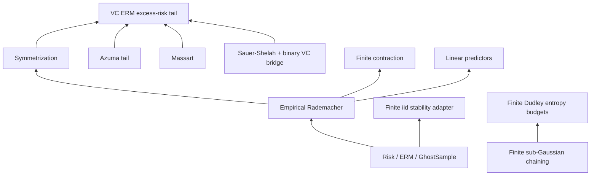

# Theorem Map

This page lists the public theorem spine by family. Names are Lean
declarations; modules are relative to `FormalSLT`.

## Core definitions

| Declaration | Module | Role |
|---|---|---|
| `risk` | `Risk` | Expected loss under a measure |
| `empiricalRisk` | `Risk` | Sample average loss |
| `IsERM` | `ERM` | Predicate selecting empirical risk minimizers over a finite class |
| `excessRisk` | `ERM` | Risk above the best-in-class comparator |
| `genGap` | `GhostSample` | One-sided uniform generalization gap |
| `piMeasure` | `GhostSample` | IID product measure on `Fin n -> Z` |
| `empiricalRademacherComplexity` | `Rademacher.FiniteSample` | Finite-sample empirical Rademacher complexity |
| `effectiveClass` | `VC.Rademacher` | Distinct loss vectors realized on a sample |
| `binaryClassTrace` | `VC.PACBridge` | Binary label patterns realized on a sample |
| `FiniteNet` | `Covering.FiniteSubGaussianChaining` | Finite net with an explicit nearest projection |

## Finite union and budget allocation

| Theorem | Module | Bound |
|---|---|---|
| `finiteMeasureUnionBound` | `Probability.FiniteUnionBound` | Finite-index measure union bound |
| `finiteMeasureUnionBound_budget` | `Probability.FiniteUnionBound` | Supplied finite per-event budgets whose sum is bounded by a total budget |
| `finiteMeasureUnionBound_const` | `Probability.FiniteUnionBound` | Common per-event budget gives `card * β` total mass |
| `finiteMeasureUnionBound_equalBudget` | `Probability.FiniteUnionBound` | Explicit per-event budget whose finite sum is bounded by a total budget |
| `finiteMeasureUnionBound_cardInv` | `Probability.FiniteUnionBound` | Nonempty finite class with per-event budget `α / card` has union mass `≤ α` |

## Uniform-convergence probability bridges

| Theorem | Module | Bound |
|---|---|---|
| `finiteClassUniformDeviationUnionBound` | `UniformConvergence` | Pointwise finite-class bad-event tails imply a simultaneous `card * tail` bound |
| `finiteClassUniformDeviationUnionBound_cardInv` | `UniformConvergence` | Equal split of a target failure budget gives simultaneous mass `≤ δ` |
| `finiteClassTwoSidedUniformDeviationUnionBound` | `UniformConvergence` | Pointwise absolute-deviation tails imply a simultaneous finite-class bound |
| `finiteClassTwoSidedUniformDeviationUnionBound_cardInv` | `UniformConvergence` | Equal-budget absolute-deviation bridge for finite hypothesis classes |
| `finiteTimeClassUnionBound_cardInv` | `UniformConvergence` | Equal-budget union bound over a finite time horizon and finite hypothesis class |
| `finiteTimeClassTwoSidedUniformDeviationUnionBound_cardInv` | `UniformConvergence` | Finite-horizon absolute-deviation shell over all `(time, hypothesis)` pairs |
| `finiteTimeClassUnionBound_timeBudget` | `UniformConvergence` | Finite time budgets whose sum is `≤ δ`, with each time split across hypotheses |
| `finiteTimeClassTwoSidedUniformDeviationUnionBound_timeBudget` | `UniformConvergence` | Finite-horizon absolute-deviation shell with a supplied time-budget sequence |
| `finiteTimeClassTwoSidedUniformDeviationUnionBound_timeBudget_threshold` | `UniformConvergence` | Finite-horizon absolute-deviation shell with a threshold depending on `(time, hypothesis)` |
| `finiteDyadicTimeBudget` | `UniformConvergence` | Standard dyadic time-budget schedule `δ * 2^(-1-t)` |
| `finiteDyadicTimeBudget_sum_fin_le` | `UniformConvergence` | Every finite prefix of the dyadic time-budget schedule sums to at most `δ` |
| `finiteDyadicTimeBudget_tsum_le` | `UniformConvergence` | The full natural-time dyadic schedule has total budget at most `δ` |
| `countableTimeClassUnionBound_timeBudget` | `UniformConvergence` | Countable-time finite-class union shell with a supplied summable time-budget sequence |
| `countableTimeClassUnionBound_dyadicBudget` | `UniformConvergence` | Countable-time finite-class union shell using the standard dyadic schedule |
| `countableTimeClassTwoSidedUniformDeviationUnionBound_dyadicBudget_threshold` | `UniformConvergence` | Countable-time dyadic absolute-deviation shell with time-varying thresholds |
| `countableTimeClass_iUnion_eq_exists` | `UniformConvergence` | Rewrites a countable time-class indexed union as an existential event |
| `countableTimeClass_not_forall_lt_eq_exists_ge` | `UniformConvergence` | Rewrites failure of an all-times/all-hypotheses strict bound as an existential crossing event |
| `finiteTimeClassUnionBound_dyadicBudget` | `UniformConvergence` | Finite-prefix time-class union shell using the standard dyadic schedule |
| `finiteTimeClassTwoSidedUniformDeviationUnionBound_dyadicBudget` | `UniformConvergence` | Finite-prefix absolute-deviation shell using the standard dyadic schedule |
| `finiteTimeClassTwoSidedUniformDeviationUnionBound_dyadicBudget_threshold` | `UniformConvergence` | Finite-prefix dyadic absolute-deviation shell with time-varying thresholds |
| `finiteTimeClassTwoSidedUnionBoundFromOneSidedTails_dyadicBudget` | `UniformConvergence` | Finite-prefix dyadic shell from one-sided upper and lower pointwise tails |
| `empiricalAverageUpperHoeffdingTail` | `UniformConvergence` | Named `ENNReal` upper-tail budget produced by the fixed-hypothesis Hoeffding wrapper |
| `empiricalAverageLowerHoeffdingTail` | `UniformConvergence` | Named `ENNReal` lower-tail budget produced by the fixed-hypothesis Hoeffding wrapper |
| `finiteTimeClassEmpiricalAverageDeviationFromHoeffding_dyadicBudget` | `UniformConvergence` | Finite-prefix dyadic finite-class deviation bound from bounded independent empirical-average losses |
| `finiteTimeClassSharedSampleEmpiricalAverageDeviationFromHoeffding_dyadicBudget` | `UniformConvergence` | Shared-sample finite-prefix wrapper for bounded independent empirical-average losses |
| `empiricalAverageUpperHoeffdingTail_eq_lower` | `UniformConvergence` | Normalizes the upper-tail Hoeffding range expression to the lower-tail expression |
| `empiricalAverageTwoSidedHoeffdingTail` | `UniformConvergence` | Combined two-sided empirical-average Hoeffding budget |
| `finiteTimeClassSharedSampleEmpiricalAverageDeviationFromHoeffding_twoSidedTailBudget` | `UniformConvergence` | Shared-sample finite-prefix wrapper using one combined two-sided Hoeffding budget |
| `empiricalAverageUniformRangeTwoSidedHoeffdingTail` | `UniformConvergence` | Uniform-range two-sided empirical-average Hoeffding budget with one denominator proxy |
| `empiricalAverageTwoSidedHoeffdingTail_le_uniformRangeTwoSidedHoeffdingTail` | `UniformConvergence` | Algebraic bridge from the concrete finite sum of squared half-ranges to the uniform range proxy |
| `empiricalAverageRangeSum_le_card_mul_uniformRange` | `UniformConvergence` | Finite-sum range envelope from a pointwise uniform range-width bound |
| `empiricalAverageRangeSum_pos_of_exists_range_pos` | `UniformConvergence` | Positive finite-sum denominator certificate from one sampled coordinate with positive range |
| `empiricalAverageTwoSidedHoeffdingTail_le_uniformRangeTwoSidedHoeffdingTail_of_rangeBound` | `UniformConvergence` | Two-sided Hoeffding tail bridge from a pointwise range-width bound and closed-form proxy |
| `empiricalAverageTwoSidedHoeffdingTail_le_uniformRangeTwoSidedHoeffdingTail_of_rangeBound_of_exists_range_pos` | `UniformConvergence` | Two-sided Hoeffding tail bridge using pointwise range width and an explicit nondegenerate sample coordinate |
| `finiteTimeClassSharedSampleEmpiricalAverageDeviationFromHoeffding_uniformRangeBudget` | `UniformConvergence` | Shared-sample finite-prefix wrapper using one uniform range proxy and dyadic time budgets |
| `finiteTimeClassSharedSampleEmpiricalAverageDeviationFromHoeffding_uniformRangeBudget_of_rangeBound` | `UniformConvergence` | Shared-sample finite-prefix wrapper with pointwise uniform range width and one closed-form proxy |
| `finiteTimeClassSharedSampleEmpiricalAverageDeviationFromHoeffding_uniformRangeBudget_of_rangeBound_of_exists_range_pos` | `UniformConvergence` | Shared-sample finite-prefix wrapper with pointwise uniform range width and nondegenerate sample-coordinate certificates |
| `empiricalAverageUniformRangeTwoSidedHoeffdingSampleSizeTail` | `UniformConvergence` | Displayed two-sided Hoeffding budget `2 * exp(-2 * sampleSize * ε^2 / R^2)` |
| `empiricalAverageUniformRangeTwoSidedHoeffdingTail_eq_sampleSizeTail` | `UniformConvergence` | Algebraic identification between the range-proxy budget and the sample-size display |
| `finiteTimeClassSharedSampleEmpiricalAverageDeviationFromHoeffding_sampleSize` | `UniformConvergence` | Shared-sample finite-prefix wrapper using the displayed sample-size Hoeffding budget |
| `finiteTimeClassSharedSampleEmpiricalAverageDeviationFromHoeffding_sampleSize_threshold` | `UniformConvergence` | Shared-sample finite-prefix wrapper using a displayed sample-size Hoeffding budget and time-varying thresholds |
| `empiricalAverageUniformRangeTwoSidedHoeffdingSampleSizeTail_le_of_logBudget` | `UniformConvergence` | Real log-budget condition implies the displayed Hoeffding tail fits a target budget |
| `empiricalAverageUniformRangeTwoSidedHoeffdingSampleSizeTail_le_of_explicitRadius` | `UniformConvergence` | Unit-range displayed Hoeffding tail is bounded at the inverted square-root confidence radius |
| `empiricalAverageUniformRangeTwoSidedHoeffdingSampleSizeTail_le_of_sampleSize_ge` | `UniformConvergence` | Explicit sample-size lower bound implies the displayed Hoeffding tail fits a target budget |
| `finiteTimeClassSharedSampleEmpiricalAverageDeviationFromHoeffding_sampleSize_from_logBudget` | `UniformConvergence` | Shared-sample finite-prefix wrapper using real log budgets below the dyadic ENNReal budget split |
| `finiteTimeClassSharedSampleEmpiricalAverageDeviationFromHoeffding_sampleSize_ge` | `UniformConvergence` | Shared-sample finite-prefix wrapper using explicit sample-size lower bounds and real budgets |
| `finiteTimeClassSharedSampleEmpiricalAverageDeviationFromHoeffding_sampleSize_dyadicRealBudget` | `UniformConvergence` | Shared-sample finite-prefix wrapper using explicit sample-size lower bounds and the concrete dyadic real budget `δ * 2^(-1-t) / card(H)` |
| `finiteDyadicRealBudget_classBudget_ofReal` | `UniformConvergence` | Concrete real dyadic class budget maps exactly to the `ENNReal` dyadic time/class split |
| `empiricalAverageUniformRangeSampleSize_ge_of_sqrtBudget_le` | `UniformConvergence` | Algebraic bridge from a square-root radius condition to the displayed sample-size lower bound |
| `finiteTimeClassSharedSampleEmpiricalAverageDeviationFromHoeffding_epsilonOfSampleSize_dyadicRealBudget` | `UniformConvergence` | Shared-sample finite-prefix wrapper using a radius-style condition and the concrete dyadic real budget |
| `finiteDyadicRealBudget_horizon_le_time` | `UniformConvergence` | Finite-horizon dyadic real-budget monotonicity: the horizon budget is no larger than any prefix time budget |
| `finiteTimeClassSharedSampleEmpiricalAverageDeviationFromHoeffding_horizonUniformRadius_dyadicRealBudget` | `UniformConvergence` | Shared-sample finite-prefix wrapper using one horizon-level radius condition |
| `finiteDyadicRealBudget_horizon_logBudget_eq_closedForm` | `UniformConvergence` | Closed-form rewrite of the finite-horizon dyadic log-budget term |
| `finiteTimeClassSharedSampleEmpiricalAverageDeviationFromHoeffding_closedFormHorizonRadius_dyadicRealBudget` | `UniformConvergence` | Shared-sample finite-prefix wrapper using a closed-form horizon/class/budget radius |
| `finiteTimeClassSharedSampleEmpiricalAverageDeviationFromHoeffding_closedFormHorizonSampleSize_dyadicRealBudget` | `UniformConvergence` | Shared-sample finite-prefix wrapper using a closed-form horizon/class/budget sample-size condition |
| `finitePrefixFiniteClassDeviationFromHoeffding_closedForm` | `UniformConvergence` | Route-facing finite-prefix finite-class Hoeffding deviation theorem with the closed-form sample-size condition |
| `finitePrefixFiniteClassDeviationFromHoeffding_closedForm_cardSample` | `UniformConvergence` | Route-facing finite-prefix finite-class Hoeffding theorem with denominator written directly as `(s.card : ℝ)` |
| `finitePrefixFiniteClassDeviationFromHoeffding_closedForm_unitRange` | `UniformConvergence` | Route-facing unit-range finite-prefix finite-class Hoeffding theorem with compact `log(card/time/budget) / (2 * ε^2)` sample-size condition |
| `finitePrefixFiniteClassDeviationFromHoeffding_unitRange_radius` | `UniformConvergence` | Route-facing unit-range finite-prefix finite-class Hoeffding theorem in confidence-radius form |
| `finitePrefixFiniteClassDeviationFromHoeffding_unitRange_explicitRadius` | `UniformConvergence` | Route-facing unit-range finite-prefix finite-class Hoeffding theorem with the confidence radius written directly in the deviation event |
| `finitePrefixFiniteClassDeviationFromHoeffding_unitRange_explicitRadius_nonemptySample` | `UniformConvergence` | Route-facing explicit-radius theorem with radius positivity discharged by nonempty sample and strict finite-prefix budget assumptions |
| `finitePrefixFiniteClassDeviationFromHoeffding_zeroOneRange_explicitRadius` | `UniformConvergence` | Route-facing explicit-radius theorem for losses bounded in `[0,1]`, removing caller-supplied lower and upper range functions and discharging the negative-integral identity internally |
| `finitePrefixFiniteClassDeviationFromHoeffding_zeroOneRange_timeVaryingRadius` | `UniformConvergence` | Finite-prefix time-varying dyadic-radius event from supplied pointwise tails and checked dyadic budget conversion |
| `finitePrefixFiniteClassDeviationFromHoeffding_zeroOneRange_timeVaryingRadius_fromHoeffding` | `UniformConvergence` | Finite-prefix time-varying dyadic-radius theorem for `[0,1]` losses with the pointwise tails discharged from Hoeffding |
| `zeroOneDyadicFiniteClassConfidenceRadius` | `UniformConvergence` | Named dyadic confidence radius for `[0,1]` finite-class empirical-average deviations |
| `zeroOneDyadicFiniteClassConfidenceRadius_le_of_sampleSize_ge` | `UniformConvergence` | Sample-size lower bound implies the named dyadic confidence radius is at most a target `ε` |
| `anytimeFiniteClassDeviationFromHoeffding_zeroOneRange_timeVaryingRadius_fromHoeffding` | `UniformConvergence` | Countable-time finite-class Hoeffding theorem for `[0,1]` losses with dyadic per-time radii |
| `anytimeFiniteClassDeviationFromHoeffding_zeroOneRange_timeVaryingRadius_exists_fromHoeffding` | `UniformConvergence` | Existential-event version of the countable-time finite-class Hoeffding theorem |
| `anytimeFiniteClassDeviationFromHoeffding_zeroOneRange_namedRadius_exists_fromHoeffding` | `UniformConvergence` | Existential-event anytime theorem using the named dyadic confidence radius |
| `finiteClassConfidenceSequenceFailureEvent` | `UniformConvergence` | Named failure event for the `[0,1]` finite-class dyadic confidence sequence |
| `FiniteClassConfidenceSequence` | `UniformConvergence` | Bundled assumptions for the `[0,1]` finite-class dyadic confidence sequence |
| `anytimeFiniteClassDeviationFromHoeffding_zeroOneRange_confidenceSequence_fromHoeffding` | `UniformConvergence` | Confidence-sequence failure-probability theorem for all natural times and finite hypotheses |
| `FiniteClassConfidenceSequence.failure_probability_le` | `UniformConvergence` | Bundled API theorem bounding the named confidence-sequence failure event |

## Rademacher and VC spine

| Theorem | Module | Bound |
|---|---|---|
| `expected_genGap_le_two_expected_empiricalRademacherComplexity` | `Rademacher.Symmetrization` | `E[genGap] <= 2 * E[Rad]` |
| `genGap_tail_bound_azuma_explicit` | `Azuma.GenGapTail` | `P(genGap - E[genGap] >= ε) <= exp(-ε² n / (8B²))` |
| `hasBoundedDifferences_tail_sharp` | `Azuma.GenGapTail` | `P(f - E[f] >= ε) <= exp(-2ε² / sum_k c_k²)` |
| `genGap_tail_bound_sharp_explicit` | `Azuma.GenGapTail` | `P(genGap - E[genGap] >= ε) <= exp(-ε² n / (2B²))` |
| `mcdiarmid_of_hasBoundedDifferences_sharp` | `Concentration.SharpMcDiarmid` | Public wrapper for the sharp product bounded-differences tail |
| `mcdiarmid_of_hasBoundedDifferences_sharp_lower` | `Concentration.SharpMcDiarmid` | Lower-tail wrapper obtained from the upper tail applied to `-f` |
| `mcdiarmid_twoSided_of_hasBoundedDifferences_sharp` | `Concentration.SharpMcDiarmid` | Two-sided homogeneous product bounded-differences tail `P(\|f - E[f]\| >= ε) <= 2 exp(-2ε² / sum_k c_k²)` |
| `mcdiarmid_of_hasBoundedDifferences_sharp_hetero` | `Concentration.HeterogeneousMcDiarmid` | Heterogeneous-law product upper tail with the sharp McDiarmid exponent |
| `mcdiarmid_of_hasBoundedDifferences_sharp_hetero_lower` | `Concentration.HeterogeneousMcDiarmid` | Heterogeneous-law product lower tail with the sharp McDiarmid exponent |
| `mcdiarmid_twoSided_of_hasBoundedDifferences_sharp_hetero` | `Concentration.HeterogeneousMcDiarmid` | Two-sided heterogeneous-law product tail `P(\|f - E[f]\| >= ε) <= 2 exp(-2ε² / sum_k c_k²)` |
| `mcdiarmid_of_hasBoundedDifferences_sharp_of_hetero` | `Concentration.HeterogeneousMcDiarmid` | Homogeneous recovery from the heterogeneous product theorem by taking a constant law family |
| `massart_finite_class` | `Rademacher.Massart` | `Rad(H,S) <= B * sqrt(2 * log card(H) / n)` |
| `genGap_highProb_rademacher` | `Rademacher.HighProbability` | `P(genGap >= 2 * E[Rad] + ε) <= exp(-ε² n / (2B²))` |
| `genGap_highProb_finiteClass` | `Rademacher.FiniteClassHighProb` | Massart plus sharp high-probability Rademacher |
| `uniformDeviation_highProb_finiteClass` | `Rademacher.UniformDeviation` | Two-sided finite-class uniform deviation with sharp one-sided tails |
| `sauerShelah_polynomial_bound` | `VC.SauerShelah` | `sum_{k<=d} C(n,k) <= (en/d)^d` |
| `empiricalRademacherComplexity_le_massart_effective` | `VC.Rademacher` | Effective-class Massart bound |
| `vcRademacher_pointwise` | `VC.SampleComplexity` | `Rad <= B * sqrt(2d * log(en/d) / n)` |
| `genGap_highProb_vcClass` | `VC.SampleComplexity` | VC-style one-sided genGap tail with sharp exponent |
| `uniformDeviation_highProb_vcClass` | `VC.SampleComplexity` | VC-style two-sided uniform deviation with sharp one-sided tails |
| `vc_erm_excessRisk_tail` | `VC.SampleComplexity` | VC-style ERM excess-risk tail with sharp concentration term |
| `vc_erm_sample_complexity` | `VC.SampleComplexity` | Closed-form VC ERM sample-complexity theorem with explicit `72 * B^2` constant |
| `effectiveClass_zeroOneLoss_card_eq_binaryClassTrace` | `VC.BinaryVCBridge` | Effective 0-1 loss patterns equal binary traces |
| `effectiveClass_zeroOneLoss_card_le_sauerShelah` | `VC.BinaryVCBridge` | Binary VC Sauer-Shelah corollary |

## Contraction and linear predictors

| Theorem | Module | Bound |
|---|---|---|
| `one_step_contraction` | `Rademacher.Contraction` | One coordinate replacement step for the finite contraction proof |
| `contraction_1lip` | `Rademacher.Contraction` | Finite-sample scalar contraction for 1-Lipschitz transforms |
| `contraction_empirical` | `Rademacher.Contraction` | Empirical Rademacher wrapper for 1-Lipschitz transforms |
| `empiricalRademacherComplexity_contraction_lipschitz` | `Rademacher.Contraction` | `Rad_S(φ ∘ F) <= L * Rad_S(F)` for finite scalar classes |
| `linearPredictor_rademacher_finiteDim` | `Rademacher.LinearPredictor` | `Rad <= R * n⁻¹ * sqrt(sum k, ||z k||²)` |
| `linearPredictor_rademacher_uniform_finiteDim` | `Rademacher.LinearPredictor` | `||z k|| <= B` implies `Rad <= R * B / sqrt n` |

## Covering and finite chaining

| Theorem | Module | Bound |
|---|---|---|
| `rademacher_covering_bound` | `Covering.Rademacher` | `Rad(F) <= ε + Rad(N_ε)` |
| `rademacher_covering_massart` | `Covering.Rademacher` | Covering plus Massart |
| `rademacher_two_step_chaining` | `Covering.DudleyChaining` | Two-scale finite chaining bound |
| `finite_expectedSup_le_of_mgf_log` | `Covering.FiniteSubGaussianChaining` | MGF control gives finite expected-sup entropy budget |
| `finite_expectedSup_le_of_subGaussian_mgf_sqrt` | `Covering.FiniteSubGaussianChaining` | Optimized finite sub-Gaussian max bound |
| `finite_chaining_expectation_bound` | `Covering.FiniteSubGaussianChaining` | Finite multiscale chaining decomposition in expectation |
| `finite_projected_chaining_expectation_bound` | `Covering.FiniteSubGaussianChaining` | Finite projected-supremum chaining without an identity terminal projection |
| `finite_chaining_expectation_bound_of_radius_sqrt` | `Covering.FiniteSubGaussianChaining` | Radius-bounded finite chaining with square-root entropy budgets |
| `finite_chaining_expectation_bound_of_net_sequence_pairs_sqrt` | `Covering.FiniteSubGaussianChaining` | Projection-pair entropy version for finite net sequences |
| `finite_chaining_expectation_bound_of_net_sequence_coveringNumbers_sqrt` | `Covering.FiniteSubGaussianChaining` | Covering-number version for finite net sequences |
| `finite_projected_chaining_expectation_bound_of_net_sequence_coveringNumbers_sqrt` | `Covering.FiniteSubGaussianChaining` | Projected finite-net chaining bound with covering-number entropy budgets |
| `FiniteNet.ProjectedIndex` | `Covering.FiniteSubGaussianChaining` | Finite image of a net projection, used to avoid a finite ambient index assumption |
| `finite_projectedNet_chaining_expectation_bound_of_net_sequence_coveringNumbers_sqrt` | `Covering.FiniteSubGaussianChaining` | Projected finite-net-image chaining bound without `[Fintype T]` |
| `FiniteDyadicDudleyInstance` | `Covering.FiniteSubGaussianChaining` | Packaged reusable finite dyadic Dudley instance: net sequence, coarse budget, variance positivity, and coarse projected-supremum bound |
| `FiniteDyadicDudleyInstance.SupremumAdapter` | `Covering.FiniteSubGaussianChaining` | Optional supplied-supremum adapter to a terminal projected finite-net supremum plus explicit terminal error |
| `FiniteDyadicDudleyInstance.projected_dudley_bound` | `Covering.FiniteSubGaussianChaining` | Projected finite-net Dudley bound from a packaged finite dyadic Dudley instance |
| `FiniteDyadicDudleyInstance.suppliedSup_dudley_bound` | `Covering.FiniteSubGaussianChaining` | Supplied-supremum finite Dudley bound from a packaged instance and adapter |
| `finite_dudley_entropy_sum_projection_pairs` | `Covering.FiniteSubGaussianChaining` | Finite Dudley-style entropy sum over projection-pair families |
| `finite_dudley_entropy_sum_coveringNumbers` | `Covering.FiniteSubGaussianChaining` | Finite Dudley-style entropy sum with covering-number products |
| `finite_dudley_entropy_sum_projection_pairs_geometric_radius` | `Covering.FiniteSubGaussianChaining` | Dyadic/geometric radius schedule for projection pairs |
| `finite_dudley_entropy_sum_coveringNumbers_geometric_radius` | `Covering.FiniteSubGaussianChaining` | Dyadic/geometric radius schedule for covering numbers |
| `finite_dudley_entropy_sum_projection_pairs_geometric_entropy_budget` | `Covering.FiniteSubGaussianChaining` | Per-scale entropy-budget wrapper for projection pairs |
| `finite_dudley_entropy_sum_coveringNumbers_geometric_entropy_budget` | `Covering.FiniteSubGaussianChaining` | Per-scale entropy-budget wrapper for covering numbers |
| `finite_dudley_entropy_sum_projection_pairs_geometric_uniform_entropy` | `Covering.FiniteSubGaussianChaining` | Uniform entropy cap collapses the dyadic sum to a `2 * radiusScale` budget for projection pairs |
| `finite_dudley_entropy_sum_coveringNumbers_geometric_uniform_entropy` | `Covering.FiniteSubGaussianChaining` | Uniform entropy cap collapses the dyadic covering-number sum to a `2 * radiusScale` budget |
| `finite_dudley_entropy_sum_projection_pairs_geometric_annulus_budget` | `Covering.FiniteSubGaussianChaining` | Finite dyadic annulus-budget bridge for projection pairs |
| `finite_dudley_entropy_sum_coveringNumbers_geometric_annulus_budget` | `Covering.FiniteSubGaussianChaining` | Finite dyadic annulus-budget bridge for covering numbers |
| `finite_dudley_entropy_sum_projection_pairs_geometric_integral_budget` | `Covering.FiniteSubGaussianChaining` | Finite dyadic entropy-integral budget for projection pairs |
| `finite_dudley_entropy_sum_coveringNumbers_geometric_integral_budget` | `Covering.FiniteSubGaussianChaining` | Finite dyadic entropy-integral budget for covering numbers |
| `finiteDyadicEntropyAtRadiusUpperSum` | `Covering.FiniteSubGaussianChaining` | Finite dyadic entropy-at-radius upper sum sampled at lower annulus endpoints |
| `finiteDyadicEntropyIntegralBudget_one_const` | `Covering.FiniteSubGaussianChaining` | One-step dyadic entropy budget for a constant entropy envelope |
| `finiteDyadicEntropyIntegralBudget_le_entropyAtRadiusUpperSum` | `Covering.FiniteSubGaussianChaining` | Finite dyadic budget comparison to an entropy-at-radius upper sum |
| `finitePrefixSupEnvelope_const` | `Covering.FiniteSubGaussianChaining` | Constant scale budgets remain constant under the finite prefix-sup envelope |
| `finitePrefixSupEnvelope_eq_self_of_monotone` | `Covering.FiniteSubGaussianChaining` | Monotone scale budgets equal their finite prefix-sup envelope |
| `finite_dudley_entropy_sum_coveringNumbers_geometric_integral_budget_prefix_envelope` | `Covering.FiniteSubGaussianChaining` | Finite covering-count wrapper with a monotone prefix-sup entropy envelope |
| `finite_projected_dudley_entropy_sum_coveringNumbers_geometric_integral_budget_prefix_envelope` | `Covering.FiniteSubGaussianChaining` | Projected finite Dudley wrapper with a monotone prefix-sup entropy envelope |
| `finite_projectedNet_dudley_entropy_sum_coveringNumbers_geometric_integral_budget_prefix_envelope` | `Covering.FiniteSubGaussianChaining` | Projected finite-net-image Dudley wrapper without `[Fintype T]` |
| `finite_projectedNet_dudley_entropy_sum_coveringNumbers_geometric_entropy_integral_comparison` | `Covering.FiniteSubGaussianChaining` | Projected finite-net Dudley wrapper compared to a supplied finite entropy-at-radius integral budget |
| `shiftedDyadicIntervalIntegralSum_eq_truncatedIntervalIntegral` | `Covering.FiniteSubGaussianChaining` | Shifted finite dyadic annulus integrals compose into one truncated interval integral |
| `finiteDyadicEntropyAtRadiusUpperSum_le_two_mul_truncatedIntervalIntegral` | `Covering.FiniteSubGaussianChaining` | Finite entropy-at-radius upper sum dominated by a single truncated interval integral |
| `finite_projectedNet_dudley_entropy_sum_coveringNumbers_geometric_entropy_truncatedIntervalIntegral_comparison` | `Covering.FiniteSubGaussianChaining` | Projected finite-net Dudley wrapper with a truncated interval-integral entropy budget |
| `finiteExpectation_supFunctional_le_projected_add_terminalError` | `Covering.FiniteSubGaussianChaining` | Finite expectation adapter from a supplied supremum functional to a projected finite-supremum surrogate |
| `finiteSup_skeleton_le_projectedSup_add_terminalError` | `Covering.FiniteSubGaussianChaining` | Finite skeleton supremum controlled by terminal projected finite-net supremum plus explicit error |
| `finiteExpectation_supFunctional_le_projected_add_skeleton_terminalError` | `Covering.FiniteSubGaussianChaining` | Expected supplied supremum controlled through explicit finite-skeleton and terminal-projection errors |
| `terminalApprox_of_pathwise_modulus` | `Covering.FiniteSubGaussianChaining` | Terminal net radius plus pathwise modulus discharges the terminal-projection approximation hypothesis |
| `terminalApprox_of_pathwise_modulus_radiusBound` | `Covering.FiniteSubGaussianChaining` | Radius-bound variant of terminal pathwise-modulus approximation |
| `finiteSup_le_skeletonSup_add_of_pointwise_approx` | `Covering.FiniteSubGaussianChaining` | Finite ambient supremum controlled by a finite skeleton under pointwise approximation |
| `supFunctional_le_skeletonSup_add_of_witnessed_pointwise_approx` | `Covering.FiniteSubGaussianChaining` | Supplied supremum functional controlled by an approximate witness and finite skeleton selector |
| `finite_supFunctional_dudley_entropy_sum_coveringNumbers_geometric_entropy_truncatedIntervalIntegral_comparison` | `Covering.FiniteSubGaussianChaining` | Boundary-layer finite Dudley wrapper for a supplied supremum functional plus terminal error |
| `finite_separableSupFunctional_dudley_entropy_sum_coveringNumbers_geometric_entropy_truncatedIntervalIntegral_comparison` | `Covering.FiniteSubGaussianChaining` | Boundary-layer finite Dudley wrapper with explicit finite-skeleton and terminal-projection hypotheses |
| `finiteMetricCoverOfTotallyBoundedUniv` | `Covering.TotalBoundedDudley` | Totally bounded metric spaces admit finite covers at every positive real radius |
| `finiteNetOfTotallyBoundedUniv` | `Covering.TotalBoundedDudley` | Extracts the repo's bundled finite-net record from total boundedness |
| `dyadicChainingFiniteNetOfTotallyBoundedUniv_pair_radius_le` | `Covering.TotalBoundedDudley` | Dyadic total-bounded net schedule satisfies the adjacent-radius budget used by finite chaining |
| `dyadicChainingFiniteNetSequenceOfTotallyBounded` | `Covering.TotalBoundedDudley` | Packages the total-bounded dyadic net schedule as a `FiniteDyadicNetSequence` under global projection-pair hypotheses |
| `finiteDyadicDudleyInstanceOfTotallyBounded` | `Covering.TotalBoundedDudley` | Packages the total-bounded dyadic net schedule as a `FiniteDyadicDudleyInstance` when global coarse-budget and projection-pair hypotheses are available |
| `finite_projectedNet_dudley_entropy_sum_totalBounded_dyadic_coveringNumbers` | `Covering.TotalBoundedDudley` | Total-bounded dyadic wrapper over the terminal projected finite-net image, without `[Fintype T]` |
| `finite_projectedNet_dudley_entropy_sum_totalBounded_dyadic_entropy_integral_comparison` | `Covering.TotalBoundedDudley` | Total-bounded projected finite-net wrapper compared to a supplied finite entropy-at-radius integral budget |
| `finite_projectedNet_dudley_entropy_sum_totalBounded_dyadic_entropy_truncatedIntervalIntegral_comparison` | `Covering.TotalBoundedDudley` | Total-bounded projected finite-net wrapper with one truncated interval-integral entropy budget |
| `finite_supFunctional_dudley_totalBounded_dyadic_entropy_truncatedIntervalIntegral_comparison` | `Covering.TotalBoundedDudley` | Total-bounded boundary wrapper for a supplied supremum functional under explicit terminal approximation |
| `finite_separableSupFunctional_dudley_totalBounded_dyadic_entropy_truncatedIntervalIntegral_comparison` | `Covering.TotalBoundedDudley` | Total-bounded boundary wrapper with explicit finite-skeleton/dense-net and terminal-projection assumptions |
| `finite_witnessedSup_modulus_dudley_totalBounded_dyadic_entropy_truncatedIntervalIntegral_comparison` | `Covering.TotalBoundedDudley` | Total-bounded Dudley boundary wrapper using approximate witnesses, finite skeleton selectors, and pathwise modulus |
| `EpsilonizedSupremumBoundaryChoice` | `Covering.TotalBoundedDudley` | Finite skeleton and terminal-scale certificate for an epsilonized Dudley boundary step |
| `finite_epsilonizedSup_modulus_dudley_totalBounded_dyadic_entropy_truncatedIntervalIntegral_comparison` | `Covering.TotalBoundedDudley` | For every positive error budget, a finite skeleton/terminal-scale certificate yields a Dudley bound with `+ eta` |
| `skeletonApprox_of_finiteCover_pathwiseModulus` | `Covering.TotalBoundedDudley` | Finite-cover radius plus pathwise modulus gives the finite-skeleton approximation hypothesis |
| `FiniteCoverSupremumBoundaryChoice` | `Covering.TotalBoundedDudley` | Finite-cover/pathwise-modulus certificate for the epsilonized Dudley boundary step |
| `finite_epsilonizedSup_dudley_totalBounded_of_finiteCoverSupremumBoundaryChoice` | `Covering.TotalBoundedDudley` | Epsilonized total-bounded Dudley wrapper from finite-cover and pathwise-modulus certificates |
| `finite_projected_dudley_entropy_sum_totalBounded_dyadic_coveringNumbers` | `Covering.TotalBoundedDudley` | Total-bounded dyadic wrapper for the terminal projected supremum, without an identity terminal net |
| `finite_dudley_entropy_sum_totalBounded_dyadic_coveringNumbers` | `Covering.TotalBoundedDudley` | Finite-terminal total-bounded dyadic wrapper composed with the finite Dudley entropy-budget theorem |

## Two-point Dudley example

| Declaration | Module | Role |
|---|---|---|
| `TwoPoint` | `Covering.TwoPointDudley` | The two-point discrete metric index type |
| `twoPointDist_nonneg` | `Covering.TwoPointDudley` | The two-point discrete metric is nonnegative |
| `twoPointDist_symm` | `Covering.TwoPointDudley` | The two-point discrete metric is symmetric |
| `twoPointDist_triangle` | `Covering.TwoPointDudley` | The two-point discrete metric satisfies the triangle inequality |
| `twoPoint_rademacher_mgf_bound` | `Covering.TwoPointDudley` | One-coordinate Rademacher process increments satisfy the sub-Gaussian MGF bound |
| `twoPointRademacherProcess` | `Covering.TwoPointDudley` | The two-point Rademacher process packaged as a finite sub-Gaussian process |
| `twoPointDyadicNet` | `Covering.TwoPointDudley` | Full two-point finite net with dyadic positive radius |
| `twoPointDyadicNet_radius_geometric` | `Covering.TwoPointDudley` | Adjacent two-point dyadic radii satisfy the geometric chaining budget |
| `twoPointDyadicNet_pair_card_gt_one` | `Covering.TwoPointDudley` | Adjacent two-point projection-pair families are nontrivial |
| `twoPointDyadicNet_coverCount_le` | `Covering.TwoPointDudley` | Adjacent two-point covering-number products are bounded by the constant cover-count envelope |
| `twoPointDyadicNetSequence` | `Covering.TwoPointDudley` | A second concrete `FiniteDyadicNetSequence` instantiation, independent of `[0,1]` |
| `twoPointDudleyInstance` | `Covering.TwoPointDudley` | Packaged finite dyadic Dudley instance for the two-point Rademacher process |
| `twoPointRademacher_projected_dudley_m_bound` | `Covering.TwoPointDudley` | Arbitrary finite-horizon projected Dudley bound routed through the packaged finite dyadic Dudley API |
| `twoPointRademacherSup_le_projectedSup` | `Covering.TwoPointDudley` | Terminal projected-net adapter for the two-point supplied supremum |
| `twoPointRademacherSupAdapter` | `Covering.TwoPointDudley` | Supplied-supremum adapter for the two-point packaged Dudley instance |
| `twoPointRademacherSup_dudley_m_bound` | `Covering.TwoPointDudley` | Supplied-supremum finite Dudley bound routed through the packaged finite dyadic Dudley API |

## Finite discrete Dudley family

| Declaration | Module | Role |
|---|---|---|
| `finDiscreteDist` | `Covering.FiniteDiscreteDudley` | Discrete metric on `Fin n` |
| `finDiscreteDist_nonneg` | `Covering.FiniteDiscreteDudley` | The finite discrete metric is nonnegative |
| `finDiscreteDist_symm` | `Covering.FiniteDiscreteDudley` | The finite discrete metric is symmetric |
| `finDiscreteDist_triangle` | `Covering.FiniteDiscreteDudley` | The finite discrete metric satisfies the triangle inequality |
| `finDiscreteRademacherValue` | `Covering.FiniteDiscreteDudley` | One-coordinate Rademacher process embedded in the finite discrete family |
| `finDiscrete_rademacher_mgf_bound` | `Covering.FiniteDiscreteDudley` | Embedded Rademacher process increments satisfy the sub-Gaussian MGF bound |
| `finDiscreteRademacherProcess` | `Covering.FiniteDiscreteDudley` | The embedded Rademacher process packaged as a finite sub-Gaussian process over `Fin n` |
| `finDiscreteDyadicNet` | `Covering.FiniteDiscreteDudley` | Full finite net on `Fin n` at every dyadic scale |
| `finDiscreteDyadicCoverCount` | `Covering.FiniteDiscreteDudley` | Explicit adjacent-scale cover-count envelope `n * n` |
| `finDiscreteDyadicNet_dist` | `Covering.FiniteDiscreteDudley` | Finite discrete nets use the process metric |
| `finDiscreteDyadicNet_coveringNumber` | `Covering.FiniteDiscreteDudley` | The full finite discrete net has covering number `n` |
| `finDiscreteDyadicNet_coverCount_le` | `Covering.FiniteDiscreteDudley` | Adjacent finite-discrete covering-number products are bounded by the `n * n` envelope |
| `finDiscreteDyadicNetSequence` | `Covering.FiniteDiscreteDudley` | General `FiniteDyadicNetSequence` instance for `Fin n` with `[Fact (2 ≤ n)]` |
| `finDiscreteDudleyInstance` | `Covering.FiniteDiscreteDudley` | Packaged finite dyadic Dudley instance for the `Fin n` embedded Rademacher process |
| `finDiscreteRademacher_projected_dudley_m_bound` | `Covering.FiniteDiscreteDudley` | Arbitrary finite-horizon projected Dudley bound for the embedded Rademacher process routed through the packaged finite dyadic Dudley API |
| `finDiscreteRademacherSup` | `Covering.FiniteDiscreteDudley` | Supremum functional for the embedded Rademacher process over `Fin n` |
| `finDiscreteRademacherSup_true` | `Covering.FiniteDiscreteDudley` | The supplied supremum is nontrivial: it equals `1` on the positive Rademacher outcome |
| `finDiscreteRademacherSup_le_projectedSup` | `Covering.FiniteDiscreteDudley` | Terminal projected-net adapter for the finite-discrete supplied supremum |
| `finDiscreteRademacherSupAdapter` | `Covering.FiniteDiscreteDudley` | Supplied-supremum adapter for the finite-discrete packaged Dudley instance |
| `finDiscreteRademacherSup_dudley_m_bound` | `Covering.FiniteDiscreteDudley` | Supplied-supremum finite Dudley bound for the embedded Rademacher process routed through the packaged finite dyadic Dudley API |

## Unit-interval Dudley example

| Declaration | Module | Role |
|---|---|---|
| `UnitInterval` | `Covering.UnitIntervalDudley` | The closed interval `[0,1]` as a metric index type |
| `unitInterval_totallyBounded_univ` | `Covering.UnitIntervalDudley` | The unit interval is totally bounded |
| `unitIntervalFiniteNet_covers` | `Covering.UnitIntervalDudley` | Total-bounded finite net covers the unit interval at a supplied radius |
| `unitIntervalDyadicFiniteNet_covers` | `Covering.UnitIntervalDudley` | Dyadic total-bounded finite net covers the unit interval at the dyadic chaining radius |
| `unitIntervalDyadicGridCenter_leftEndpoint` | `Covering.UnitIntervalDudley` | The reusable dyadic grid center map contains the left endpoint |
| `unitIntervalDyadicGridCenter_rightEndpoint` | `Covering.UnitIntervalDudley` | The reusable dyadic grid center map contains the right endpoint |
| `unitIntervalDyadicGrid_card` | `Covering.UnitIntervalDudley` | Level-`k` dyadic grid has cardinality `2^k + 1` |
| `unitIntervalDyadicGridPairCoverCount_zero` | `Covering.UnitIntervalDudley` | The first adjacent dyadic grid pair count is `15` |
| `unitIntervalDyadicGridFloorProject` | `Covering.UnitIntervalDudley` | Floor projection from `[0,1]` to the level-`k` dyadic grid |
| `unitIntervalDyadicGridFloorProject_dist_le` | `Covering.UnitIntervalDudley` | Floor-projected dyadic grid covers `[0,1]` at spacing radius `1 / 2^k` |
| `unitIntervalDyadicGridNet_covers` | `Covering.UnitIntervalDudley` | Generic dyadic finite net covers `[0,1]` at spacing radius `1 / 2^k` |
| `unitIntervalDyadicGridNet_coveringNumber` | `Covering.UnitIntervalDudley` | Generic dyadic finite net has `2^k + 1` centers |
| `unitIntervalDyadicGridNet_coveringNumber_one` | `Covering.UnitIntervalDudley` | Level-`1` generic dyadic finite net has `3` centers |
| `unitIntervalDyadicGridNet_coveringNumber_two` | `Covering.UnitIntervalDudley` | Level-`2` generic dyadic finite net has `5` centers |
| `unitIntervalDyadicGridNet_coveringNumberPair_zero` | `Covering.UnitIntervalDudley` | Level-`1` and level-`2` generic dyadic finite-net covering-number product is the first dyadic pair count |
| `unitIntervalDyadicGridRoundProject` | `Covering.UnitIntervalDudley` | Rounded nearest-grid projection from `[0,1]` to the level-`k` dyadic grid |
| `unitIntervalDyadicGridRoundProject_zero` | `Covering.UnitIntervalDudley` | Rounded dyadic projection fixes the left endpoint |
| `unitIntervalDyadicGridRoundProject_one` | `Covering.UnitIntervalDudley` | Rounded dyadic projection fixes the right endpoint |
| `unitIntervalDyadicGridRoundProject_dist_le` | `Covering.UnitIntervalDudley` | Rounded dyadic grid covers `[0,1]` at half-spacing radius `1 / 2^(k+1)` |
| `unitIntervalDyadicRoundedGridNet_covers` | `Covering.UnitIntervalDudley` | Rounded generic dyadic finite net covers `[0,1]` at half-spacing radius `1 / 2^(k+1)` |
| `unitIntervalDyadicRoundedGridNet_coveringNumber` | `Covering.UnitIntervalDudley` | Rounded generic dyadic finite net has `2^k + 1` centers |
| `unitIntervalDyadicRoundedGridNet_coveringNumber_one` | `Covering.UnitIntervalDudley` | Level-`1` rounded dyadic finite net has `3` centers |
| `unitIntervalDyadicRoundedGridNet_coveringNumber_two` | `Covering.UnitIntervalDudley` | Level-`2` rounded dyadic finite net has `5` centers |
| `unitIntervalDyadicRoundedGridNet_coveringNumberPair_zero` | `Covering.UnitIntervalDudley` | Level-`1` and level-`2` rounded dyadic finite-net covering-number product is the first dyadic pair count |
| `unitIntervalRoundedDyadicGridIndex` | `Covering.UnitIntervalDudley` | Shifted rounded dyadic grid index sequence, starting at level `1` |
| `unitIntervalRoundedDyadicGridNet` | `Covering.UnitIntervalDudley` | Shifted rounded dyadic finite-net sequence for finite-scale Dudley chaining |
| `unitIntervalRoundedDyadicGridCoverCount` | `Covering.UnitIntervalDudley` | Adjacent-level covering-product envelope for the shifted rounded dyadic sequence |
| `monotone_unitIntervalRoundedDyadicGridCoverCount` | `Covering.UnitIntervalDudley` | Rounded dyadic adjacent-level cover counts are monotone in the scale |
| `monotone_unitIntervalRoundedDyadicGridEntropy` | `Covering.UnitIntervalDudley` | Rounded dyadic entropy-at-scale sequence is monotone |
| `unitIntervalRoundedDyadicGridEntropy_prefixSup` | `Covering.UnitIntervalDudley` | Prefix-sup envelope collapses for the rounded dyadic entropy sequence |
| `unitIntervalRoundedDyadicGridDudleyInstance` | `Covering.UnitIntervalDudley` | Packaged finite dyadic Dudley instance for the rounded unit-interval grid sequence |
| `unitIntervalRoundedDyadicGridNet_dist` | `Covering.UnitIntervalDudley` | Shifted rounded dyadic finite nets use the Rademacher process metric |
| `unitIntervalRoundedDyadicGridNet_radius_pos` | `Covering.UnitIntervalDudley` | Adjacent rounded dyadic radii have positive sum at every scale |
| `unitIntervalRoundedDyadicGridNet_radius_geometric` | `Covering.UnitIntervalDudley` | Adjacent rounded dyadic radii satisfy the geometric chaining radius budget |
| `unitIntervalRoundedDyadicGridNet_pair_card_gt_one` | `Covering.UnitIntervalDudley` | Adjacent rounded dyadic projection-pair family is nontrivial at every scale |
| `unitIntervalRoundedDyadicGridNet_coveringNumber_product` | `Covering.UnitIntervalDudley` | Adjacent rounded dyadic covering-number product equals the reusable cover-count envelope |
| `unitIntervalRoundedDyadicGridNet_coverCount_le` | `Covering.UnitIntervalDudley` | Adjacent rounded dyadic covering-number product is bounded by the cover-count envelope |
| `unitIntervalRoundedDyadicGridNet_radius_pos_range` | `Covering.UnitIntervalDudley` | Range wrapper for positive adjacent rounded dyadic radii over any finite horizon |
| `unitIntervalRoundedDyadicGridNet_radius_geometric_range` | `Covering.UnitIntervalDudley` | Range wrapper for the geometric radius budget over any finite horizon |
| `unitIntervalRoundedDyadicGridNet_pair_card_gt_one_range` | `Covering.UnitIntervalDudley` | Range wrapper for nontrivial adjacent projection-pair families over any finite horizon |
| `unitIntervalRoundedDyadicGridNet_coverCount_le_range` | `Covering.UnitIntervalDudley` | Range wrapper for the adjacent rounded-grid covering-product envelope over any finite horizon |
| `unitIntervalHalfMeshNet_covers` | `Covering.UnitIntervalDudley` | Explicit three-point mesh covers `[0,1]` at radius `1/4` |
| `unitIntervalHalfMeshNet_coveringNumber` | `Covering.UnitIntervalDudley` | Explicit half mesh has covering number `3` |
| `unitIntervalQuarterMeshNet_covers` | `Covering.UnitIntervalDudley` | Explicit five-point mesh covers `[0,1]` at radius `1/8` |
| `unitIntervalQuarterMeshNet_coveringNumber` | `Covering.UnitIntervalDudley` | Explicit quarter mesh has covering number `5` |
| `unitIntervalHalfQuarterPair_card_gt_one` | `Covering.UnitIntervalDudley` | Adjacent half/quarter projection-pair family is nontrivial |
| `unitIntervalHalfQuarter_coveringNumber_product` | `Covering.UnitIntervalDudley` | Half/quarter covering-number product is `15` |
| `unitIntervalHalfQuarter_coveringNumber_product_eq_dyadicGridPairCoverCount_zero` | `Covering.UnitIntervalDudley` | The half/quarter product is identified with the first adjacent dyadic grid pair count |
| `unitInterval_rademacherLinear_mgf_bound` | `Covering.UnitIntervalDudley` | Rademacher linear process increment satisfies the sub-Gaussian MGF bound |
| `unitIntervalRademacherLinearProcess_increment_mgf` | `Covering.UnitIntervalDudley` | The packaged finite sub-Gaussian process has the required increment MGF |
| `unitIntervalRademacherLinearSup_expectation` | `Covering.UnitIntervalDudley` | The supplied supremum has expectation `1/2` |
| `unitIntervalRademacherLinearSup_upper` | `Covering.UnitIntervalDudley` | The supplied supremum upper-bounds the full non-finite unit-interval family |
| `unitIntervalRademacherLinearSup_attained` | `Covering.UnitIntervalDudley` | The supplied supremum is attained at an endpoint |
| `unitIntervalRademacherLinearSup_isLeastUpperBound` | `Covering.UnitIntervalDudley` | The supplied supremum is the least upper bound over the non-finite unit-interval family |
| `unitIntervalRademacherLinearSup_isLUB_range` | `Covering.UnitIntervalDudley` | The supplied supremum is the least upper bound of the actual process range |
| `unitIntervalRademacherLinearSup_sSup_range` | `Covering.UnitIntervalDudley` | The supplied supremum equals the order supremum of the actual process range |
| `unitIntervalRademacherLinear_halfQuarter_increment_log15_bound` | `Covering.UnitIntervalDudley` | Half/quarter projection-pair increment pays the concrete `log 15` entropy term |
| `unitIntervalRademacherLinear_projectedQuarterMesh_dudley_log15_bound` | `Covering.UnitIntervalDudley` | Projected quarter-mesh supremum satisfies the finite-net Dudley bound with a `sqrt(log 15)` prefix envelope |
| `unitIntervalRademacherLinearSup_projectedQuarterMesh_dudley_log15_bound` | `Covering.UnitIntervalDudley` | The nonzero supplied supremum routes through the projected quarter-mesh Dudley bound |
| `unitIntervalRademacherLinearSup_projectedQuarterMesh_dudley_log15_bound_eval` | `Covering.UnitIntervalDudley` | The projected quarter-mesh supplied-supremum bound evaluated to `1 + sqrt 2 * sqrt(log 15)` |
| `unitIntervalRademacherLinear_roundedDyadicGrid_dudley_log15_bound` | `Covering.UnitIntervalDudley` | Rounded generic dyadic-grid projected supremum satisfies the finite-net Dudley bound with a `sqrt(log 15)` prefix envelope |
| `unitIntervalRademacherLinearSup_roundedDyadicGrid_dudley_log15_bound` | `Covering.UnitIntervalDudley` | The nonzero supplied supremum routes through the rounded generic dyadic-grid Dudley bound |
| `unitIntervalRademacherLinearSup_roundedDyadicGrid_dudley_log15_bound_eval` | `Covering.UnitIntervalDudley` | The rounded-grid supplied-supremum bound evaluated to `1 + sqrt 2 * sqrt(log 15)` |
| `unitIntervalRademacherLinear_roundedDyadicGrid_dudley_m2_bound` | `Covering.UnitIntervalDudley` | Three-level rounded dyadic-grid projected supremum satisfies the finite-net Dudley bound with reusable adjacent cover counts |
| `unitIntervalRademacherLinearSup_roundedDyadicGrid_dudley_m2_bound` | `Covering.UnitIntervalDudley` | The nonzero supplied supremum routes through the `m = 2` rounded dyadic-grid Dudley bound |
| `unitIntervalRademacherLinear_roundedDyadicGrid_dudley_m_bound` | `Covering.UnitIntervalDudley` | Arbitrary finite-horizon rounded dyadic-grid projected supremum Dudley bound routed through the packaged API |
| `unitIntervalRademacherLinear_roundedDyadicGrid_dudley_m_bound_prefixFree` | `Covering.UnitIntervalDudley` | Arbitrary finite-horizon projected rounded-grid Dudley bound with the prefix-sup envelope removed |
| `unitIntervalRademacherLinearSup_le_projectedRoundedDyadicGridSup` | `Covering.UnitIntervalDudley` | Endpoint adapter from the supplied supremum to any rounded dyadic projected finite supremum |
| `unitIntervalRademacherLinear_projectedRoundedDyadicGridSup_eq` | `Covering.UnitIntervalDudley` | Projected finite supremum over any rounded dyadic grid equals the supplied supremum |
| `unitIntervalRademacherLinearSupRoundedDyadicGridAdapter` | `Covering.UnitIntervalDudley` | Supplied-supremum adapter for the packaged rounded unit-interval Dudley instance |
| `unitIntervalRademacherLinearSup_roundedDyadicGrid_dudley_m_bound` | `Covering.UnitIntervalDudley` | Arbitrary finite-horizon rounded dyadic-grid Dudley bound for the supplied supremum routed through the packaged API |
| `unitIntervalRademacherLinearSup_roundedDyadicGrid_dudley_m_bound_prefixFree` | `Covering.UnitIntervalDudley` | Arbitrary finite-horizon supplied-supremum rounded-grid Dudley bound with the prefix-sup envelope removed |
| `unitIntervalRademacherLinear_roundedDyadicGrid_dudley_m3_bound` | `Covering.UnitIntervalDudley` | Named `m = 3` projected rounded dyadic-grid Dudley corollary |
| `unitIntervalRademacherLinearSup_roundedDyadicGrid_dudley_m3_bound` | `Covering.UnitIntervalDudley` | Named `m = 3` supplied-supremum rounded dyadic-grid Dudley corollary |
| `unitIntervalRademacherLinearSup_dudley_m0_bound` | `Covering.UnitIntervalDudley` | Coarse finite-horizon `m = 0` Dudley bound for the supplied supremum |
| `unitIntervalRademacherLinearSup_dudley_m1_bound_of_entropy` | `Covering.UnitIntervalDudley` | First-scale supplied-supremum Dudley bound under an explicit entropy envelope |
| `unitIntervalRademacherLinearSup_dudley_m1_bound_constEntropy_eval` | `Covering.UnitIntervalDudley` | Constant-envelope first-scale bound evaluated to a scalar expression |

## Stability and PAC-Bayes foundations

| Theorem | Module | Bound |
|---|---|---|
| `trainingLoss_hasBoundedDifferences` | `AlgorithmicStability` | Uniform stability gives bounded differences for training loss |
| `stability_genGap_hasBoundedDifferences` | `AlgorithmicStability` | Uniform stability gives bounded differences for the gen gap scaffold |
| `FiniteCoordinateSwapIdentity` | `AlgorithmicStability` | Finite coordinate-swap symmetry predicate for explicit sample weights |
| `finiteProductSampleWeight` | `AlgorithmicStability` | Iid finite product sample weights `∏ k, p (S k)` |
| `finiteProductSampleWeight_coordinateSwapIdentity` | `AlgorithmicStability` | Finite iid product weights satisfy the coordinate-swap identity |
| `expectedFiniteStabilityGap_le_uniformStability_of_coordinateSwap` | `AlgorithmicStability` | Uniform stability gives finite expected gap `≤ β` under a finite swap identity |
| `expectedFiniteStabilityGap_le_uniformStability_finiteProduct` | `AlgorithmicStability` | Uniform stability gives finite iid product-weight expected gap `≤ β` |
| `abs_expectedFiniteStabilityGap_le_uniformStability_of_coordinateSwap` | `AlgorithmicStability` | Uniform stability gives finite two-sided expected stability gap `≤ β` under a finite swap identity |
| `abs_expectedFiniteStabilityGap_le_uniformStability_finiteProduct` | `AlgorithmicStability` | Uniform stability gives finite iid two-sided expected stability gap `≤ β` |
| `expectedFiniteGeneralizationGap_le_uniformStability_of_coordinateSwap` | `AlgorithmicStability` | Literal finite `E[R(A(S)) - Rhat_S(A(S))] ≤ β` wrapper under a finite swap identity |
| `expectedFiniteGeneralizationGap_le_uniformStability_finiteProduct` | `AlgorithmicStability` | Literal finite iid product-weight `E[R(A(S)) - Rhat_S(A(S))] ≤ β` wrapper |
| `abs_expectedFiniteGeneralizationGap_le_uniformStability_of_coordinateSwap` | `AlgorithmicStability` | Literal finite absolute expected generalization-gap wrapper under a finite swap identity |
| `abs_expectedFiniteGeneralizationGap_le_uniformStability_finiteProduct` | `AlgorithmicStability` | Literal finite iid product-weight absolute expected generalization-gap wrapper |
| `finiteClass_loss_measurable` | `AlgorithmicStability` | Finite per-hypothesis loss measurability gives joint loss measurability |
| `boundedLoss_selectedLoss_integrable` | `AlgorithmicStability` | Bounded finite-class selected loss is integrable under `μⁿ × μ` |
| `boundedLoss_updateSelectedLoss_integrable` | `AlgorithmicStability` | Bounded coordinate-updated selected loss is integrable under `μⁿ × μ` |
| `boundedLoss_coordinateSelectedLoss_integrable` | `AlgorithmicStability` | Bounded empirical coordinate loss is integrable under `μⁿ` |
| `expectedStabilityGap_le_uniformStability_piMeasure_of_boundedLoss` | `AlgorithmicStability` | Product-measure expected gap `≤ β` with bounded-loss integrability discharged |
| `abs_expectedStabilityGap_le_uniformStability_piMeasure_of_boundedLoss` | `AlgorithmicStability` | Product-measure two-sided expected gap `≤ β` with bounded-loss integrability discharged |
| `mcdiarmid_inequality_iid_const_width` | `Stability.BousquetElisseeff` | Iid bounded-differences upper tail with the sharp McDiarmid constant |
| `bousquet_elisseeff_expectedGap_variant` | `Stability.BousquetElisseeff` | Stability high-probability bound with explicit expected-gap and measurability hypotheses |
| `bousquet_elisseeff_expectedGap_variant_of_boundedLoss` | `Stability.BousquetElisseeff` | Bounded-loss finite-class wrapper for the sharp stability high-probability theorem |
| `bousquet_elisseeff_uniform_stability_corollary` | `Stability.BousquetElisseeff` | `β = c0 / n` stability corollary for the sharp variant |
| `bousquet_elisseeff_uniform_stability_corollary_of_boundedLoss` | `Stability.BousquetElisseeff` | Bounded-loss finite-class `β = c0 / n` high-probability stability corollary |
| `exp_le_quadratic_of_le` | `Probability.BernsteinMGF` | Pointwise Bennett inequality for a centered bounded variable |
| `bennett_mgf` | `Probability.BernsteinMGF` | Finite centered bounded-variance Bennett MGF |
| `bennett_mgf_subgamma` | `Probability.BernsteinMGF` | Sub-Gamma denominator form of the finite Bennett MGF |
| `bernstein_tail` | `Probability.BernsteinMGF` | One-sample finite Bernstein upper-tail bound |
| `averaged_bernstein_tail` | `Probability.BernsteinMGF` | Iid product-weight Bernstein tail with the `n * eps^2` exponent |
| `BernsteinCondition` | `Rademacher.Localized` | Finite Bernstein condition: excess-loss second moment controlled by excess risk |
| `localizedEmpiricalRademacherComplexity_nonneg_of_zero` | `Rademacher.Localized` | Localized empirical Rademacher complexity is nonnegative when the class contains an identically zero excess-loss comparator |
| `localizedEmpiricalRademacherComplexity_mono` | `Rademacher.Localized` | Finite localized empirical Rademacher complexity is monotone under predicate inclusion |
| `localizedExcessRiskEmpiricalRademacherComplexity_nonneg` | `Rademacher.Localized` | Excess-risk localized empirical Rademacher complexity is nonnegative because the comparator belongs to every nonnegative radius |
| `localizedExcessRiskEmpiricalRademacherComplexity_le_secondMoment` | `Rademacher.Localized` | Bernstein embeds excess-risk localized complexity into second-moment localized complexity |
| `FixedPointUpperCertificate` | `Rademacher.Localized` | Deterministic envelope certificate: above `rStar`, the localized envelope is below the identity |
| `localizedSecondMomentEmpiricalRademacherComplexity_le_of_fixedPointCertificate` | `Rademacher.Localized` | Envelope bound plus fixed-point certificate controls second-moment localized empirical complexity by its radius |
| `localizedExcessRiskEmpiricalRademacherComplexity_le_of_bernstein_fixedPointCertificate` | `Rademacher.Localized` | Bernstein bridge plus fixed-point certificate controls excess-risk localized empirical complexity by `c * r` |
| `LocalizedDeviationCertificate` | `Rademacher.Localized` | Deterministic localized concentration-event interface for population excess risk versus empirical excess risk |
| `localizedUpperDeviation` | `Rademacher.Localized` | Finite localized supremum of population-minus-empirical excess-risk gaps |
| `localizedUpperDeviationEvent` | `Rademacher.Localized` | Sample event where the localized upper-deviation statistic is bounded |
| `localizedSampleDependentUpperDeviationEvent` | `Rademacher.Localized` | Sample-dependent localized upper-deviation event for random-threshold arguments |
| `localizedFastRateUpperDeviationEvent` | `Rademacher.Localized` | Named random-threshold event used by the finite fast-rate shell |
| `localizedPointwiseUpperDeviationBadEventMass` | `Rademacher.Localized` | Finite weighted mass of one pointwise upper-deviation bad event |
| `localizedPointwiseSampleDependentUpperDeviationBadEventMass` | `Rademacher.Localized` | Finite weighted mass of one pointwise upper-deviation bad event with a sample-dependent threshold |
| `localizedUpperDeviationBadEventMass` | `Rademacher.Localized` | Finite weighted mass outside the localized upper-deviation event |
| `localizedSampleDependentUpperDeviationBadEventMass` | `Rademacher.Localized` | Finite weighted mass outside a sample-dependent localized upper-deviation event |
| `localizedFastRateUpperDeviationBadEventMass` | `Rademacher.Localized` | Finite weighted mass outside the named fast-rate random-threshold localized event |
| `localizedPointwiseUpperDeviationExpMoment` | `Rademacher.Localized` | Finite weighted exponential moment for one localized upper-deviation gap |
| `localizedPointwiseSampleDependentUpperDeviationShiftedExpMoment` | `Rademacher.Localized` | Shifted exponential moment for one localized upper-deviation gap with a sample-dependent threshold |
| `localizedPointwiseUpperDeviationBadEventMass_le_expMoment_div` | `Rademacher.Localized` | Pointwise Markov adapter from an exponential-moment budget to an upper-deviation bad-event mass |
| `localizedPointwiseSampleDependentUpperDeviationBadEventMass_le_shiftedExpMoment` | `Rademacher.Localized` | Pointwise sample-dependent bad-event mass controlled by its shifted exponential moment |
| `localizedPointwiseSampleDependentUpperDeviationShiftedExpMoment_le_fixedExpMoment_div` | `Rademacher.Localized` | Sample-dependent shifted moment controlled by a fixed-threshold exponential moment under a pointwise lower bound on the random threshold |
| `localizedPointwiseSampleDependentUpperDeviationShiftedExpMoment_add_const` | `Rademacher.Localized` | Fixed slack added to a sample-dependent threshold factors out of the shifted exponential moment |
| `localizedPointwiseUpperDeviationExpMoment_finiteProduct_le_of_single` | `Rademacher.Localized` | Finite iid product MGF bridge for one localized upper-deviation gap from a one-coordinate MGF budget |
| `localizedOneCoordinateDeviationMGF_le_of_excessLoss_mem_Icc_neg_one_one` | `Rademacher.Localized` | Bounded excess losses in `[-1,1]` supply the localized one-coordinate MGF budget |
| `localizedUpperDeviationBadEventMass_le_sum_pointwise` | `Rademacher.Localized` | Finite weighted union bound: localized upper-deviation bad-event mass is controlled by pointwise localized bad-event masses |
| `localizedSampleDependentUpperDeviationBadEventMass_le_sum_pointwise` | `Rademacher.Localized` | Sample-dependent localized upper-deviation bad-event mass is controlled by pointwise sample-dependent bad-event masses |
| `localizedUpperDeviationBadEventMass_le_sum_tails` | `Rademacher.Localized` | Localized bad-event mass controlled by supplied pointwise tail budgets |
| `localizedSampleDependentUpperDeviationBadEventMass_le_sum_tails` | `Rademacher.Localized` | Sample-dependent localized bad-event mass controlled by supplied pointwise tail budgets |
| `localizedUpperDeviationBadEventMass_le_sum_expMoment_div` | `Rademacher.Localized` | Localized bad-event mass controlled by summed pointwise exponential-moment budgets |
| `localizedSampleDependentUpperDeviationBadEventMass_le_sum_shiftedExpMoment` | `Rademacher.Localized` | Sample-dependent localized bad-event mass controlled by summed shifted exponential-moment budgets |
| `localizedFastRateUpperDeviationBadEventMass_le_sum_shiftedExpMoment` | `Rademacher.Localized` | Named fast-rate bad-event mass controlled by shifted exponential-moment budgets |
| `localizedFastRatePointwiseShiftedExpMoment_le_centered_div` | `Rademacher.Localized` | Algebraic interface: factors the fixed slack out of the shifted moment. Conservative-only (per-hypothesis centered moment ≤ fixed moment); names the whole-supremum obligation, does not discharge it |
| `localizedFastRateUpperDeviationBadEventMass_le_sum_centeredShiftedExpMoment_div` | `Rademacher.Localized` | Algebraic interface: bad-event mass via summed centered moments and a fixed-slack denominator. Conservative-only union bound; not a non-conservative concentration result |
| `localizedFastRatePointwiseShiftedExpMoment_finiteProduct_le_boundedExcess` | `Rademacher.Localized` | Bounded-excess finite-product shifted-moment budget for one hypothesis in the named fast-rate random-threshold event |
| `localizedUpperDeviationBadEventMass_finiteProduct_le_sum_boundedExcess` | `Rademacher.Localized` | Iid product-weight localized bad-event mass bound under pointwise `[-1,1]` excess-loss assumptions |
| `localizedUpperDeviationBadEventMass_finiteProduct_le_delta_boundedExcess` | `Rademacher.Localized` | Delta-form iid product-weight localized concentration bound under pointwise `[-1,1]` excess-loss assumptions |
| `localizedUpperDeviationBadEventMass_le_delta` | `Rademacher.Localized` | Delta-form finite localized concentration adapter from supplied pointwise tail budgets |
| `localizedSampleDependentUpperDeviationBadEventMass_le_fixed` | `Rademacher.Localized` | Sample-dependent bad-event mass is controlled by a fixed-threshold bad-event mass when the random threshold is pointwise larger |
| `localizedFastRateUpperDeviationBadEventMass_le_fixed_epsilon` | `Rademacher.Localized` | Named fast-rate bad-event mass is controlled by the fixed-`ε` bad-event mass using nonnegativity of the empirical localized complexity |
| `localizedFastRateUpperDeviationBadEventMass_finiteProduct_le_delta_boundedExcess` | `Rademacher.Localized` | Conservative finite product-mass bound for the named fast-rate event by reduction to the fixed-threshold bounded-excess theorem |
| `localizedDeviationCertificate_of_mem_upperDeviationEvent` | `Rademacher.Localized` | Event membership constructs the deterministic localized deviation certificate |
| `finiteExcessRisk_le_of_localizedDeviation_empirical_nonpos` | `Rademacher.Localized` | Localized deviation plus nonpositive empirical excess risk controls population excess risk by the deviation slack |
| `finiteExcessRisk_le_of_localizedUpperDeviationEvent_empirical_nonpos` | `Rademacher.Localized` | Fixed-threshold localized upper-deviation event payoff for empirical competitors |
| `localizedFiniteClassHighConfidence_empirical_nonpos_boundedExcess` | `Rademacher.Localized` | Fixed-threshold finite high-confidence localized statement combining bounded-excess bad-event mass with the empirical-competitor payoff |
| `centeredSecondMoment_le_of_bernstein_localized` | `Rademacher.Localized` | Variance proxy for the centered excess-loss deviation is bounded by `c * r` on the localized class |
| `localizedFiniteClassBernsteinHighConfidence_empirical_nonpos` | `Rademacher.Localized` | Finite localized Bernstein high-confidence theorem with bad-event mass bounded by the averaged Bernstein tail and fixed-threshold payoff |
| `finiteExcessRisk_le_of_localizedSampleDependentUpperDeviationEvent_empirical_nonpos` | `Rademacher.Localized` | Sample-dependent localized upper-deviation event payoff for empirical competitors |
| `localizedSampleDependentHighConfidence_empirical_nonpos` | `Rademacher.Localized` | Supplied-mass high-confidence adapter for sample-dependent localized upper-deviation events |
| `localizedSampleDependentHighConfidence_empirical_nonpos_of_shiftedExpMoment` | `Rademacher.Localized` | Sample-dependent high-confidence adapter from shifted exponential-moment budgets |
| `finiteExcessRisk_le_of_localizedDeviation_bernstein_fixedPoint` | `Rademacher.Localized` | Localized deviation plus Bernstein/fixed-point control gives a finite fast-rate shell |
| `finiteExcessRisk_le_of_localizedUpperDeviationEvent_bernstein_fixedPoint` | `Rademacher.Localized` | Event-facing finite fast-rate shell, reducing the remaining localized task to proving the upper-deviation event |
| `finiteExcessRisk_le_of_localizedFastRateUpperDeviationEvent_bernstein_fixedPoint` | `Rademacher.Localized` | Fast-rate shell stated through the named sample-dependent upper-deviation event |
| `localizedFastRateHighConfidence_bernstein_fixedPoint_of_shiftedExpMoment` | `Rademacher.Localized` | Assumption-facing high-confidence finite fast-rate wrapper from shifted exponential-moment budgets |
| `localizedFastRateHighConfidence_bernstein_fixedPoint_of_centeredShiftedExpMoment` | `Rademacher.Localized` | Assumption-facing high-confidence wrapper from supplied centered shifted-moment budgets. Interface only — the budgets it consumes are conservative-only per hypothesis |
| `localizedFastRateHighConfidence_bernstein_fixedPoint_boundedExcess` | `Rademacher.Localized` | Conservative finite fast-rate high-confidence wrapper pairing the bounded-excess bad-event mass with the Bernstein/fixed-point payoff |
| `klDiv_nonneg` | `PACBayesKL` | Finite KL divergence is nonnegative under full support |
| `donsker_varadhan` | `PACBayesKL` | `sum ρ_i f_i <= KL(ρ||π) + log(sum π_i exp(f_i))` |
| `continuous_donsker_varadhan` | `PACBayes.ContinuousChangeOfMeasure` | Measure-theoretic Donsker-Varadhan bound from Radon-Nikodym tilting |
| `continuous_catoni_changeOfMeasure_bound` | `PACBayes.ContinuousChangeOfMeasure` | Continuous fixed-`lambda` Catoni change-of-measure bound from a prior log-MGF certificate |
| `continuousPriorPosterior_certificate_derived` | `PACBayes.ContinuousPriorPosterior` | Continuous prior/posterior certificate with the PAC gate derived by change of measure |
| `pacbayes_changeOfMeasure` | `PACBayesMcAllester` | Rescaled finite Donsker-Varadhan change-of-measure inequality |
| `pacbayes_mcallester_deterministic` | `PACBayesMcAllester` | Deterministic PAC-Bayes posterior bound from a prior log-MGF certificate |
| `pacbayes_mcallester_subGaussian` | `PACBayesMcAllester` | Fixed-`λ` sub-Gaussian deterministic PAC-Bayes bound |
| `pacbayes_mcallester_sqrt` | `PACBayesMcAllester` | Deterministic sqrt-form bound under a uniform-in-`λ` MGF certificate |
| `finiteEmpiricalRisk` | `PACBayesFiniteProductMGF` | Finite empirical risk for a real-valued loss |
| `finiteProduct_mgf_empiricalRiskDeviation_eq_pow` | `PACBayesFiniteProductMGF` | Exact iid product factorization of `E exp(lam * (R_i - Rhat_i))` |
| `finiteProduct_mgf_empiricalRiskDeviation_le_of_single` | `PACBayesFiniteProductMGF` | Single-coordinate MGF budget lifts to the finite sample-average MGF |
| `finitePriorAveraged_mgf_empiricalRiskDeviation_le` | `PACBayesFiniteProductMGF` | Prior-averaged finite iid empirical-risk-deviation MGF bound |
| `oneCoordinate_boundedLoss_mgf` | `PACBayesBoundedLoss` | `[0,1]` bounded-loss one-coordinate MGF instantiation |
| `sampleAverage_boundedLoss_mgf` | `PACBayesBoundedLoss` | Finite sample-average bounded-loss MGF bound |
| `priorAveraged_boundedLoss_mgf` | `PACBayesBoundedLoss` | Prior-averaged bounded-loss MGF bound |
| `priorAveraged_boundedLoss_mgf_badEventMass_le_delta` | `PACBayesBoundedLoss` | Finite Markov bad-event bound for the prior MGF |
| `posteriorRisk_bound_of_priorDeviationMGF_le` | `PACBayesBoundedLoss` | Deterministic posterior-risk adapter from a prior MGF certificate |
| `finiteCatoni_badEventMass_le_delta` | `PACBayesBoundedLoss` | Finite `[0,1]` Catoni-style PAC-Bayes posterior-risk bad-event bound |
| `catoni_fixedLambda_budget_eq_sqrt` | `PACBayesBoundedLoss` | Fixed-λ Catoni penalty optimized to a square-root budget |
| `posteriorRisk_bound_of_priorDeviationMGF_le_complexity_sqrt` | `PACBayesBoundedLoss` | Deterministic fixed-budget McAllester-style posterior-risk adapter |
| `finiteMcAllesterBoundedComplexity_badEventMass_le_delta` | `PACBayesBoundedLoss` | Finite `[0,1]` fixed-budget McAllester-style bad-event bound |
| `finiteMcAllesterGridPeeling_badEventMass_le_delta` | `PACBayesBoundedLoss` | Finite-grid McAllester peeling bound with allocated confidence mass |
| `finiteMcAllesterGridOptimized_badEventMass_le_delta` | `PACBayesBoundedLoss` | Posterior-dependent finite-grid McAllester wrapper under an explicit bucket certificate |
| `pac_bayes_generalization` | `PACBayesBoundedLoss` | Closed PAC-Bayes good-event theorem: with product-sample mass at least `1 - delta`, every posterior satisfies the Catoni-form risk bound |
| `posteriorMarginVarianceProxy` | `PACBayesBernstein` | Posterior average of a supplied per-hypothesis margin-variance proxy |
| `priorBernsteinExpMoment` | `PACBayesBernstein` | Normalized Bernstein prior exponential moment with variance and scale terms |
| `posteriorGeneralizationGap_le_bernstein_of_priorBernsteinExpMoment_le` | `PACBayesBernstein` | Deterministic fixed-sample PAC-Bayes Bernstein adapter from a prior-moment certificate |
| `finitePACBayesBernstein_fixedLambda_badEventMass_le_delta` | `PACBayesBernstein` | Finite fixed-`lambda` PAC-Bayes Bernstein bad-event bound |
| `finitePACBayesBernsteinPenalty_badEventMass_le_delta` | `PACBayesBernstein` | Posterior-dependent finite Bernstein bad-event wrapper under complexity and penalty certificates |
| `finitePACBayesBernsteinMargin_badEventMass_le_delta` | `PACBayesBernstein` | Finite supplied margin-proxy wrapper with `sqrt(2 * Vρ * Cρ) + scale * Cρ` penalty form |

## Conditional sub-Gamma extractor

| Theorem | Module | Role |
|---|---|---|
| `bennett_taylor_bound` | `Concentration.SubGamma.BennettBound` | Pointwise Bennett Taylor bound for bounded increments in the regime `b * λ < 3` |
| `integrable_exp_mul_of_bounded` | `Concentration.SubGamma.BoundedExpIntegrable` | Bounded real increments have integrable exponential tilts under a finite measure |
| `condExp_mul_bounded_left` | `Concentration.SubGamma.CondExpProduct` | Pulls a bounded measurable factor through conditional expectation under the stated integrability hypotheses |
| `condJensen_real` | `Concentration.SubGamma.CondJensen` | Conditional Jensen inequality for real-valued conditional expectations |
| `cond_markov_of_nonneg` | `Concentration.SubGamma.CondMarkov` | Conditional Markov-style inequality for nonnegative real functions |
| `condExp_sq_eq_condVar_of_centered` | `Concentration.SubGamma.CondVarianceFromSquare` | Under conditional centering, the conditional second moment is the conditional variance proxy |
| `condSubGammaMGF_of_bounded_centered_condVariance` | `Concentration.SubGamma.Extractor` | Boundedness, conditional centering, and a conditional second-moment proxy imply a conditional sub-Gamma MGF bound |

## Anytime-valid confidence sequences

| Theorem | Module | Role |
|---|---|---|
| `condExp_mixture_swap` | `AnytimeValid.MixtureCS` | Conditional-expectation swap for the mixture exponential process |
| `mixture_is_supermartingale` | `AnytimeValid.MixtureCS` | Mixture of sub-Gamma exponential processes is a nonnegative supermartingale |
| `atTop_time_uniform_confidence_sequence_subGamma_mixture` | `AnytimeValid.MixtureCS` | Time-uniform mixture confidence sequence from the sub-Gamma exponential supermartingale |

## Partial dependency view for the original finite-class spine

