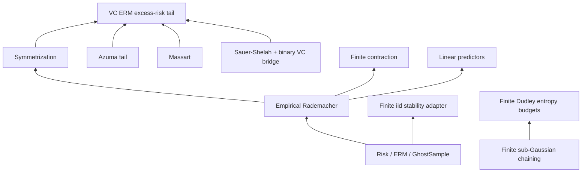

# Theorem Map

This page lists the public theorem spine by family. Names are Lean
declarations; modules are relative to `FormalSLT`.

## Core definitions

| Declaration | Module | Role |
|---|---|---|
| `risk` | `Risk` | Expected loss under a measure |
| `empiricalRisk` | `Risk` | Sample average loss |
| `IsERM` | `ERM` | Predicate selecting empirical risk minimizers over a finite class |
| `excessRisk` | `ERM` | Risk above the best-in-class comparator |
| `genGap` | `GhostSample` | One-sided uniform generalization gap |
| `piMeasure` | `GhostSample` | IID product measure on `Fin n -> Z` |
| `empiricalRademacherComplexity` | `Rademacher.FiniteSample` | Finite-sample empirical Rademacher complexity |
| `effectiveClass` | `VC.Rademacher` | Distinct loss vectors realized on a sample |
| `binaryClassTrace` | `VC.PACBridge` | Binary label patterns realized on a sample |
| `FiniteNet` | `Covering.FiniteSubGaussianChaining` | Finite net with an explicit nearest projection |

## Rademacher and VC spine

| Theorem | Module | Bound |
|---|---|---|
| `expected_genGap_le_two_expected_empiricalRademacherComplexity` | `Rademacher.Symmetrization` | `E[genGap] <= 2 * E[Rad]` |
| `genGap_tail_bound_azuma_explicit` | `Azuma.GenGapTail` | `P(genGap - E[genGap] >= ε) <= exp(-ε² n / (8B²))` |
| `massart_finite_class` | `Rademacher.Massart` | `Rad(H,S) <= B * sqrt(2 * log card(H) / n)` |
| `genGap_highProb_rademacher` | `Rademacher.HighProbability` | `P(genGap >= 2 * E[Rad] + ε) <= exp(-ε² n / (8B²))` |
| `genGap_highProb_finiteClass` | `Rademacher.FiniteClassHighProb` | Massart plus high-probability Rademacher |
| `uniformDeviation_highProb_finiteClass` | `Rademacher.UniformDeviation` | Two-sided finite-class uniform deviation |
| `sauerShelah_polynomial_bound` | `VC.SauerShelah` | `sum_{k<=d} C(n,k) <= (en/d)^d` |
| `empiricalRademacherComplexity_le_massart_effective` | `VC.Rademacher` | Effective-class Massart bound |
| `vcRademacher_pointwise` | `VC.SampleComplexity` | `Rad <= B * sqrt(2d * log(en/d) / n)` |
| `genGap_highProb_vcClass` | `VC.SampleComplexity` | VC-style one-sided genGap tail |
| `uniformDeviation_highProb_vcClass` | `VC.SampleComplexity` | VC-style two-sided uniform deviation |
| `vc_erm_excessRisk_tail` | `VC.SampleComplexity` | VC-style ERM excess-risk tail |
| `vc_erm_sample_complexity` | `VC.SampleComplexity` | Closed-form VC ERM sample-complexity theorem with explicit `128 * B^2` constant |
| `effectiveClass_zeroOneLoss_card_eq_binaryClassTrace` | `VC.BinaryVCBridge` | Effective 0-1 loss patterns equal binary traces |
| `effectiveClass_zeroOneLoss_card_le_sauerShelah` | `VC.BinaryVCBridge` | Binary VC Sauer-Shelah corollary |

## Contraction and linear predictors

| Theorem | Module | Bound |
|---|---|---|
| `one_step_contraction` | `Rademacher.Contraction` | One coordinate replacement step for the finite contraction proof |
| `contraction_1lip` | `Rademacher.Contraction` | Finite-sample scalar contraction for 1-Lipschitz transforms |
| `contraction_empirical` | `Rademacher.Contraction` | Empirical Rademacher wrapper for 1-Lipschitz transforms |
| `empiricalRademacherComplexity_contraction_lipschitz` | `Rademacher.Contraction` | `Rad_S(φ ∘ F) <= L * Rad_S(F)` for finite scalar classes |
| `linearPredictor_rademacher_finiteDim` | `Rademacher.LinearPredictor` | `Rad <= R * n⁻¹ * sqrt(sum k, ||z k||²)` |
| `linearPredictor_rademacher_uniform_finiteDim` | `Rademacher.LinearPredictor` | `||z k|| <= B` implies `Rad <= R * B / sqrt n` |

## Covering and finite chaining

| Theorem | Module | Bound |
|---|---|---|
| `rademacher_covering_bound` | `Covering.Rademacher` | `Rad(F) <= ε + Rad(N_ε)` |
| `rademacher_covering_massart` | `Covering.Rademacher` | Covering plus Massart |
| `rademacher_two_step_chaining` | `Covering.DudleyChaining` | Two-scale finite chaining bound |
| `finite_expectedSup_le_of_mgf_log` | `Covering.FiniteSubGaussianChaining` | MGF control gives finite expected-sup entropy budget |
| `finite_expectedSup_le_of_subGaussian_mgf_sqrt` | `Covering.FiniteSubGaussianChaining` | Optimized finite sub-Gaussian max bound |
| `finite_chaining_expectation_bound` | `Covering.FiniteSubGaussianChaining` | Finite multiscale chaining decomposition in expectation |
| `finite_projected_chaining_expectation_bound` | `Covering.FiniteSubGaussianChaining` | Finite projected-supremum chaining without an identity terminal projection |
| `finite_chaining_expectation_bound_of_radius_sqrt` | `Covering.FiniteSubGaussianChaining` | Radius-bounded finite chaining with square-root entropy budgets |
| `finite_chaining_expectation_bound_of_net_sequence_pairs_sqrt` | `Covering.FiniteSubGaussianChaining` | Projection-pair entropy version for finite net sequences |
| `finite_chaining_expectation_bound_of_net_sequence_coveringNumbers_sqrt` | `Covering.FiniteSubGaussianChaining` | Covering-number version for finite net sequences |
| `finite_projected_chaining_expectation_bound_of_net_sequence_coveringNumbers_sqrt` | `Covering.FiniteSubGaussianChaining` | Projected finite-net chaining bound with covering-number entropy budgets |
| `FiniteNet.ProjectedIndex` | `Covering.FiniteSubGaussianChaining` | Finite image of a net projection, used to avoid a finite ambient index assumption |
| `finite_projectedNet_chaining_expectation_bound_of_net_sequence_coveringNumbers_sqrt` | `Covering.FiniteSubGaussianChaining` | Projected finite-net-image chaining bound without `[Fintype T]` |
| `finite_dudley_entropy_sum_projection_pairs` | `Covering.FiniteSubGaussianChaining` | Finite Dudley-style entropy sum over projection-pair families |
| `finite_dudley_entropy_sum_coveringNumbers` | `Covering.FiniteSubGaussianChaining` | Finite Dudley-style entropy sum with covering-number products |
| `finite_dudley_entropy_sum_projection_pairs_geometric_radius` | `Covering.FiniteSubGaussianChaining` | Dyadic/geometric radius schedule for projection pairs |
| `finite_dudley_entropy_sum_coveringNumbers_geometric_radius` | `Covering.FiniteSubGaussianChaining` | Dyadic/geometric radius schedule for covering numbers |
| `finite_dudley_entropy_sum_projection_pairs_geometric_entropy_budget` | `Covering.FiniteSubGaussianChaining` | Per-scale entropy-budget wrapper for projection pairs |
| `finite_dudley_entropy_sum_coveringNumbers_geometric_entropy_budget` | `Covering.FiniteSubGaussianChaining` | Per-scale entropy-budget wrapper for covering numbers |
| `finite_dudley_entropy_sum_projection_pairs_geometric_uniform_entropy` | `Covering.FiniteSubGaussianChaining` | Uniform entropy cap collapses the dyadic sum to a `2 * radiusScale` budget for projection pairs |
| `finite_dudley_entropy_sum_coveringNumbers_geometric_uniform_entropy` | `Covering.FiniteSubGaussianChaining` | Uniform entropy cap collapses the dyadic covering-number sum to a `2 * radiusScale` budget |
| `finite_dudley_entropy_sum_projection_pairs_geometric_annulus_budget` | `Covering.FiniteSubGaussianChaining` | Finite dyadic annulus-budget bridge for projection pairs |
| `finite_dudley_entropy_sum_coveringNumbers_geometric_annulus_budget` | `Covering.FiniteSubGaussianChaining` | Finite dyadic annulus-budget bridge for covering numbers |
| `finite_dudley_entropy_sum_projection_pairs_geometric_integral_budget` | `Covering.FiniteSubGaussianChaining` | Finite dyadic entropy-integral budget for projection pairs |
| `finite_dudley_entropy_sum_coveringNumbers_geometric_integral_budget` | `Covering.FiniteSubGaussianChaining` | Finite dyadic entropy-integral budget for covering numbers |
| `finiteDyadicEntropyAtRadiusUpperSum` | `Covering.FiniteSubGaussianChaining` | Finite dyadic entropy-at-radius upper sum sampled at lower annulus endpoints |
| `finiteDyadicEntropyIntegralBudget_le_entropyAtRadiusUpperSum` | `Covering.FiniteSubGaussianChaining` | Finite dyadic budget comparison to an entropy-at-radius upper sum |
| `finite_dudley_entropy_sum_coveringNumbers_geometric_integral_budget_prefix_envelope` | `Covering.FiniteSubGaussianChaining` | Finite covering-count wrapper with a monotone prefix-sup entropy envelope |
| `finite_projected_dudley_entropy_sum_coveringNumbers_geometric_integral_budget_prefix_envelope` | `Covering.FiniteSubGaussianChaining` | Projected finite Dudley wrapper with a monotone prefix-sup entropy envelope |
| `finite_projectedNet_dudley_entropy_sum_coveringNumbers_geometric_integral_budget_prefix_envelope` | `Covering.FiniteSubGaussianChaining` | Projected finite-net-image Dudley wrapper without `[Fintype T]` |
| `finite_projectedNet_dudley_entropy_sum_coveringNumbers_geometric_entropy_integral_comparison` | `Covering.FiniteSubGaussianChaining` | Projected finite-net Dudley wrapper compared to a supplied finite entropy-at-radius integral budget |
| `shiftedDyadicIntervalIntegralSum_eq_truncatedIntervalIntegral` | `Covering.FiniteSubGaussianChaining` | Shifted finite dyadic annulus integrals compose into one truncated interval integral |
| `finiteDyadicEntropyAtRadiusUpperSum_le_two_mul_truncatedIntervalIntegral` | `Covering.FiniteSubGaussianChaining` | Finite entropy-at-radius upper sum dominated by a single truncated interval integral |
| `finite_projectedNet_dudley_entropy_sum_coveringNumbers_geometric_entropy_truncatedIntervalIntegral_comparison` | `Covering.FiniteSubGaussianChaining` | Projected finite-net Dudley wrapper with a truncated interval-integral entropy budget |
| `finiteExpectation_supFunctional_le_projected_add_terminalError` | `Covering.FiniteSubGaussianChaining` | Finite expectation adapter from a supplied supremum functional to a projected finite-supremum surrogate |
| `finiteSup_skeleton_le_projectedSup_add_terminalError` | `Covering.FiniteSubGaussianChaining` | Finite skeleton supremum controlled by terminal projected finite-net supremum plus explicit error |
| `finiteExpectation_supFunctional_le_projected_add_skeleton_terminalError` | `Covering.FiniteSubGaussianChaining` | Expected supplied supremum controlled through explicit finite-skeleton and terminal-projection errors |
| `terminalApprox_of_pathwise_modulus` | `Covering.FiniteSubGaussianChaining` | Terminal net radius plus pathwise modulus discharges the terminal-projection approximation hypothesis |
| `terminalApprox_of_pathwise_modulus_radiusBound` | `Covering.FiniteSubGaussianChaining` | Radius-bound variant of terminal pathwise-modulus approximation |
| `finiteSup_le_skeletonSup_add_of_pointwise_approx` | `Covering.FiniteSubGaussianChaining` | Finite ambient supremum controlled by a finite skeleton under pointwise approximation |
| `supFunctional_le_skeletonSup_add_of_witnessed_pointwise_approx` | `Covering.FiniteSubGaussianChaining` | Supplied supremum functional controlled by an approximate witness and finite skeleton selector |
| `finite_supFunctional_dudley_entropy_sum_coveringNumbers_geometric_entropy_truncatedIntervalIntegral_comparison` | `Covering.FiniteSubGaussianChaining` | Boundary-layer finite Dudley wrapper for a supplied supremum functional plus terminal error |
| `finite_separableSupFunctional_dudley_entropy_sum_coveringNumbers_geometric_entropy_truncatedIntervalIntegral_comparison` | `Covering.FiniteSubGaussianChaining` | Boundary-layer finite Dudley wrapper with explicit finite-skeleton and terminal-projection hypotheses |
| `finiteMetricCoverOfTotallyBoundedUniv` | `Covering.TotalBoundedDudley` | Totally bounded metric spaces admit finite covers at every positive real radius |
| `finiteNetOfTotallyBoundedUniv` | `Covering.TotalBoundedDudley` | Extracts the repo's bundled finite-net record from total boundedness |
| `dyadicChainingFiniteNetOfTotallyBoundedUniv_pair_radius_le` | `Covering.TotalBoundedDudley` | Dyadic total-bounded net schedule satisfies the adjacent-radius budget used by finite chaining |
| `finite_projectedNet_dudley_entropy_sum_totalBounded_dyadic_coveringNumbers` | `Covering.TotalBoundedDudley` | Total-bounded dyadic wrapper over the terminal projected finite-net image, without `[Fintype T]` |
| `finite_projectedNet_dudley_entropy_sum_totalBounded_dyadic_entropy_integral_comparison` | `Covering.TotalBoundedDudley` | Total-bounded projected finite-net wrapper compared to a supplied finite entropy-at-radius integral budget |
| `finite_projectedNet_dudley_entropy_sum_totalBounded_dyadic_entropy_truncatedIntervalIntegral_comparison` | `Covering.TotalBoundedDudley` | Total-bounded projected finite-net wrapper with one truncated interval-integral entropy budget |
| `finite_supFunctional_dudley_totalBounded_dyadic_entropy_truncatedIntervalIntegral_comparison` | `Covering.TotalBoundedDudley` | Total-bounded boundary wrapper for a supplied supremum functional under explicit terminal approximation |
| `finite_separableSupFunctional_dudley_totalBounded_dyadic_entropy_truncatedIntervalIntegral_comparison` | `Covering.TotalBoundedDudley` | Total-bounded boundary wrapper with explicit finite-skeleton/dense-net and terminal-projection assumptions |
| `finite_witnessedSup_modulus_dudley_totalBounded_dyadic_entropy_truncatedIntervalIntegral_comparison` | `Covering.TotalBoundedDudley` | Total-bounded Dudley boundary wrapper using approximate witnesses, finite skeleton selectors, and pathwise modulus |
| `EpsilonizedSupremumBoundaryChoice` | `Covering.TotalBoundedDudley` | Finite skeleton and terminal-scale certificate for an epsilonized Dudley boundary step |
| `finite_epsilonizedSup_modulus_dudley_totalBounded_dyadic_entropy_truncatedIntervalIntegral_comparison` | `Covering.TotalBoundedDudley` | For every positive error budget, a finite skeleton/terminal-scale certificate yields a Dudley bound with `+ eta` |
| `skeletonApprox_of_finiteCover_pathwiseModulus` | `Covering.TotalBoundedDudley` | Finite-cover radius plus pathwise modulus gives the finite-skeleton approximation hypothesis |
| `FiniteCoverSupremumBoundaryChoice` | `Covering.TotalBoundedDudley` | Finite-cover/pathwise-modulus certificate for the epsilonized Dudley boundary step |
| `finite_epsilonizedSup_dudley_totalBounded_of_finiteCoverSupremumBoundaryChoice` | `Covering.TotalBoundedDudley` | Epsilonized total-bounded Dudley wrapper from finite-cover and pathwise-modulus certificates |
| `finite_projected_dudley_entropy_sum_totalBounded_dyadic_coveringNumbers` | `Covering.TotalBoundedDudley` | Total-bounded dyadic wrapper for the terminal projected supremum, without an identity terminal net |
| `finite_dudley_entropy_sum_totalBounded_dyadic_coveringNumbers` | `Covering.TotalBoundedDudley` | Finite-terminal total-bounded dyadic wrapper composed with the finite Dudley entropy-budget theorem |

## Stability and PAC-Bayes foundations

| Theorem | Module | Bound |
|---|---|---|
| `trainingLoss_hasBoundedDifferences` | `AlgorithmicStability` | Uniform stability gives bounded differences for training loss |
| `stability_genGap_hasBoundedDifferences` | `AlgorithmicStability` | Uniform stability gives bounded differences for the gen gap scaffold |
| `FiniteCoordinateSwapIdentity` | `AlgorithmicStability` | Finite coordinate-swap symmetry predicate for explicit sample weights |
| `finiteProductSampleWeight` | `AlgorithmicStability` | Iid finite product sample weights `∏ k, p (S k)` |
| `finiteProductSampleWeight_coordinateSwapIdentity` | `AlgorithmicStability` | Finite iid product weights satisfy the coordinate-swap identity |
| `expectedFiniteStabilityGap_le_uniformStability_of_coordinateSwap` | `AlgorithmicStability` | Uniform stability gives finite expected gap `≤ β` under a finite swap identity |
| `expectedFiniteStabilityGap_le_uniformStability_finiteProduct` | `AlgorithmicStability` | Uniform stability gives finite iid product-weight expected gap `≤ β` |
| `abs_expectedFiniteStabilityGap_le_uniformStability_of_coordinateSwap` | `AlgorithmicStability` | Uniform stability gives finite two-sided expected stability gap `≤ β` under a finite swap identity |
| `abs_expectedFiniteStabilityGap_le_uniformStability_finiteProduct` | `AlgorithmicStability` | Uniform stability gives finite iid two-sided expected stability gap `≤ β` |
| `expectedFiniteGeneralizationGap_le_uniformStability_of_coordinateSwap` | `AlgorithmicStability` | Literal finite `E[R(A(S)) - Rhat_S(A(S))] ≤ β` wrapper under a finite swap identity |
| `expectedFiniteGeneralizationGap_le_uniformStability_finiteProduct` | `AlgorithmicStability` | Literal finite iid product-weight `E[R(A(S)) - Rhat_S(A(S))] ≤ β` wrapper |
| `abs_expectedFiniteGeneralizationGap_le_uniformStability_of_coordinateSwap` | `AlgorithmicStability` | Literal finite absolute expected generalization-gap wrapper under a finite swap identity |
| `abs_expectedFiniteGeneralizationGap_le_uniformStability_finiteProduct` | `AlgorithmicStability` | Literal finite iid product-weight absolute expected generalization-gap wrapper |
| `finiteClass_loss_measurable` | `AlgorithmicStability` | Finite per-hypothesis loss measurability gives joint loss measurability |
| `boundedLoss_selectedLoss_integrable` | `AlgorithmicStability` | Bounded finite-class selected loss is integrable under `μⁿ × μ` |
| `boundedLoss_updateSelectedLoss_integrable` | `AlgorithmicStability` | Bounded coordinate-updated selected loss is integrable under `μⁿ × μ` |
| `boundedLoss_coordinateSelectedLoss_integrable` | `AlgorithmicStability` | Bounded empirical coordinate loss is integrable under `μⁿ` |
| `expectedStabilityGap_le_uniformStability_piMeasure_of_boundedLoss` | `AlgorithmicStability` | Product-measure expected gap `≤ β` with bounded-loss integrability discharged |
| `abs_expectedStabilityGap_le_uniformStability_piMeasure_of_boundedLoss` | `AlgorithmicStability` | Product-measure two-sided expected gap `≤ β` with bounded-loss integrability discharged |
| `mcdiarmid_inequality_iid_const_width` | `Stability.BousquetElisseeff` | Iid bounded-differences upper tail with the Azuma constant |
| `bousquet_elisseeff_azuma_expectedGap_variant` | `Stability.BousquetElisseeff` | Stability high-probability bound with explicit expected-gap and measurability hypotheses |
| `bousquet_elisseeff_azuma_expectedGap_variant_of_boundedLoss` | `Stability.BousquetElisseeff` | Bounded-loss finite-class wrapper for the Azuma-constant stability high-probability theorem |
| `bousquet_elisseeff_uniform_stability_corollary` | `Stability.BousquetElisseeff` | `β = c0 / n` stability corollary for the Azuma-constant variant |
| `bousquet_elisseeff_uniform_stability_corollary_of_boundedLoss` | `Stability.BousquetElisseeff` | Bounded-loss finite-class `β = c0 / n` high-probability stability corollary |
| `BernsteinCondition` | `Rademacher.Localized` | Finite Bernstein condition: excess-loss second moment controlled by excess risk |
| `localizedEmpiricalRademacherComplexity_mono` | `Rademacher.Localized` | Finite localized empirical Rademacher complexity is monotone under predicate inclusion |
| `localizedExcessRiskEmpiricalRademacherComplexity_le_secondMoment` | `Rademacher.Localized` | Bernstein embeds excess-risk localized complexity into second-moment localized complexity |
| `FixedPointUpperCertificate` | `Rademacher.Localized` | Deterministic envelope certificate: above `rStar`, the localized envelope is below the identity |
| `localizedSecondMomentEmpiricalRademacherComplexity_le_of_fixedPointCertificate` | `Rademacher.Localized` | Envelope bound plus fixed-point certificate controls second-moment localized empirical complexity by its radius |
| `localizedExcessRiskEmpiricalRademacherComplexity_le_of_bernstein_fixedPointCertificate` | `Rademacher.Localized` | Bernstein bridge plus fixed-point certificate controls excess-risk localized empirical complexity by `c * r` |
| `LocalizedDeviationCertificate` | `Rademacher.Localized` | Deterministic localized concentration-event interface for population excess risk versus empirical excess risk |
| `finiteExcessRisk_le_of_localizedDeviation_empirical_nonpos` | `Rademacher.Localized` | Localized deviation plus nonpositive empirical excess risk controls population excess risk by the deviation slack |
| `finiteExcessRisk_le_of_localizedDeviation_bernstein_fixedPoint` | `Rademacher.Localized` | Localized deviation plus Bernstein/fixed-point control gives a finite fast-rate shell |
| `klDiv_nonneg` | `PACBayesKL` | Finite KL divergence is nonnegative under full support |
| `donsker_varadhan` | `PACBayesKL` | `sum ρ_i f_i <= KL(ρ||π) + log(sum π_i exp(f_i))` |
| `pacbayes_changeOfMeasure` | `PACBayesMcAllester` | Rescaled finite Donsker-Varadhan change-of-measure inequality |
| `pacbayes_mcallester_deterministic` | `PACBayesMcAllester` | Deterministic PAC-Bayes posterior bound from a prior log-MGF certificate |
| `pacbayes_mcallester_subGaussian` | `PACBayesMcAllester` | Fixed-`λ` sub-Gaussian deterministic PAC-Bayes bound |
| `pacbayes_mcallester_sqrt` | `PACBayesMcAllester` | Deterministic sqrt-form bound under a uniform-in-`λ` MGF certificate |
| `finiteEmpiricalRisk` | `PACBayesFiniteProductMGF` | Finite empirical risk for a real-valued loss |
| `finiteProduct_mgf_empiricalRiskDeviation_eq_pow` | `PACBayesFiniteProductMGF` | Exact iid product factorization of `E exp(lam * (R_i - Rhat_i))` |
| `finiteProduct_mgf_empiricalRiskDeviation_le_of_single` | `PACBayesFiniteProductMGF` | Single-coordinate MGF budget lifts to the finite sample-average MGF |
| `finitePriorAveraged_mgf_empiricalRiskDeviation_le` | `PACBayesFiniteProductMGF` | Prior-averaged finite iid empirical-risk-deviation MGF bound |
| `oneCoordinate_boundedLoss_mgf` | `PACBayesBoundedLoss` | `[0,1]` bounded-loss one-coordinate MGF instantiation |
| `sampleAverage_boundedLoss_mgf` | `PACBayesBoundedLoss` | Finite sample-average bounded-loss MGF bound |
| `priorAveraged_boundedLoss_mgf` | `PACBayesBoundedLoss` | Prior-averaged bounded-loss MGF bound |
| `priorAveraged_boundedLoss_mgf_badEventMass_le_delta` | `PACBayesBoundedLoss` | Finite Markov bad-event bound for the prior MGF |
| `posteriorRisk_bound_of_priorDeviationMGF_le` | `PACBayesBoundedLoss` | Deterministic posterior-risk adapter from a prior MGF certificate |
| `finiteCatoni_badEventMass_le_delta` | `PACBayesBoundedLoss` | Finite `[0,1]` Catoni-style PAC-Bayes posterior-risk bad-event bound |
| `catoni_fixedLambda_budget_eq_sqrt` | `PACBayesBoundedLoss` | Fixed-λ Catoni penalty optimized to a square-root budget |
| `posteriorRisk_bound_of_priorDeviationMGF_le_complexity_sqrt` | `PACBayesBoundedLoss` | Deterministic fixed-budget McAllester-style posterior-risk adapter |
| `finiteMcAllesterBoundedComplexity_badEventMass_le_delta` | `PACBayesBoundedLoss` | Finite `[0,1]` fixed-budget McAllester-style bad-event bound |
| `finiteMcAllesterGridPeeling_badEventMass_le_delta` | `PACBayesBoundedLoss` | Finite-grid McAllester peeling bound with allocated confidence mass |
| `finiteMcAllesterGridOptimized_badEventMass_le_delta` | `PACBayesBoundedLoss` | Posterior-dependent finite-grid McAllester wrapper under an explicit bucket certificate |
| `pac_bayes_generalization` | `PACBayesBoundedLoss` | Closed PAC-Bayes good-event theorem: with product-sample mass at least `1 - delta`, every posterior satisfies the Catoni-form risk bound |

## Dependency view

