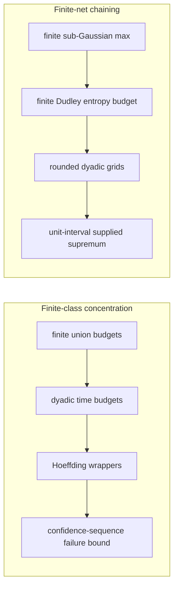
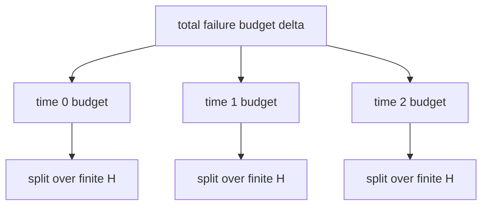
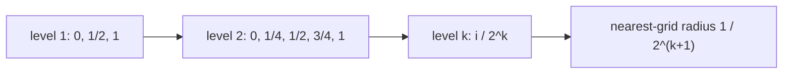
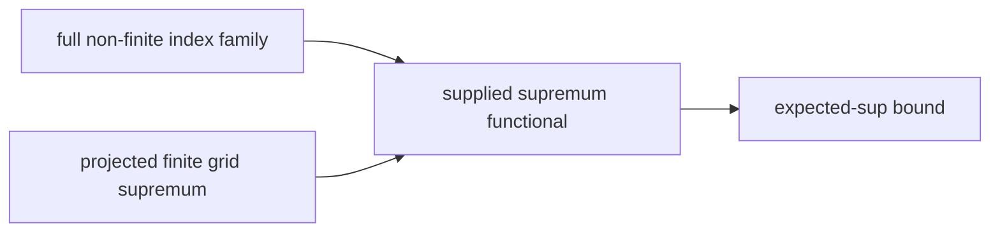

FormalSLT is a Lean 4 library for checking theorem chains from statistical
learning theory. The v0.1 surface has two useful endpoints and one API
reusability check:

1. a finite-class countable-time Hoeffding confidence-sequence wrapper for
   `[0,1]` losses;
2. a concrete non-finite `[0,1]` Dudley bridge through rounded dyadic finite
   nets.
3. a second dyadic-net instance over a two-point metric space, showing that the
   generic wrapper is not tied to `[0,1]`.

This page explains what is checked, what remains outside scope, and how to
verify the claims locally.

## The v0.1 Backbone



The two chains are separate. The confidence-sequence theorem is a finite-class
concentration statement. The Dudley theorem is a finite-net chaining statement
for one concrete non-finite metric index space.

## Chain 1: Countable-Time Finite-Class Hoeffding

The endpoint theorem is:

```lean
FiniteClassConfidenceSequence.failure_probability_le
```

Lean anchor:

```text
FormalSLT/UniformConvergence.lean:3718
```

It bounds the probability that there exists a time `t` and a hypothesis `h`
whose empirical average deviates from its risk by at least the named dyadic
radius.

The proof chain is:

| Step | Lean declaration |
|---|---|
| finite event budgets | `finiteMeasureUnionBound_budget` |
| summable dyadic time allocation | `finiteDyadicTimeBudget_tsum_le` |
| countable-time class union bound | `countableTimeClassUnionBound_dyadicBudget` |
| finite-prefix Hoeffding wrapper | `finitePrefixFiniteClassDeviationFromHoeffding_zeroOneRange_timeVaryingRadius_fromHoeffding` |
| named confidence radius | `zeroOneDyadicFiniteClassConfidenceRadius` |
| sample-size to radius bridge | `zeroOneDyadicFiniteClassConfidenceRadius_le_of_sampleSize_ge` |
| named failure event | `finiteClassConfidenceSequenceFailureEvent` |
| bundled assumption object | `FiniteClassConfidenceSequence` |
| final failure-event theorem | `anytimeFiniteClassDeviationFromHoeffding_zeroOneRange_confidenceSequence_fromHoeffding` |
| bundled API theorem | `FiniteClassConfidenceSequence.failure_probability_le` |

The theorem is finite-class. The hypothesis type has `[Fintype H]` and
`[Nonempty H]`, and the sample is a fixed finite set of coordinates. The loss
assumption is visible in the statement: losses are almost surely in `Set.Icc 0
1`.

The display-facing sample-size theorem is:

```lean
zeroOneDyadicFiniteClassConfidenceRadius_le_of_sampleSize_ge
```

For `t = 0`, one hypothesis, and failure budget `δ = 0.05`, the checked
dyadic radius needs 25 reviews for half-width 0.30, 55 reviews for half-width
0.20, and 220 reviews for half-width 0.10. These are dyadic confidence-sequence
numbers, not the looser fixed-time Hoeffding examples on the topic page.

## The Dyadic Budget

The countable-time step allocates failure probability across times using a
summable dyadic budget:

```text
time 0: delta / 2
time 1: delta / 4
time 2: delta / 8
...
```

At each time, the budget is split over the finite hypothesis class.



## Chain 2: A Concrete Non-Finite Dudley Bridge

The endpoint theorem is:

```lean
unitIntervalRademacherLinearSup_roundedDyadicGrid_dudley_m_bound_prefixFree
```

Lean anchor:

```text
FormalSLT/Covering/UnitIntervalDudley.lean:2096
```

The index type is the unit interval:

```lean
abbrev UnitInterval : Type :=
  {x : ℝ // x ∈ Set.Icc (0 : ℝ) 1}
```

The process is:

```text
X(b,t) = signOfBool b * t
```

where `b : Bool` and `t : [0,1]`.

The proof chain is:

| Step | Lean declaration |
|---|---|
| finite expected-sup MGF bound | `finite_expectedSup_le_of_mgf_log` |
| finite Dudley entropy budget | `finite_dudley_entropy_sum_coveringNumbers_geometric_entropy_budget` |
| total-bounded supplied-supremum adapter | `finite_supFunctional_dudley_totalBounded_dyadic_entropy_truncatedIntervalIntegral_comparison` |
| `[0,1]` total boundedness | `unitInterval_totallyBounded_univ` |
| nearest rounded-grid projection | `unitIntervalDyadicGridRoundProject_dist_le` |
| concrete range supremum | `unitIntervalRademacherLinearSup_sSup_range` |
| final supplied-supremum Dudley bound | `unitIntervalRademacherLinearSup_roundedDyadicGrid_dudley_m_bound_prefixFree` |

## Rounded Dyadic Grids

The rounded dyadic grid at level `k` contains points of the form:

```text
i / 2^k,    i = 0, ..., 2^k
```

The checked nearest-grid theorem proves radius:

```text
1 / 2^(k + 1)
```



This matters because the generic finite-net Dudley machinery consumes finite
nets at adjacent scales. The rounded-grid family makes those scales reusable
instead of relying only on one-off half and quarter meshes.

## Supremum Adapter

The unit-interval theorem still uses a supplied supremum functional, but in
this concrete process the supplied functional is tied to the actual range
supremum by checked Lean declarations:

```lean
unitIntervalRademacherLinearSup_isLeastUpperBound
unitIntervalRademacherLinearSup_isLUB_range
unitIntervalRademacherLinearSup_sSup_range
```



The checked statement is concrete to this Rademacher linear process. It is not
a theorem constructing arbitrary measurable suprema for all non-finite classes.

## What Is Checked

- The finite-class confidence-sequence theorem compiles and is covered by
  `examples/CheckUniformConvergence.lean`.
- The finite union-budget layer compiles and is covered by
  `examples/CheckFiniteUnionBound.lean`.
- The unit-interval Dudley bridge compiles and is covered by
  `examples/CheckUnitIntervalDudley.lean`.
- The reusable dyadic-net sequence API and both concrete instances are covered
  by `examples/CheckV01Usability.lean`.
- The two-point dyadic-net example is covered by
  `examples/CheckTwoPointDudley.lean`.
- The printed axiom profile for the headline declarations stays inside:

```text
[propext, Classical.choice, Quot.sound]
```

## What Is Not Claimed

The current FormalSLT v0.1 surface does not prove:

- the full continuous Dudley entropy integral;
- a general separability theorem;
- arbitrary measurable suprema over non-finite classes;
- infinite-class confidence sequences;
- a martingale or e-process anytime theorem;
- neural-network generalization bounds.

These are not hidden caveats. They are the current proof boundary.

## How to Verify

From the FormalSLT worktree:

```bash
lake build
lake env lean examples/CheckV01Usability.lean
lake env lean examples/CheckUnitIntervalDudley.lean
lake env lean examples/CheckTwoPointDudley.lean
lake env lean examples/CheckFiniteUnionBound.lean
lake env lean examples/CheckUniformConvergence.lean
python3 scripts/generate_proof_frontier_manifest.py --check
```

For the shortest import check, use:

```bash
lake env lean examples/CheckV01Usability.lean
```

The quickstart is:

```text
docs/formalslt-v0.1-quickstart.md
```

The v0.1 artifact map is:

```text
docs/formalslt-v0.1-artifact-map-2026-06-01.md
```

The technical note draft is:

```text
docs/formalslt-v0.1-technical-note.md
```

## Next Theorem Work

Two next steps would make the checked surface easier to use:

1. Use the `FiniteClassConfidenceSequence` bundle in downstream formal
   statements instead of restating the long theorem signature.
2. Instantiate the dyadic-net API on a finite family with more than two points,
   so the cover-count bookkeeping is tested outside constant-size examples.
3. Abstract the rounded dyadic-net Dudley wrapper so the unit-interval proof is
   one instance of a reusable finite-horizon theorem.

Those are theorem-engineering steps, not page polish. The page should move only
after the checked theorem surface and limitations stay aligned.
