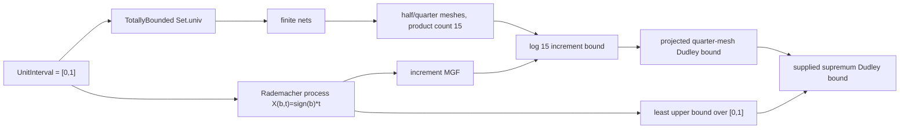

# Unit-Interval Dudley Example

This note records a concrete non-finite index-space example in
`FormalSLT.Covering.UnitIntervalDudley`.

The ambient index type is the unit interval:

```lean
abbrev UnitInterval : Type :=
  {x : ℝ // x ∈ Set.Icc (0 : ℝ) 1}
```

The type is not assumed finite. The module uses total boundedness and explicit
finite meshes to feed the existing finite sub-Gaussian chaining machinery.

## Theorem Chain



## Main Lean Anchors

Index-space and finite-net extraction:

- `unitInterval_totallyBounded_univ`
- `unitIntervalFiniteNet`
- `unitIntervalFiniteNet_covers`
- `unitIntervalDyadicFiniteNet`
- `unitIntervalDyadicFiniteNet_covers`

Explicit meshes:

- `unitIntervalHalfMeshNet`
- `unitIntervalHalfMeshNet_covers`
- `unitIntervalHalfMeshNet_coveringNumber`
- `unitIntervalQuarterMeshNet`
- `unitIntervalQuarterMeshNet_covers`
- `unitIntervalQuarterMeshNet_coveringNumber`
- `unitIntervalHalfQuarterPair_card_gt_one`
- `unitIntervalHalfQuarter_coveringNumber_product`

Rademacher process:

- `unitInterval_rademacherLinear_mgf_bound`
- `unitIntervalRademacherLinearProcess`
- `unitIntervalRademacherLinearProcess_increment_mgf`
- `unitIntervalRademacherLinearSup`
- `unitIntervalRademacherLinearSup_expectation`
- `unitIntervalRademacherLinearSup_upper`
- `unitIntervalRademacherLinearSup_attained`
- `unitIntervalRademacherLinearSup_isLeastUpperBound`

Dudley instantiations:

- `unitIntervalRademacherLinear_halfQuarter_increment_log15_bound`
- `unitIntervalRademacherLinear_projectedQuarterMesh_dudley_log15_bound`
- `unitIntervalRademacherLinearSup_projectedQuarterMesh_dudley_log15_bound`
- `unitIntervalRademacherLinearSup_dudley_m0_bound`
- `unitIntervalRademacherLinearSup_dudley_m1_bound_of_entropy`
- `unitIntervalRademacherLinearSup_dudley_m1_bound_constEntropy`
- `unitIntervalRademacherLinearSup_dudley_m1_bound_constEntropy_eval`

## What Is Proved

The module proves that `[0,1]` is totally bounded, extracts bundled finite nets,
and constructs a concrete sub-Gaussian process

```text
X(b,t) = signOfBool b * t
```

indexed by the non-finite metric space `[0,1]`. The supplied supremum is
nonzero:

```text
E[unitIntervalRademacherLinearSup] = 1/2
```

The module also proves that this supplied functional is the least upper bound of
the full non-finite index family:

```text
unitIntervalRademacherLinearSup_isLeastUpperBound
```

The explicit half and quarter meshes have covering numbers `3` and `5`, so the
adjacent projection-pair count is controlled by `15`. The checked theorem

```text
unitIntervalRademacherLinearSup_projectedQuarterMesh_dudley_log15_bound
```

routes the supplied nonzero supremum through the projected quarter-mesh Dudley
bound with a concrete `sqrt (log 15)` entropy envelope. In this example the
quarter mesh contains the endpoints `0` and `1`, so the terminal step from the
projected mesh back to the supplied supremum has no additional slack.

## What Is Not Claimed

This module does not prove a full continuous Dudley entropy-integral theorem.
It does not construct arbitrary measurable suprema over non-finite classes.
It does not discharge general separability assumptions.

The checked contribution is narrower: a concrete non-finite index-space example
that exercises the total-bounded finite-net bridge and the finite
sub-Gaussian chaining layer.

## Verification

```bash
lake build FormalSLT.Covering.UnitIntervalDudley
lake env lean examples/CheckUnitIntervalDudley.lean
```

The checker prints the axiom profile for the headline declarations. The
expected axiom set is:

```text
[propext, Classical.choice, Quot.sound]
```
