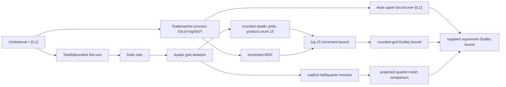

# Unit-Interval Dudley Example

This note records a concrete non-finite index-space example in
`FormalSLT.Covering.UnitIntervalDudley`.

The ambient index type is the unit interval:

```lean
abbrev UnitInterval : Type :=
  {x : ℝ // x ∈ Set.Icc (0 : ℝ) 1}
```

The type is not assumed finite. The module uses total boundedness and explicit
finite meshes to feed the existing finite sub-Gaussian chaining machinery.

## Theorem Chain



## Main Lean Anchors

Index-space and finite-net extraction:

- `unitInterval_totallyBounded_univ`
- `unitIntervalFiniteNet`
- `unitIntervalFiniteNet_covers`
- `unitIntervalDyadicFiniteNet`
- `unitIntervalDyadicFiniteNet_covers`

Reusable dyadic grid skeleton:

- `unitIntervalDyadicGridIndex`
- `unitIntervalDyadicGridCenter`
- `unitIntervalDyadicGridCenter_leftEndpoint`
- `unitIntervalDyadicGridCenter_rightEndpoint`
- `unitIntervalDyadicGrid_card`
- `unitIntervalDyadicGridPairCoverCount`
- `unitIntervalDyadicGridPairCoverCount_zero`
- `unitIntervalDyadicGridFloorProject`
- `unitIntervalDyadicGridFloorProject_dist_le`
- `unitIntervalDyadicGridNet`
- `unitIntervalDyadicGridNet_covers`
- `unitIntervalDyadicGridNet_coveringNumber`
- `unitIntervalDyadicGridNet_coveringNumber_one`
- `unitIntervalDyadicGridNet_coveringNumber_two`
- `unitIntervalDyadicGridNet_coveringNumberPair_zero`
- `unitIntervalDyadicGridRoundProject`
- `unitIntervalDyadicGridRoundProject_zero`
- `unitIntervalDyadicGridRoundProject_one`
- `unitIntervalDyadicGridRoundProject_dist_le`
- `unitIntervalDyadicRoundedGridNet`
- `unitIntervalDyadicRoundedGridNet_covers`
- `unitIntervalDyadicRoundedGridNet_coveringNumber`
- `unitIntervalDyadicRoundedGridNet_coveringNumber_one`
- `unitIntervalDyadicRoundedGridNet_coveringNumber_two`
- `unitIntervalDyadicRoundedGridNet_coveringNumberPair_zero`
- `unitIntervalRoundedDyadicGridIndex`
- `unitIntervalRoundedDyadicGridNet`
- `unitIntervalRoundedDyadicGridCoverCount`
- `monotone_unitIntervalRoundedDyadicGridCoverCount`
- `monotone_unitIntervalRoundedDyadicGridEntropy`
- `unitIntervalRoundedDyadicGridEntropy_prefixSup`
- `unitIntervalRoundedDyadicGridNet_dist`
- `unitIntervalRoundedDyadicGridNet_radius_pos`
- `unitIntervalRoundedDyadicGridNet_radius_geometric`
- `unitIntervalRoundedDyadicGridNet_pair_card_gt_one`
- `unitIntervalRoundedDyadicGridNet_coveringNumber_product`
- `unitIntervalRoundedDyadicGridNet_coverCount_le`
- `unitIntervalRoundedDyadicGridNet_radius_pos_range`
- `unitIntervalRoundedDyadicGridNet_radius_geometric_range`
- `unitIntervalRoundedDyadicGridNet_pair_card_gt_one_range`
- `unitIntervalRoundedDyadicGridNet_coverCount_le_range`

Explicit meshes:

- `unitIntervalHalfMeshNet`
- `unitIntervalHalfMeshNet_covers`
- `unitIntervalHalfMeshNet_coveringNumber`
- `unitIntervalQuarterMeshNet`
- `unitIntervalQuarterMeshNet_covers`
- `unitIntervalQuarterMeshNet_coveringNumber`
- `unitIntervalHalfQuarterPair_card_gt_one`
- `unitIntervalHalfQuarter_coveringNumber_product`
- `unitIntervalHalfQuarter_coveringNumber_product_eq_dyadicGridPairCoverCount_zero`

Rademacher process:

- `unitInterval_rademacherLinear_mgf_bound`
- `unitIntervalRademacherLinearProcess`
- `unitIntervalRademacherLinearProcess_increment_mgf`
- `unitIntervalRademacherLinearSup`
- `unitIntervalRademacherLinearSup_expectation`
- `unitIntervalRademacherLinearSup_upper`
- `unitIntervalRademacherLinearSup_attained`
- `unitIntervalRademacherLinearSup_isLeastUpperBound`
- `unitIntervalRademacherLinearSup_isLUB_range`
- `unitIntervalRademacherLinearSup_sSup_range`

Dudley instantiations:

- `unitIntervalRademacherLinear_halfQuarter_increment_log15_bound`
- `unitIntervalRademacherLinear_projectedQuarterMesh_dudley_log15_bound`
- `unitIntervalRademacherLinearSup_projectedQuarterMesh_dudley_log15_bound`
- `unitIntervalRademacherLinearSup_projectedQuarterMesh_dudley_log15_bound_eval`
- `unitIntervalRademacherLinear_roundedDyadicGrid_dudley_log15_bound`
- `unitIntervalRademacherLinearSup_roundedDyadicGrid_dudley_log15_bound`
- `unitIntervalRademacherLinearSup_roundedDyadicGrid_dudley_log15_bound_eval`
- `unitIntervalRademacherLinear_roundedDyadicGrid_dudley_m2_bound`
- `unitIntervalRademacherLinearSup_roundedDyadicGrid_dudley_m2_bound`
- `unitIntervalRademacherLinear_roundedDyadicGrid_dudley_m_bound`
- `unitIntervalRademacherLinear_roundedDyadicGrid_dudley_m_bound_prefixFree`
- `unitIntervalRademacherLinearSup_le_projectedRoundedDyadicGridSup`
- `unitIntervalRademacherLinear_projectedRoundedDyadicGridSup_eq`
- `unitIntervalRademacherLinearSup_roundedDyadicGrid_dudley_m_bound`
- `unitIntervalRademacherLinearSup_roundedDyadicGrid_dudley_m_bound_prefixFree`
- `unitIntervalRademacherLinear_roundedDyadicGrid_dudley_m3_bound`
- `unitIntervalRademacherLinearSup_roundedDyadicGrid_dudley_m3_bound`
- `unitIntervalRademacherLinearSup_dudley_m0_bound`
- `unitIntervalRademacherLinearSup_dudley_m1_bound_of_entropy`
- `unitIntervalRademacherLinearSup_dudley_m1_bound_constEntropy`
- `unitIntervalRademacherLinearSup_dudley_m1_bound_constEntropy_eval`

## What Is Proved

The module proves that `[0,1]` is totally bounded, extracts bundled finite nets,
and constructs a concrete sub-Gaussian process

```text
X(b,t) = signOfBool b * t
```

indexed by the non-finite metric space `[0,1]`. The supplied supremum is
nonzero:

```text
E[unitIntervalRademacherLinearSup] = 1/2
```

The module also proves that this supplied functional is the least upper bound of
the full non-finite index family, and exposes the same fact as a range-level
order-supremum equality:

```text
unitIntervalRademacherLinearSup_isLeastUpperBound
unitIntervalRademacherLinearSup_sSup_range
```

The reusable dyadic grid skeleton packages the level-`k` grid cardinality
`2^k + 1`, records that each dyadic grid contains both endpoints, and provides
two generic finite-net projections. The floor-projected net covers at spacing
radius `1 / 2^k`. The rounded nearest-grid net strengthens this to half-spacing
radius `1 / 2^(k+1)`, matching the explicit half/quarter mesh covering scales.
The dyadic skeleton also evaluates the level-`1` and level-`2` generic
covering numbers as `3` and `5`, and identifies their adjacent product with the
first dyadic grid pair count `15`. The shifted rounded dyadic sequence
`unitIntervalRoundedDyadicGridNet j = unitIntervalDyadicRoundedGridNet (j+1)`
packages the adjacent-radius, nontrivial projection-pair, and covering-product
facts needed by finite-scale chaining at arbitrary adjacent levels. The rounded
dyadic grid now carries both the checked `m = 1` Dudley chain, using levels `1`
and `2`, an `m = 2` Dudley chain, using levels `1`, `2`, and `3`, and a named
`m = 3` corollary using levels `1` through `4`. The theorem
`unitIntervalRademacherLinearSup_roundedDyadicGrid_dudley_m_bound` packages the
same rounded-grid chain for arbitrary finite `m`, with the adjacent product
counts supplied by `unitIntervalRoundedDyadicGridCoverCount`.
The monotonicity lemmas `monotone_unitIntervalRoundedDyadicGridCoverCount` and
`monotone_unitIntervalRoundedDyadicGridEntropy` now remove the generic
prefix-sup envelope from that arbitrary finite-horizon bound. The resulting
prefix-free theorems
`unitIntervalRademacherLinear_roundedDyadicGrid_dudley_m_bound_prefixFree` and
`unitIntervalRademacherLinearSup_roundedDyadicGrid_dudley_m_bound_prefixFree`
state the reusable rounded-grid chain directly in terms of the scale entropy
`sqrt (log (unitIntervalRoundedDyadicGridCoverCount j))`.
The theorem
`unitIntervalRademacherLinear_projectedRoundedDyadicGridSup_eq` records that
the projected finite supremum over any rounded dyadic grid is exactly the
supplied supremum for this process, because the grids contain both endpoints.
The explicit half and quarter meshes remain as concrete named comparison
meshes. Their covering numbers `3` and `5` are tied back to the first adjacent
dyadic grid pair count by

```text
unitIntervalHalfQuarter_coveringNumber_product_eq_dyadicGridPairCoverCount_zero
```

The checked theorem

```text
unitIntervalRademacherLinearSup_roundedDyadicGrid_dudley_log15_bound
```

routes the supplied nonzero supremum through the rounded generic dyadic-grid
Dudley bound with a concrete `sqrt (log 15)` entropy envelope. In this example
the level-`2` rounded dyadic grid contains the endpoints `0` and `1`, so the
terminal step from the projected grid back to the supplied supremum has no
additional slack. The projected quarter-mesh theorem remains as a separately
checked comparison path with the same scalar bound.
The evaluated corollary

```text
unitIntervalRademacherLinearSup_roundedDyadicGrid_dudley_log15_bound_eval
```

records the same one-step rounded-grid theorem as the scalar bound
`E[sup] <= 1 + sqrt 2 * sqrt (log 15)`.

The checked theorem

```text
unitIntervalRademacherLinearSup_roundedDyadicGrid_dudley_m2_bound
```

is the next finite-scale step. It routes the same supplied supremum through the
rounded dyadic grid sequence at terminal level `3`, with the two adjacent
covering products controlled by `unitIntervalRoundedDyadicGridCoverCount`.

The checked theorem

```text
unitIntervalRademacherLinearSup_roundedDyadicGrid_dudley_m_bound
```

is the reusable finite-horizon version. It routes the supplied supremum through
the terminal shifted rounded grid `unitIntervalRoundedDyadicGridNet m` for any
finite `m`. The named `m = 3` corollary records the first explicit finite-scale
step beyond the earlier `m = 1` and `m = 2` examples.

The checked theorem

```text
unitIntervalRademacherLinearSup_roundedDyadicGrid_dudley_m_bound_prefixFree
```

is the strengthened reusable finite-horizon version. It proves the same
arbitrary-`m` supplied-supremum bound after discharging the prefix-sup envelope
using the monotone rounded-grid entropy sequence.

## What Is Not Claimed

This module does not prove a full continuous Dudley entropy-integral theorem.
It does not construct arbitrary measurable suprema over non-finite classes.
It does not discharge general separability assumptions.

The checked contribution is narrower: a concrete non-finite index-space example
that exercises the total-bounded finite-net bridge and the finite
sub-Gaussian chaining layer.

## Verification

```bash
lake build FormalSLT.Covering.UnitIntervalDudley
lake env lean examples/CheckUnitIntervalDudley.lean
```

The checker prints the axiom profile for the headline declarations. The
expected axiom set is:

```text
[propext, Classical.choice, Quot.sound]
```
